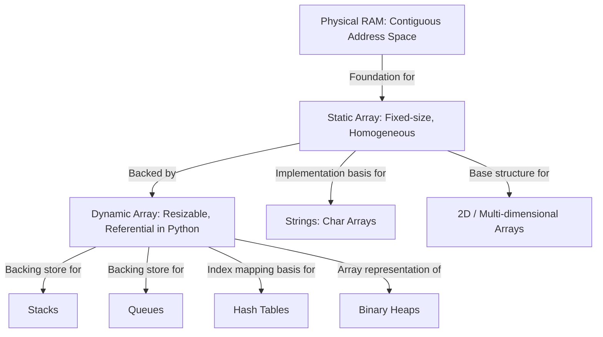
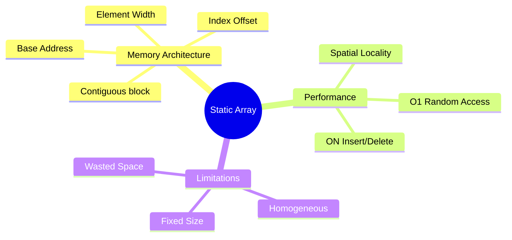
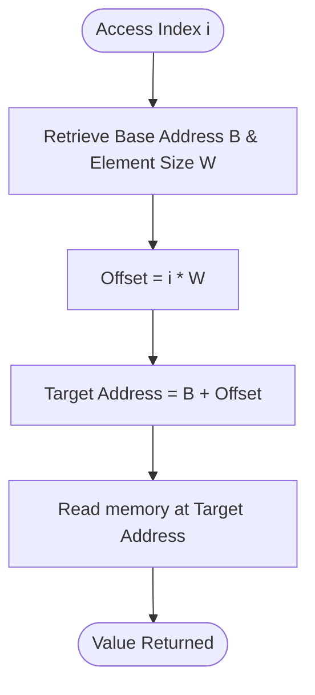
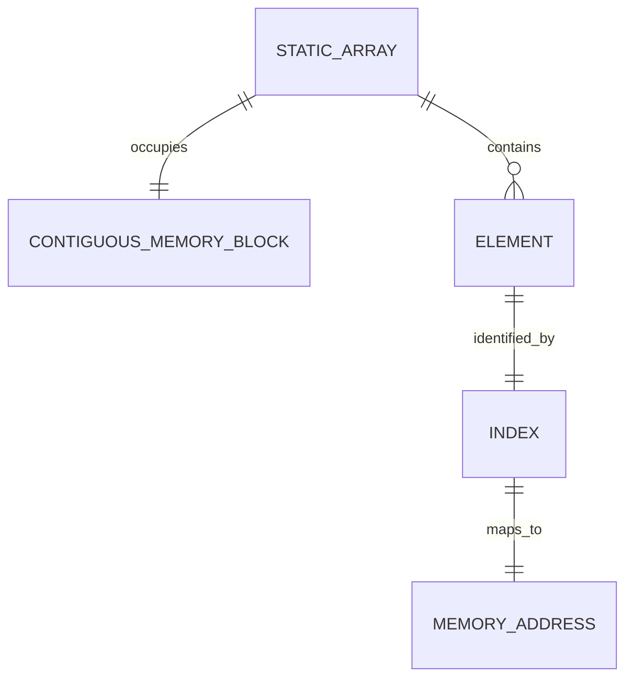
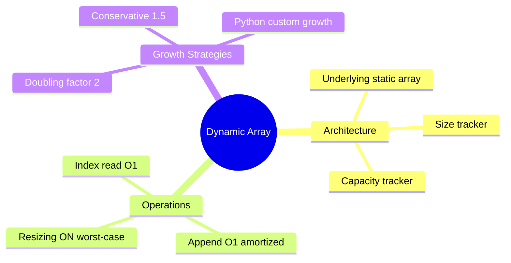
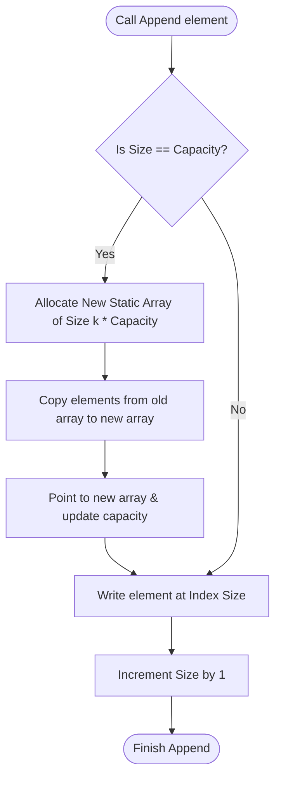
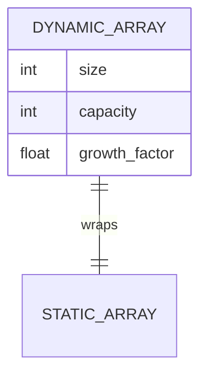

# Introduction to Arrays

This document provides a mastery-level, industry-aligned guide to understanding **Arrays**. It covers core memory architecture, dynamic resizing mechanics, fundamental operations, and Python-specific implementation details.

---

# 1. The Big Picture & Concept Connections

Before diving into individual concepts, it is vital to understand how arrays fit into the broader landscape of computer science and data structures.

### Prerequisite Concepts
To fully grasp arrays, you should be familiar with the following fundamental concepts:
*   **Physical Memory (RAM):** Random Access Memory is structured as a vast, linear sequence of memory cells, where each byte has a unique, sequential numerical address. Because the hardware allows the CPU to fetch the contents of any arbitrary memory address in constant time, it forms the physical foundation for the $O(1)$ random-access guarantee of arrays.
*   **Pointers & Memory Addresses:** A memory address is a hexadecimal or integer value indicating a physical storage location in RAM. A pointer is a variable that stores this address rather than a direct value. In low-level languages, arrays store values directly, but in Python, lists are referential arrays storing pointers to objects located elsewhere in heap memory.
*   **Time & Space Complexity (Big-O Notation):** A mathematical notation used to classify algorithms according to how their run time or space requirements grow as the input size ($N$) increases. You must understand Big-O to analyze why retrieving an array element by index is $O(1)$ while inserting an element at the beginning is $O(N)$ due to element shifting.

### Dependent Concepts
Once you master arrays, they serve as the building blocks for:
*   **Strings:** Character arrays with specialized operations.
*   **Matrix/Multi-dimensional Arrays:** Arrays of arrays.
*   **Hash Tables:** Using an array index as a direct key lookup via hashing.
*   **Stacks and Queues:** Linear structures frequently backed by dynamic arrays.
*   **Heaps (Binary Heaps):** Complete binary trees represented as arrays.
*   **Graphs:** Represented via Adjacency Matrices (2D arrays) or Adjacency Lists.

### The Big Picture Relationship


---

# 2. Concept 1: Memory Layout & Core Architecture of Static Arrays

## Definition
A **Static Array** is a linear data structure that stores a collection of elements of the same data type in contiguous memory locations. Its capacity (size) is fixed at the time of creation and cannot be altered.

### Formal Mathematical Definition
Let $A$ be a static array of capacity $N$, starting at physical memory address $B$ (called the **Base Address**). If each data element in the array occupies $W$ bytes of storage, then the physical memory address of the element at index $i$ (where $0 \le i < N$) is given by the formula:
$$\text{Address}(A[i]) = B + i \times W$$

---

## Intuition
Imagine a straight hallway with a row of identical lockers numbered starting from $0$. 
*   If you know exactly where locker $0$ starts (the **Base Address**) and how wide each locker is ($W$ bytes), you can walk directly to any locker $i$ without inspecting the previous lockers. 
*   You simply calculate the distance: $\text{BaseAddress} + i \times \text{Width}$.
*   This ability to calculate the location of any element instantly is why arrays support **$O(1)$ random access**.

---

## Detailed Explanation
### Contiguous Memory Allocation
When you declare a static array, the Operating System allocates a single, unbroken block of physical memory. No other program data can reside in the middle of this block. This contiguity is the source of the array's greatest strength (speed) and its greatest weakness (inflexibility).

### CPU Cache Friendliness (Spatial Locality)
Because array elements are stored right next to each other, accessing $A[i]$ causes the CPU to load not just that element, but a whole block of memory (a **cache line**) containing adjacent elements ($A[i+1], A[i+2]$, etc.) into the L1/L2 cache. This makes iterating through an array incredibly fast compared to linked structures (like linked lists), whose nodes are scattered randomly across memory.

```
Memory Layout of a Static Array of 4-byte integers starting at Base Address 1000:
+---------+---------+---------+---------+---------+
| Index   |    0    |    1    |    2    |    3    |
+---------+---------+---------+---------+---------+
| Value   |   42    |   87    |   19    |   56    |
+---------+---------+---------+---------+---------+
| Address |  1000   |  1004   |  1008   |  1012   |
+---------+---------+---------+---------+---------+
```

---

## Key Components
1.  **Base Address ($B$):** The memory address of the first byte of the first element ($A[0]$).
2.  **Element Size ($W$):** The fixed width (in bytes) of each element's data type (e.g., 4 bytes for standard integers, 8 bytes for doubles).
3.  **Index ($i$):** An integer offset indicating how many element-widths to skip from the base address.
4.  **Capacity ($N$):** The maximum number of elements the array can hold.

---

## Workflow / Process: Random Access Address Calculation
```
Input: Target Index (i), Base Address (B), Element Size (W)
  |
  v
Compute Offset: Offset = i * W
  |
  v
Add Base Address: Final Address = B + Offset
  |
  v
Retrieve Value at Final Address
```

---

## Examples
*   **Simple Example:** Storing a list of 5 daily temperature readings: `[30, 32, 28, 29, 31]`.
*   **Real-World Example:** Storing the pixel data of an image. A grayscale image can be represented as a continuous block of bytes, where each byte represents the brightness of a pixel at a computed offset: $\text{Index} = y \times \text{Width} + x$.
*   **Industry Use Case:** Audio Buffer processing in Digital Audio Workstations (DAWs). The raw audio waveforms are processed in fixed-size blocks (e.g., 512 frames) to minimize scheduling overhead and guarantee real-time latency limits.

---

## Python Implementation
Python does not support raw static arrays out of the box in its native syntax, because Python `list` is a dynamic array. However, we can simulate a static array using low-level systems libraries like `ctypes` to allocate raw contiguous blocks of memory.

```python
import ctypes

class StaticArray:
    """Simulates a low-level fixed-size contiguous static array using ctypes."""
    
    def __init__(self, size: int, c_type=ctypes.c_int):
        if size <= 0:
            raise ValueError("Array size must be greater than zero.")
        self._size = size
        self._c_type = c_type
        # Allocate contiguous memory block of 'size' elements of type 'c_type'
        self._data = (c_type * size)()
        
    def __len__(self) -> int:
        return self._size
    
    def __getitem__(self, index: int):
        """Allows direct O(1) read access via array[index] syntax."""
        if not 0 <= index < self._size:
            raise IndexError("Array index out of range.")
        return self._data[index]
        
    def __setitem__(self, index: int, value):
        """Allows direct O(1) write access via array[index] = value syntax."""
        if not 0 <= index < self._size:
            raise IndexError("Array index out of range.")
        self._data[index] = value

# Example Usage
if __name__ == "__main__":
    # Create a static array of size 5 to store integers
    arr = StaticArray(5, ctypes.c_int)
    
    # Write values
    for i in range(len(arr)):
        arr[i] = i * 10
        
    # Read values
    print("Static Array Elements:")
    for i in range(len(arr)):
        print(f"Index {i}: {arr[i]}")
```

---

## Advantages & Limitations
### Advantages
*   **Constant Time Access:** Direct lookup of any element in $O(1)$ time complexity.
*   **No Metadata Overhead:** Minimal storage overhead; memory is used purely for storing values.
*   **Cache Locality:** Highly cache-friendly structure, boosting execution speed.

### Disadvantages / Limitations
*   **Fixed Capacity:** The size must be declared upfront. If the array fills up, it cannot grow. If it remains mostly empty, memory is wasted.
*   **Expensive Insertions/Deletions:** Inserting or deleting elements in the middle requires shifting adjacent elements, resulting in $O(N)$ time complexity.

---

## Best Practices
*   Use static arrays when the dataset size is fixed, known at runtime compilation, and never needs to change.
*   Always check bounds before indexing to prevent segmentation faults (in languages like C/C++) or `IndexError` (in Python/Java).

---

## Common Mistakes
*   **Off-by-One Errors:** Trying to access index `len(array)` instead of `len(array) - 1`.
*   **Uninitialized Memory Access:** Reading values from an allocated array before writing data to it, which yields garbage memory values in compiled languages.

---

## Interview Questions & Answers
### Q1: Why are arrays 0-indexed?
**Answer:** The index represents the *offset* (distance) from the Base Address. The first element is located exactly at the Base Address, meaning we need to shift by $0$ element-widths. Therefore:
$$\text{Address}(A[0]) = B + 0 \times W = B$$

### Q2: What is spatial locality, and how do arrays benefit from it?
**Answer:** Spatial locality refers to the phenomenon where a CPU accesses a memory location and is highly likely to access nearby locations soon after. Because arrays are contiguous, when the CPU fetches $A[i]$, it fetches the entire cache block containing $A[i+1]$, $A[i+2]$, etc. This significantly reduces main memory access latency.

---

## Visual Learning

### Mermaid Mind Map


### Mermaid Flowchart: Direct Address Calculation


### Mermaid Relationship Diagram


---

# 3. Concept 2: Dynamic Arrays & Resizing Mechanisms

## Definition
A **Dynamic Array** (also known as a resizable array) is a variable-sized data structure that wraps a static array under the hood and automatically expands its capacity when elements are appended beyond its current limits.

### Formal Definition
A dynamic array maintains two values: **Size** ($S$, current number of elements) and **Capacity** ($C$, length of the underlying static array), where $S \le C$. 
When an append operation is requested:
1.  If $S < C$, the element is written to index $S$, and $S = S + 1$.
2.  If $S = C$, a new static array of capacity $k \times C$ (where $k > 1$ is the growth factor) is allocated.
3.  The $S$ elements are copied from the old array to the new array.
4.  The old array is deallocated, and the new array pointer is saved.
5.  The element is written, and $S = S + 1$.

---

## Intuition
Imagine a tour bus. You rent a bus with 10 seats (Capacity = 10). If 10 tourists get on, the bus is full. If an 11th tourist arrives, you cannot stretch the bus. Instead, you rent a larger bus with 20 seats (growth factor $k=2$), move all 10 passengers over to the new bus, release the old bus, and let the 11th tourist board the new bus.

---

## Detailed Explanation
### The Resizing Trigger & Growth Factor
Resizing must occur dynamically. The growth factor ($k$) determines the expansion rate:
*   **Java ArrayList:** $k = 1.5$
*   **C++ std::vector:** $k = 2.0$ (typically)
*   **Python List:** $k \approx 1.125$ to $1.25$ (Python uses a custom growth pattern to minimize memory waste while keeping appends efficient).

### Amortized Analysis of Append Operation
While copying elements during a resize operation takes $O(N)$ time, this copy is rare. Most appends take $O(1)$ time. 
Using the **Aggregate Method** of amortized analysis:
*   Assume growth factor $k = 2$.
*   To insert $N$ elements into an array starting with capacity 1, resizes happen at sizes $1, 2, 4, 8, \dots$.
*   The total number of element copy operations during resizes is:
    $$1 + 2 + 4 + 8 + \dots + \frac{N}{2} \approx N - 1$$
*   The total operations for $N$ appends is: $N$ (regular writes) $+ (N - 1)$ (copy operations during resizing) $\approx 2N$.
*   The **amortized time complexity** per append is:
    $$\frac{\text{Total Time}}{\text{Number of Appends}} = \frac{2N}{N} = O(1)$$

```
Dynamic Array Expansion Sequence (Capacity doubling):

Step 1: Size = 2, Capacity = 2
+---+---+
| A | B |
+---+---+

Step 2: Append 'C' -> Trigger Resize (New Capacity = 4)
1. Allocate new memory block of size 4.
2. Copy 'A' and 'B'.
3. Append 'C'.

+---+---+---+---+
| A | B | C |   |
+---+---+---+---+
```

---

## Key Components
1.  **Underlying Pointer:** Points to the beginning of the active static array in memory.
2.  **Size ($S$):** The number of actual elements currently stored in the array.
3.  **Capacity ($C$):** The maximum capacity of the current underlying static array.
4.  **Growth Factor ($k$):** The multiplier used to determine the size of the next array during expansion.

---

## Workflow / Process: Append Operation
```
Append(element)
  |
  +---> Is Size == Capacity?
          |
          +---> Yes: 1. Create new static array of size (Capacity * GrowthFactor)
          |          2. Copy elements from old array to new array
          |          3. Deallocate old array
          |          4. Update Capacity = Capacity * GrowthFactor
          |
          +---> No:  (Proceed directly)
  |
  v
Write element at Index [Size]
Increment Size
```

---

## Examples
*   **Simple Example:** Storing chat messages as they arrive in a live stream.
*   **Real-World Example:** Python's built-in `list` class. You can append any number of items without declaring the limit beforehand.
*   **Industry Use Case:** Buffer pools in databases that dynamically read records of varying sizes from storage and append them to an in-memory database cursor.

---

## Python Implementation
Here is a custom implementation of a dynamic array in Python to reveal its internal resizing mechanisms.

```python
import ctypes

class DynamicArray:
    """A custom implementation of a resizable dynamic array."""
    
    def __init__(self, growth_factor: float = 2.0):
        self._size = 0                          # Current active elements
        self._capacity = 1                      # Initial capacity
        self._growth_factor = growth_factor
        self._data = self._make_array(self._capacity) # Underlying static array
        
    def __len__(self) -> int:
        return self._size
        
    def __getitem__(self, index: int):
        if not 0 <= index < self._size:
            raise IndexError("Index out of range.")
        return self._data[index]
        
    def _make_array(self, capacity: int):
        """Creates a static array using ctypes."""
        return (ctypes.py_object * capacity)()
        
    def append(self, element):
        """Appends an element to the end of the array."""
        if self._size == self._capacity:
            # Resize if capacity is reached
            new_capacity = int(self._capacity * self._growth_factor)
            self._resize(new_capacity)
            
        self._data[self._size] = element
        self._size += 1
        
    def _resize(self, new_capacity: int):
        """Internal helper to copy contents to a larger underlying array."""
        print(f"[*] Resizing capacity from {self._capacity} to {new_capacity}")
        new_arr = self._make_array(new_capacity)
        
        # Copy elements from old array to new array
        for i in range(self._size):
            new_arr[i] = self._data[i]
            
        self._data = new_arr
        self._capacity = new_capacity

# Verification Code
if __name__ == "__main__":
    da = DynamicArray(growth_factor=2.0)
    for i in range(5):
        da.append(i * 10)
        print(f"Added {i*10} | Size: {len(da)} | Capacity: {da._capacity}")
```

---

## Advantages & Limitations
### Advantages
*   **Flexible Capacity:** No need to know the database size before writing code.
*   **Fast Operations:** Retains $O(1)$ random access speed.
*   **Amortized Efficiency:** $O(1)$ appends make it highly performant for sequential writes.

### Limitations
*   **Worst-Case Latency Spikes:** An append triggering a resize takes $O(N)$ time. This is unsuitable for real-time systems where uniform execution limits are strict.
*   **Memory Waste:** The unused capacity slots are allocated in memory, which wastes RAM (sometimes up to $50\%$ of allocated space).

---

## Best Practices
*   If you know the size of the array ahead of time, allocate the capacity directly (e.g., using `[None] * size` in Python) to avoid the overhead of repeated resizing.

---

## Common Mistakes
*   **Confusing Amortized Time with Worst-Case Time:** Assuming that *every* append is $O(1)$.
*   **Ignoring Shrinking:** Dynamic arrays do not automatically shrink when elements are removed unless explicitly coded to do so, leading to potential memory leaks.

---

## Interview Questions & Answers
### Q1: Prove that the amortized cost of inserting an element in a dynamic array is $O(1)$.
**Answer:** *Refer to the Amortized Analysis mathematical aggregate proof under the Detailed Explanation section.*

### Q2: Why not use a growth factor of 10 instead of 2?
**Answer:** A growth factor of 10 would reduce the number of resize operations, but it would lead to massive memory waste. For example, expanding an array of size 1,000 would instantly allocate space for 10,000 elements, wasting 9,000 slot allocations if no further elements are added. The value of 2 or 1.5 is a balance between space allocation and time efficiency.

---

## Visual Learning

### Mermaid Mind Map


### Mermaid Flowchart: Append Flow with Resizing


### Mermaid Relationship Diagram


---

# 4. Concept 3: Fundamental Array Operations & Complexity

Understanding the mechanics and time-complexity profiles of primary operations is essential for passing coding interviews and building high-performance systems.

## Operations Summary Table
| Operation | Case | Time Complexity | Auxiliary Space Complexity | Reason |
| :--- | :--- | :--- | :--- | :--- |
| **Access** | Any | $O(1)$ | $O(1)$ | Calculated memory offset. |
| **Traversal** | Any | $O(N)$ | $O(1)$ | Must visit every index. |
| **Search** | Best (First element) | $O(1)$ | $O(1)$ | Target found at start index. |
| | Worst (Not present) | $O(N)$ | $O(1)$ | Must scan all elements sequentially. |
| **Search (Sorted)**| Average/Worst | $O(\log N)$| $O(1)$ | Binary Search splits search space in half. |
| **Insertion** | Best (At end) | $O(1)$ * | $O(1)$ | No shifting required (*amortized for dynamic arrays). |
| | Worst (At index 0) | $O(N)$ | $O(1)$ | Every element must shift one position right. |
| **Deletion** | Best (At end) | $O(1)$ | $O(1)$ | Decrement index size pointer. |
| | Worst (At index 0) | $O(N)$ | $O(1)$ | Every element must shift one position left. |

---

## Detailed Mechanics of Operations

### 1. Insertion at Index $i$
To insert a new value $V$ at index $i$:
1.  Verify if the array has sufficient capacity. If not, resize.
2.  Shift all elements from index $i$ to $S-1$ one position to the right (starting from the rightmost element to avoid overwriting).
3.  Write $V$ into the slot at index $i$.
4.  Increment the size $S$.

```
Inserting 'X' at index 1:
Initial: [ A, B, C, D ]
Step 1 (Shift right): [ A, B, B, C, D ] (D shifted to index 4, C to 3, B to 2)
Step 2 (Overwrite): [ A, X, B, C, D ]
```

### 2. Deletion at Index $i$
To delete an element at index $i$:
1.  Check index bounds.
2.  Shift all elements from index $i+1$ to $S-1$ one position to the left.
3.  Optional: Nullify the index $S-1$ to prevent memory reference leaks.
4.  Decrement the size $S$.

```
Deleting element at index 1:
Initial: [ A, B, C, D ]
Step 1 (Shift left): [ A, C, D, D ] (C shifted to index 1, D to 2)
Step 2 (Nullify last): [ A, C, D, None ]
```

---

## Python Implementations of Core Operations
Here is a manual implementation of insertion, deletion, and search algorithms without using built-in methods like `list.insert()` or `list.pop()`.

```python
class ArrayOperationsDemo:
    def __init__(self, capacity: int):
        self.capacity = capacity
        self.array = [None] * capacity
        self.size = 0
        
    def traverse(self) -> None:
        """Traverses the array and prints active elements. Time Complexity: O(N)"""
        elements = [str(self.array[i]) for i in range(self.size)]
        print("Array Contents: [" + ", ".join(elements) + "]")
        
    def insert_at(self, index: int, element) -> None:
        """Inserts an element at a specific index. Time Complexity: O(N)"""
        if self.size >= self.capacity:
            raise OverflowError("Array is at full capacity.")
        if not 0 <= index <= self.size:
            raise IndexError("Insertion index out of bounds.")
            
        # Shift elements to the right, starting from the end
        for i in range(self.size, index, -1):
            self.array[i] = self.array[i - 1]
            
        self.array[index] = element
        self.size += 1
        
    def delete_at(self, index: int):
        """Deletes an element at a specific index. Time Complexity: O(N)"""
        if not 0 <= index < self.size:
            raise IndexError("Deletion index out of bounds.")
            
        removed_element = self.array[index]
        
        # Shift elements to the left
        for i in range(index, self.size - 1):
            self.array[i] = self.array[i + 1]
            
        self.array[self.size - 1] = None  # Clear trailing reference
        self.size -= 1
        return removed_element

    def linear_search(self, target) -> int:
        """Scans the array sequentially. Time Complexity: O(N)"""
        for i in range(self.size):
            if self.array[i] == target:
                return i  # Target found
        return -1  # Target not found

    def binary_search(self, target_numeric) -> int:
        """Performs binary search. Prerequisite: Array must be sorted. Time Complexity: O(log N)"""
        low = 0
        high = self.size - 1
        
        while low <= high:
            mid = (low + high) // 2
            if self.array[mid] == target_numeric:
                return mid
            elif self.array[mid] < target_numeric:
                low = mid + 1
            else:
                high = mid - 1
        return -1

# Verification Code
if __name__ == "__main__":
    demo = ArrayOperationsDemo(10)
    demo.insert_at(0, 10)
    demo.insert_at(1, 20)
    demo.insert_at(2, 30)
    demo.traverse() # Expecting: [10, 20, 30]
    
    demo.insert_at(1, 15)
    demo.traverse() # Expecting: [10, 15, 20, 30]
    
    demo.delete_at(2)
    demo.traverse() # Expecting: [10, 15, 30]
    
    print(f"Linear Search (30): Index {demo.linear_search(30)}") # Expect: 2
    print(f"Binary Search (15): Index {demo.binary_search(15)}") # Expect: 1
```

---

## Interview Questions & Answers
### Q1: Given an array, shift its elements circularly to the right by $K$ steps. What is the optimal time and space complexity?
**Answer:** The optimal solution reverses parts of the array to achieve $O(N)$ time complexity and $O(1)$ auxiliary space complexity:
1.  Reverse the entire array.
2.  Reverse the first $K$ elements.
3.  Reverse the remaining $N-K$ elements.

### Q2: Why is deleting the last element in an array $O(1)$, but deleting the first element is $O(N)$?
**Answer:** Deleting the last element does not disrupt the relative index ordering of any remaining elements; we simply decrement the size counter. Deleting the first element leaves a hole at index $0$. To maintain contiguous storage layout and allow index offset math, all remaining $N-1$ elements must shift left by one slot.

---

## Visual Learning

### Mermaid Flowchart: Deletion Mechanism
```mermaid
flowchart TD
    Start([Delete at Index idx]) --> CheckBounds{0 <= idx < Size?}
    CheckBounds -- No --> Error[Throw IndexError]
    CheckBounds -- Yes --> Loop[Loop i from idx to Size - 2]
    Loop --> Shift[A[i] = A[i + 1]]
    Shift --> NextIter{Is loop complete?}
    NextIter -- No --> Loop
    NextIter -- Yes --> ClearLast[Set A[Size - 1] = None]
    ClearLast --> DecSize[Decrement Size by 1]
    DecSize --> End([Return Deleted Item])
```

---

# 5. Concept 4: Python-Specific Implementations (Referential Lists vs Typed Arrays)

Python handles arrays differently than lower-level compiled languages like C or C++. Understanding Python's internals is crucial for writing clean code and optimizing performance.

## The Referential Array Architecture of Python `list`
A Python `list` is **not** a contiguous array of raw data values. Instead, it is a contiguous array of **memory references (pointers)**. Each pointer points to a Python Object (like an integer, string, or class instance) stored elsewhere on the **Heap**.

```
Memory Layout of a Python List containing [42, "hello"]:
+---------------+---------------+
| List Index 0  | List Index 1  |
+---------------+---------------+
|  Pointer 0x01 |  Pointer 0x0A |
+---------------+---------------+
       |               |
       v               v
   +-------+       +-------------------+
   |  42   |       | "hello" (String)  | (Heap Objects)
   +-------+       +-------------------+
```

---

## Comparison of Array Types in Python

| Feature | Python `list` | Python `array` Module | NumPy `ndarray` |
| :--- | :--- | :--- | :--- |
| **Data Types Allowed** | Heterogeneous (Any mix of types) | Homogeneous (One code type e.g., 'i', 'f') | Homogeneous (Strict data type e.g., `np.int32`) |
| **Internal Storage** | Array of Pointer References | Contiguous Raw C Values | Contiguous Raw C Values |
| **Memory Overhead** | High (Pointers + Object Headers) | Low (Only raw value types) | Extremely Low |
| **Computational Speed**| Slow for numerical operations | Medium | Fast (SIMD, Vectorization) |
| **Standard Library** | Yes (Built-in) | Yes (Standard Library) | No (Requires `pip install numpy`) |

---

## Python Benchmark: Memory and Performance Comparison
The following code compares the memory allocation and numeric iteration performance of a Python standard list, a typed array, and a NumPy array.

```python
import sys
import array
import time

try:
    import numpy as np
except ImportError:
    np = None

def run_benchmarks():
    size = 1_000_000
    print(f"Creating arrays of size: {size:,}\n")

    # 1. Python List
    start_time = time.time()
    py_list = list(range(size))
    list_time = time.time() - start_time
    
    # Calculate list memory footprint (references array size + size of individual integer objects)
    list_ref_size = sys.getsizeof(py_list)
    # Estimate total size including standard integer object overhead (28 bytes per int in 64-bit Python)
    list_total_size = list_ref_size + sum(sys.getsizeof(x) for x in py_list)

    # 2. Python Array Module
    start_time = time.time()
    py_array = array.array('i', range(size))
    array_time = time.time() - start_time
    array_total_size = sys.getsizeof(py_array)

    # 3. NumPy Array (if available)
    if np is not None:
        start_time = time.time()
        np_arr = np.arange(size, dtype=np.int32)
        np_time = time.time() - start_time
        np_total_size = np_arr.nbytes
    else:
        np_time = "N/A"
        np_total_size = "N/A"

    # Display Results
    print(f"{'Structure':<15} | {'Creation Time (s)':<18} | {'Estimated Memory Size':<25}")
    print("-" * 65)
    print(f"{'Python List':<15} | {list_time:<18.5f} | {list_total_size / (1024*1024):.2f} MB")
    print(f"{'Array Module':<15} | {array_time:<18.5f} | {array_total_size / (1024*1024):.2f} MB")
    if np is not None:
        print(f"{'NumPy Array':<15} | {np_time:<18.5f} | {np_total_size / (1024*1024):.2f} MB")
        
    print("\n[Analysis]")
    print("* The standard Python list has significant memory overhead because it allocates pointers and individual PyObject structures on the heap.")
    print("* The typed array module stores values contiguously in C-style memory, reducing memory overhead.")

if __name__ == "__main__":
    run_benchmarks()
```

---

## Interview Questions & Answers
### Q1: If standard Python lists can hold heterogeneous items, how does it maintain an $O(1)$ access time complexity?
**Answer:** The list itself is a contiguous array of memory pointers, and each pointer has a fixed size (8 bytes on 64-bit platforms). Calculating the memory address of the pointer at index $i$ is performed in $O(1)$ time:
$$\text{PointerAddress} = B + i \times 8$$
The pointer is dereferenced to access the actual Python object. Even though the target objects vary in type and physical layout, the pointer table is uniform, preserving $O(1)$ index access.

### Q2: What is "boxing" (or encapsulation) in Python, and how does it affect array performance?
**Answer:** In Python, basic types like integers are full heap objects (`PyObject`). When you perform numerical calculations in a list, Python must "unbox" the integer to access its raw machine value, execute the calculation, and then "box" the result back into a heap-allocated `PyObject`. This process creates significant garbage collection and execution latency. Contiguous arrays (like NumPy) bypass boxing by working with raw memory values directly.

---

## Visual Learning

### Mermaid Relationship Diagram: Python Memory Architecture
```mermaid
flowchart TD
    subgraph Python List (Contiguous References)
        ListObj[Python List Object Header] --> PtrTable[Pointer Table in Memory]
        PtrTable --> Ptr0[Index 0: 0x8A7B]
        PtrTable --> Ptr1[Index 1: 0x9F4C]
    end

    subgraph Heap Memory (Scattered Objects)
        Ptr0 -->|Points to| IntObj["PyObject (Type: int, Value: 42)"]
        Ptr1 -->|Points to| StrObj["PyObject (Type: str, Value: 'hello')"]
    end
```

---

# 6. Summary & Revision Section

## Comprehensive Revision Notes
*   **Contiguity:** The defining characteristic of arrays. Elements are side-by-side in memory with no gaps.
*   **Direct Addressing Formula:** $\text{Address}(A[i]) = \text{BaseAddress} + i \times W$.
*   **Static vs. Dynamic Arrays:** Static arrays are fixed-size; Dynamic arrays resize by allocating a larger array and copying elements over when they reach capacity.
*   **Resizing Performance:** Resizing capacity takes $O(N)$ time, but happens infrequently enough that the average (amortized) append time complexity remains $O(1)$.
*   **Deletion/Insertion Costs:** Both operations take $O(N)$ worst-case time because elements must shift to preserve contiguity.
*   **Python Referential Lists:** Standard Python lists store pointers, not raw values. This layout enables heterogeneous collections but increases memory overhead and cache misses.

---

## Master Mind Map (Conceptual Overview)

```mermaid
flowchart TD
    %% Styling Definitions
    classDef root fill:#4F46E5,color:#FFFFFF,stroke:#312E81,stroke-width:3px,font-weight:bold;
    classDef category fill:#0EA5E9,color:#FFFFFF,stroke:#0369A1,stroke-width:2px,font-weight:bold;
    classDef detail fill:#F8FAFC,color:#0F172A,stroke:#cbd5e1,stroke-width:1px,text-align:left;

    Root((ARRAYS MASTER SHEET)):::root
    
    %% Categories
    CatMemory["1. Memory Layout & Core Architecture"]:::category
    CatTypes["2. Array Types & Resizing"]:::category
    CatOps["3. Operations & Complexities"]:::category
    CatPython["4. Python-Specific Internals"]:::category
    
    Root --> CatMemory
    Root --> CatTypes
    Root --> CatOps
    Root --> CatPython
    
    %% Category 1 Details
    Mem1["<b>Contiguous Memory Layout:</b><br/>• Elements are stored back-to-back in RAM cells.<br/>• Boosts CPU spatial cache line loading efficiency.<br/>• No pointer traversal or memory fragmentation overhead."]:::detail
    Mem2["<b>Offset Address Calculation:</b><br/>• Formula: Address(A[i]) = BaseAddress + i * Width.<br/>• Zero-based indexing: index represents offset distance.<br/>• Enables instant, mathematical O(1) random access."]:::detail
    CatMemory --> Mem1
    CatMemory --> Mem2
    
    %% Category 2 Details
    Type1["<b>Static Arrays:</b><br/>• Fixed capacity defined during initialization.<br/>• Allocated contiguously in stack or heap.<br/>• Extremely low memory overhead; no resize checks."]:::detail
    Type2["<b>Dynamic Arrays (Resizable):</b><br/>• Wraps a static array with dynamic growth logic.<br/>• Tracks physical 'Capacity' vs active usage 'Size'.<br/>• Triggers resize copying when Size = Capacity."]:::detail
    Type3["<b>Amortized Analysis (Doubling):</b><br/>• Allocates new array of size k * Capacity (k=2 or 1.5).<br/>• Worst-case resize is O(N); average append is O(1).<br/>• Trades temporary copy latency for overall speed."]:::detail
    CatTypes --> Type1
    CatTypes --> Type2
    CatTypes --> Type3
    
    %% Category 3 Details
    Op1["<b>Access Profile:</b><br/>• Reading or writing by index is O(1).<br/>• Best, average, and worst cases are mathematically identical."]:::detail
    Op2["<b>Search Mechanisms:</b><br/>• Linear Search: O(N) traversal of every element.<br/>• Binary Search: O(log N) by dividing sorted bounds."]:::detail
    Op3["<b>Insertion & Deletion:</b><br/>• Insertion: O(N) due to right shifting of elements.<br/>• Deletion: O(N) due to left shifting of elements.<br/>• Best case is at the end (no shifting required)."]:::detail
    CatOps --> Op1
    CatOps --> Op2
    CatOps --> Op3
    
    %% Category 4 Details
    Py1["<b>Referential Lists (Python):</b><br/>• Stores contiguous references (pointers) to heap objects.<br/>• Supports heterogeneous lists containing different types.<br/>• Introduces pointer dereferencing and boxing/unboxing latency."]:::detail
    Py2["<b>Typed Value Arrays:</b><br/>• Python 'array' & NumPy 'ndarray' store raw values.<br/>• Strictly homogeneous (requires uniform data type).<br/>• Dramatically reduces RAM memory size footprint."]:::detail
    CatPython --> Py1
    CatPython --> Py2
```


