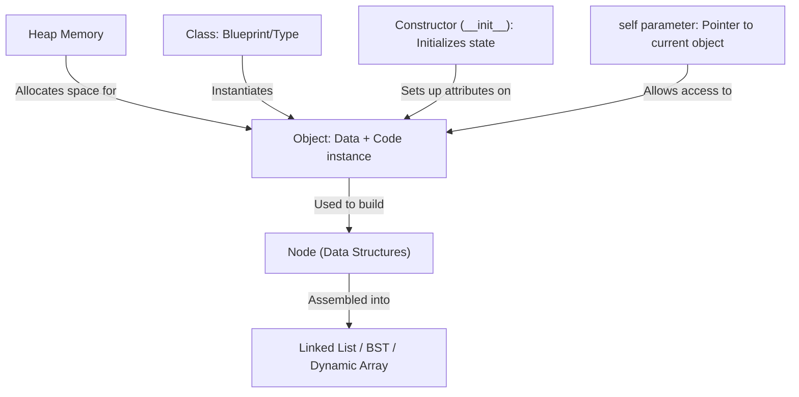
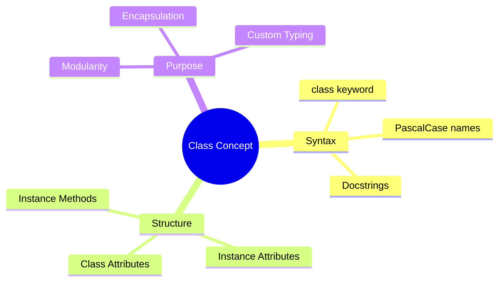
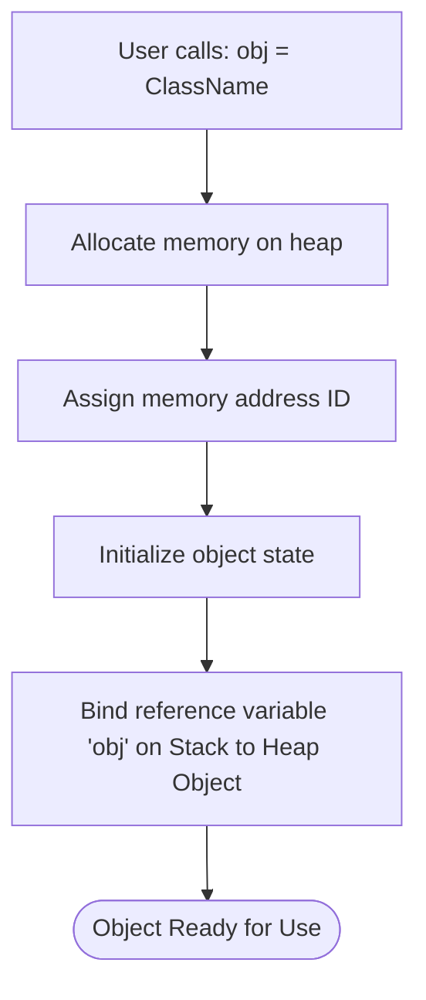
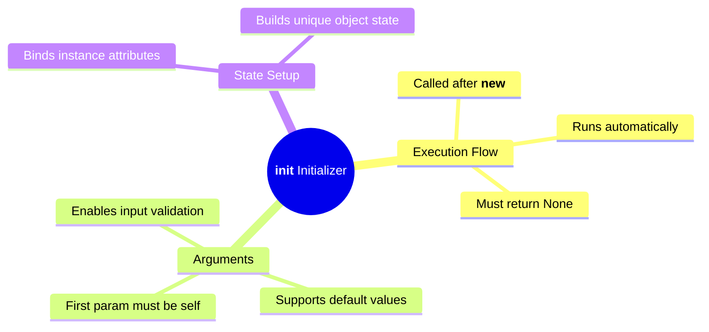
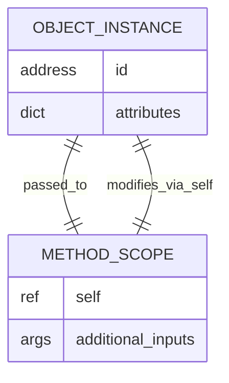
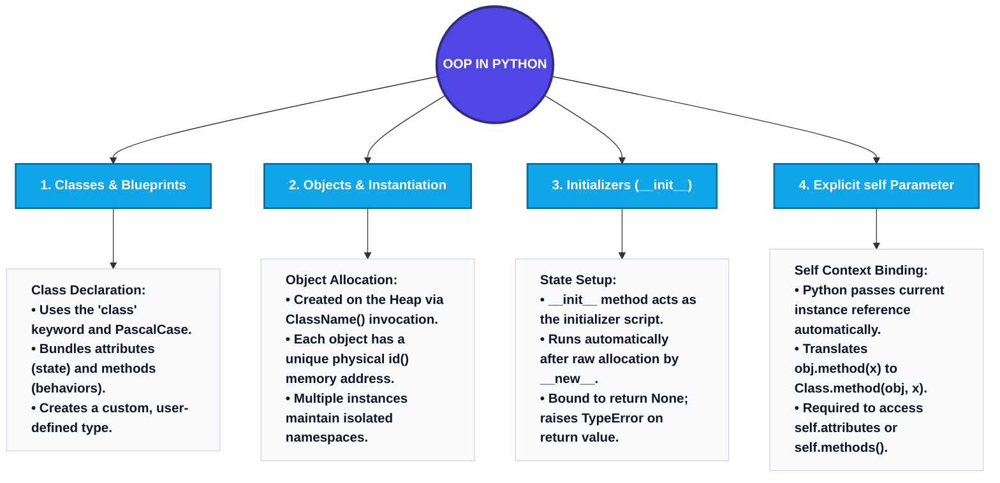

# Object-Oriented Programming (OOP) in Python

This document provides a comprehensive, technically rigorous study guide for Object-Oriented Programming (OOP) in Python. It is designed to take you from a conceptual understanding to mastery-level implementation, preparing you for both software development and technical interviews.

---

# 1. The Big Picture & Concept Connections

Object-Oriented Programming is a paradigm that structures code so that properties and behaviors are bundled into individual **objects**. In Data Structures and Algorithms (DSA), OOP is the primary tool used to model complex abstract structures—such as Nodes, Linked Lists, BSTs, and Custom Arrays—as reusable, isolated modules.

### Prerequisite Concepts
*   **Functions & Scope:** Variable lifetimes, execution frames, and local/global boundaries.
*   **Pointers & References:** Understanding that variables in Python store memory references (pointing to heap objects) rather than raw values.

### Dependent Concepts
*   **Inheritance & Polymorphism:** Creating specialized subclasses (e.g., a `SinglyLinkedList` inheriting from a base `List` class).
*   **Encapsulation & Access Modifiers:** Restricting access to internal components (e.g., prefixing variables with `_` or `__` in Python).
*   **Data Structures Construction:** Designing complex structures like `Node` classes containing value and next pointers.

### The Big Picture Relationship


---

# 2. Concept 1: Understanding OOP & Defining a Class

## Definition
**Object-Oriented Programming (OOP)** is a programming paradigm centered around the concept of **objects**, which contain data (attributes/properties) and code (methods/functions). 

A **Class** is a user-defined blueprint or prototype from which objects are created. It defines the structure and behavior that its instantiated objects will possess.

---

## Intuition
Think of a **Class** as an architectural blueprint for a house. The blueprint itself is not a house; it is a set of specifications detailing room counts, dimensions, and wiring layouts. You cannot live inside a blueprint. To live in it, you must build physical houses (objects) using that blueprint. Each house built can have distinct characteristics (like wall color or occupant names), but they all share the fundamental layout dictated by the blueprint.

---

## Detailed Explanation
In procedural programming, you write functions that act upon separate data arrays or variables. OOP merges data and operations into a single logical entity.

```
Procedural Paradigm:
[Data Variables] --------> Passed into --------> [Standalone Functions]

OOP Paradigm:
+-------------------------------------------------+
|                  CLASS OBJECT                   |
|  [Data Attributes] <----> [Instance Methods]    |
+-------------------------------------------------+
```

When you define a class in Python, you create a new user-defined type (just like `str`, `int`, or `dict`).
*   **Attributes:** Variables defined inside a class that hold state data.
*   **Methods:** Functions defined inside a class that describe behaviors and manipulate the attributes.

---

## Key Components
1.  **`class` Keyword:** The reserved syntax used to declare a class in Python.
2.  **Class Name:** By convention, named using **PascalCase** (e.g., `DatabaseConnector` rather than `database_connector`).
3.  **Docstring:** A string literal at the beginning of the class body describing its purpose.
4.  **Attributes:** Variables representing the state of the class or object.
5.  **Methods:** Functions that operate on the object's attributes.

---

## Workflow / Process: Parsing and Allocating a Class
```
Python Interpreter parses class definition
  |
  v
Creates a Class Object in memory (type 'type')
  |
  v
Populates class namespace dictionary (__dict__)
  |
  v
Awaits Instantiation calls
```

---

## Examples
*   **Simple Example:** A `Book` class representing a library book with attributes like `title` and `author`.
*   **Real-World Example:** An `HTMLParser` class in a web scraper that holds raw HTML source code and contains methods to extract links.
*   **Industry Use Case:** A `PaymentGateway` class in an e-commerce backend containing merchant credentials as attributes, and a method `process_payment(amount)` to execute API calls.

---

## Python Implementation
```python
class Book:
    """Represents a book in a library system."""
    
    # Class Attribute (Shared by all instances of Book)
    category = "General Literature"
    
    def get_info(self):
        """A simple method displaying book status."""
        return "This is a book object."

# Verification Code
if __name__ == "__main__":
    # Access class-level properties
    print(f"Book Category: {Book.category}")
    print(f"Book docstring: {Book.__doc__}")
```

---

## Advantages & Limitations
### Advantages
*   **Modularity:** Clear separation of concerns; each class forms an independent namespace.
*   **Code Reuse:** Blueprints can be reused across different modules.
*   **Data Abstraction:** Hides complex details, exposing simple API methods.

### Limitations
*   **Overhead:** In simple scripts, writing classes can introduce boilerplate and design complexity.
*   **Memory Footprint:** Each class instance consumes memory to store its attribute reference dictionary (`__dict__`).

---

## Best Practices
*   Always use PascalCase for class names (PEP 8).
*   Document class behavior using docstrings directly below the class header.
*   Avoid initializing instance-specific data as class attributes.

---

## Common Mistakes
*   **Empty Class Syntax Error:** Forgetting to write `pass` when declaring a class placeholder:
    ```python
    # Incorrect
    class Node:
    
    # Correct
    class Node:
        pass
    ```

---

## Interview Questions & Answers
### Q1: What is the difference between Class Attributes and Instance Attributes?
**Answer:** Class attributes are variables declared directly inside the class body (outside methods). They are shared among all instances of that class. Instance attributes are bound to a specific object (typically initialized inside `__init__`). Modifying an instance attribute only affects that specific object, whereas modifying a class attribute affects all instances unless overridden.

---

## Visual Learning

### Mermaid Mind Map


---

# 3. Concept 2: Object Instantiation & Memory Allocation

## Definition
**Instantiation** is the process of creating a concrete, live instance (an **object**) of a class blueprint in system memory.

---

## Intuition
If the class is a recipe for baking a chocolate cake, **instantiation** is the act of mixing the ingredients and putting them in the oven. The recipe is a sheet of paper (the class), whereas the baked cake sitting on the counter is the instantiated object. You can bake five cakes from that single recipe; each cake is a separate physical object that can be eaten, decorated, or sliced independently.

---

## Detailed Explanation
When an object is instantiated, the following low-level mechanisms take place:
1.  **Memory Allocation:** Python allocates a new chunk of memory on the **Heap** to hold the object's namespace and metadata.
2.  **Reference Creation:** A reference pointer (address) to this heap location is returned, which is typically assigned to a variable on the **Stack**.
3.  **Identity Verification:** Each object gets a unique physical ID (its memory address), which can be checked using Python's `id()` function or the `is` operator.

```
Stack (Local Reference Names)           Heap (Allocated Objects)
+-----------------------+               +--------------------------------------+
|  book1 --------------+--------------> | Object at 0x104A                     |
|                       |               | Class: Book                          |
|                       |               | __dict__: {title: "DSA with Python"} |
+-----------------------+               +--------------------------------------+
|  book2 --------------+--------------> | Object at 0x208B                     |
|                       |               | Class: Book                          |
|                       |               | __dict__: {title: "Clean Code"}      |
+-----------------------+               +--------------------------------------+
```

---

## Key Components
1.  **Instantiation Syntax:** Invoking the class name followed by parentheses: `my_object = ClassName()`.
2.  **Heap Memory:** The area of memory where Python allocates objects.
3.  **Object ID:** A unique integer returned by `id(object)`, corresponding to the memory address of the object in CPython.
4.  **`is` Operator:** A comparison operator that checks if two reference variables point to the *exact same* object in memory (compares their `id()`).

---

## Workflow / Process: Instantiating an Object
```
Call ClassName()
  |
  v
__new__() executes: Allocates raw memory on Heap
  |
  v
__init__() executes: Initializes object attributes
  |
  v
Memory address reference is returned
  |
  v
Variable on Stack stores reference
```

---

## Examples
*   **Simple Example:** Creating two independent dog objects from a `Dog` class.
*   **Real-World Example:** In a GUI framework, instantiating multiple `Button` objects—each having a different text label and position.
*   **Industry Use Case:** Instantiating `UserSession` objects to represent active, authenticated web users, each holding a unique session token.

---

## Python Implementation
```python
class Dog:
    pass

# Verification Code
if __name__ == "__main__":
    # Instantiate two distinct objects
    dog1 = Dog()
    dog2 = Dog()
    
    # Check physical memory locations
    print(f"dog1 ID: {id(dog1)}")
    print(f"dog2 ID: {id(dog2)}")
    
    # Prove they are different objects
    print(f"Is dog1 the same object as dog2? {dog1 is dog2}")  # Expect: False
    
    # Create an alias reference
    dog_alias = dog1
    print(f"Is dog_alias the same object as dog1? {dog_alias is dog1}")  # Expect: True
```

---

## Advantages & Limitations
### Advantages
*   **Dynamic Lifetimes:** Objects can be created dynamically at runtime and garbage collected when they are no longer referenced.
*   **Isolated State:** Multiple objects can operate simultaneously without corrupting each other's data.

### Limitations
*   **Memory Overhead:** Creating thousands of object instances quickly can consume substantial heap memory due to the overhead of the instance dictionaries (`__dict__`).

---

## Best Practices
*   Avoid creating redundant temporary objects inside tight loops.
*   Use `is` to check object identity (e.g., comparison with `None`), but use `==` to check value equality.

---

## Common Mistakes
*   **Forgetting Parentheses:** Assigning the class itself to a variable instead of instantiating it:
    ```python
    # Incorrect: Assigns the class object
    my_dog = Dog
    
    # Correct: Instantiates a new Dog object
    my_dog = Dog()
    ```

---

## Interview Questions & Answers
### Q1: What is the difference between `==` and `is` in Python?
**Answer:** `==` is the value equality operator. It checks if the contents of two objects are equal by calling the underlying `__eq__` method. `is` is the identity operator. It checks if two references point to the exact same memory address (i.e., whether `id(a) == id(b)`).

---

## Visual Learning

### Mermaid Flowchart: Instantiation Reference Routing


---

# 4. Concept 3: The Constructor & Initializer (`__init__`)

## Definition
The **Constructor** is a special method inside a class that runs automatically when a new object is instantiated. In Python, this initialization logic is defined within the magic method **`__init__`**.

---

## Intuition
When you buy a brand-new smartphone, the device runs an initialization sequence the first time you turn it on. It asks for your language, connects to Wi-Fi, and sets up your user profile. The phone does not start in a completely empty state; it has pre-loaded defaults and initialized configurations. The `__init__` method is that startup script for class objects, ensuring they begin life with all their essential data attributes configured.

---

## Detailed Explanation
In Python, object creation is a two-step process:
1.  **`__new__(cls, *args, **kwargs)`:** The true constructor. It is a static class method that actually allocates the physical memory block for the object and returns it. You rarely need to override this unless writing custom metaclasses or inheriting from immutable types (like `int` or `tuple`).
2.  **`__init__(self, *args, **kwargs)`:** The initializer. It receives the allocated object (passed as `self`) along with arguments passed during instantiation, and configures the object's instance attributes.

```python
# The explicit mapping of what happens during instantiation:
# obj = MyClass("value")
# ...is equivalent to:
# obj = MyClass.__new__(MyClass, "value")
# MyClass.__init__(obj, "value")
```

---

## Key Components
1.  **`def __init__(self, ...):`** The method signature.
2.  **`self` Parameter:** Must be the first parameter in the signature. It points to the newly allocated object instance.
3.  **Arguments:** Parameters following `self` that allow users to pass custom values during instantiation.
4.  **Instance Attributes:** Formed inside the method by assigning values to `self` properties (e.g., `self.name = name`).

---

## Workflow / Process: Constructor Invocation
```
User calls obj = Node(42)
  |
  v
Python executes Node.__new__() -> Allocates memory
  |
  v
Python passes raw object to Node.__init__(raw_obj, 42)
  |
  v
Inside __init__: raw_obj.data = 42
  |
  v
Initialized object reference returned
```

---

## Examples
*   **Simple Example:** A `Rectangle` class where the constructor sets `width` and `height`.
*   **Real-World Example:** A `BankAccount` class where the constructor sets `account_holder` and sets the starting `balance` to `0.0`.
*   **Industry Use Case:** A `TCPConnection` class where the constructor sets `host` and `port`, and opens a socket connection.

---

## Python Implementation
```python
class BankAccount:
    """Manages bank balances and transactions."""
    
    def __init__(self, owner: str, initial_balance: float = 0.0):
        """Initializes account credentials and validates starting balance."""
        if initial_balance < 0:
            raise ValueError("Initial balance cannot be negative.")
            
        self.owner = owner
        self.balance = initial_balance
        print(f"[*] Account created successfully for {self.owner}.")
        
    def check_balance(self):
        return f"{self.owner}'s Balance: ${self.balance:.2f}"

# Verification Code
if __name__ == "__main__":
    # Create accounts
    acc1 = BankAccount("Alice", 1500.75)
    acc2 = BankAccount("Bob")  # Uses default balance = 0.0
    
    print(acc1.check_balance())
    print(acc2.check_balance())
    
    # Try invalid balance
    try:
        acc3 = BankAccount("Charlie", -100.00)
    except ValueError as e:
        print(f"Caught expected error: {e}")
```

---

## Advantages & Limitations
### Advantages
*   **State Integrity:** Guarantees that objects always start with correct, validated values.
*   **Readability:** Simplifies object creation by bundling allocations and setup into a single line.

### Limitations
*   **No Return Values:** The `__init__` method is strictly prohibited from returning any value other than `None`. Attempting to return something else raises a `TypeError`.

---

## Best Practices
*   Keep `__init__` clean. Do not perform resource-intensive operations (like database queries or API requests) inside it.
*   Validate argument inputs immediately inside `__init__` to catch garbage data before it is saved to the object.

---

## Common Mistakes
*   **Attempting to return a value:**
    ```python
    # Incorrect
    def __init__(self, value):
        self.value = value
        return value  # Raises TypeError: __init__() should return None
    ```

---

## Interview Questions & Answers
### Q1: What is the difference between `__new__` and `__init__` in Python?
**Answer:** `__new__` is the actual constructor method responsible for allocating memory and returning a new, uninitialized instance of the class. It is a class method. `__init__` is the initializer method that takes the instance returned by `__new__` and initializes its instance variables. It does not return any value.

---

## Visual Learning

### Mermaid Mind Map


---

# 5. Concept 4: The `self` Parameter (Understanding `this` in Python)

## Definition
The **`self`** parameter is the explicit reference to the current instance of the class. It is used to access instance attributes and invoke other instance methods within the same object context.

*(Note: In languages like Java, C++, and JavaScript, this concept is represented by the implicit keyword **`this`**).*

---

## Intuition
If you are inside your house and want to paint the walls, you say: "Paint *this* room's walls blue." You do not need to look up the global GPS coordinates of your house; the word "this" contextually maps to the house you are currently occupying. 

Similarly, inside a class method, the pronoun **`self`** tells Python: "Access the variable belonging to *me* specifically, not some global variable."

---

## Detailed Explanation
Unlike other languages where `this` is a built-in keyword that is implicitly available inside methods, Python requires `self` to be **explicitly declared** as the first parameter in any instance method definition.

### Why is `self` explicit in Python?
This design is rooted in the Python zen: *"Explicit is better than implicit."* 
Under the hood, when you call an instance method:
```python
my_dog.bark(3)
```
Python automatically translates this call into:
```python
Dog.bark(my_dog, 3)
```
Python passes the object reference (`my_dog`) as the first argument (`self`) to the function. This is why you must define it in the parameter list, even though you do not pass it when calling the method.

```
Visualizing the Method Call Translation:
+-----------------------------------+
|          my_dog.bark(3)           |
+-----------------+-----------------+
                  | (Python translates under-the-hood)
                  v
+-----------------+-----------------+
|        Dog.bark(my_dog, 3)        |
+-----------------------------------+
```

---

## Key Components
1.  **Explicit Parameter:** `self` must be the first parameter in method signatures. (Note: The word `self` is a strong PEP 8 naming convention; technically, any variable name like `this` or `me` would compile, but using them is highly discouraged).
2.  **Attribute Binding:** Assigning properties to `self` (`self.attribute = value`) binds them to the specific object namespace.
3.  **Method Redirection:** Invoking helper methods within the class via `self.helper_method()`.

---

## Workflow / Process: Explicit Binding Resolution
```
User executes: obj.get_data()
  |
  v
Python locates class 'Type' of obj
  |
  v
Translates call to: Type.get_data(obj)
  |
  v
Inside get_data: 'self' refers back to 'obj' memory space
```

---

## Examples
*   **Simple Example:** Accessing a dog's name using `self.name` inside a `bark()` method.
*   **Real-World Example:** A `Point` class representing coordinate points, calculating distance using `self.x` and `self.y`.
*   **Industry Use Case:** A custom dynamic list structure invoking its own resizing routine using `self._resize()` when its internal check detects capacity limits.

---

## Python Implementation
This implementation demonstrates how Python translates instance calls under the hood, and how to use `self` to call methods from other methods.

```python
class Coordinate:
    def __init__(self, x: float, y: float):
        self.x = x
        self.y = y
        
    def print_coordinates(self):
        """Accesses properties using self."""
        print(f"X-Coordinate: {self.x} | Y-Coordinate: {self.y}")
        
    def reset(self):
        """Modifies attributes using self, and calls another method via self."""
        print("[*] Resetting coordinates...")
        self.x = 0.0
        self.y = 0.0
        # Call another method using self
        self.print_coordinates()

# Verification Code
if __name__ == "__main__":
    coord = Coordinate(12.5, 45.8)
    
    # 1. Standard Instance Call
    coord.print_coordinates()
    
    # 2. Behind-the-scenes call (equivalent to above)
    print("\nDemonstrating class-level method invocation:")
    Coordinate.print_coordinates(coord)
    
    # 3. Call method that uses self to update state and call other methods
    print()
    coord.reset()
```

---

## Advantages & Limitations
### Advantages
*   **Unambiguous Namespaces:** The explicit use of `self` prevents variable name conflicts between local method arguments and object instance variables.
*   **Code Transparency:** It is always clear when a method is accessing an object attribute (`self.x`) versus a local function variable (`x`).

### Limitations
*   **Boilerplate Syntax:** Developers must type `self.` frequently, which can make method definitions look cluttered compared to Java or C++.

---

## Best Practices
*   **Never** name the first parameter anything other than `self`. Even though the interpreter will compile other names, it violates Python community standards and breaks linters.
*   Avoid referencing instance variables directly without `self.` inside a method; doing so will result in a `NameError` as Python looks in the local function scope instead.

---

## Common Mistakes
*   **Forgetting `self` in method definition:**
    ```python
    # Incorrect
    class Node:
        def print_value():  # Lacks self parameter
            print("Hello")
            
    # Calling node_instance.print_value() will raise:
    # TypeError: print_value() takes 0 positional arguments but 1 was given
    ```
*   **Passing `self` explicitly during a method call:**
    ```python
    # Incorrect
    node = Node()
    node.print_value(node)  # Do not pass 'self' manually
    ```
*   **Using JavaScript-style `this`:**
    ```python
    # Incorrect
    class Dog:
        def __init__(self, breed):
            this.breed = breed  # Raises NameError: name 'this' is not defined
    ```

---

## Interview Questions & Answers
### Q1: Is `self` a keyword in Python?
**Answer:** No. `self` is not a reserved keyword in Python. It is simply a standard variable naming convention for the first parameter of instance methods. You could technically name it `this` or `dummy`, and the code would execute correctly, but doing so violates PEP 8 standards.

### Q2: What happens if an instance method is called on a class without passing an instance?
**Answer:** If you run `ClassName.method()` without arguments, it raises a `TypeError` because the method expects the `self` argument to be populated. You must pass an instance explicitly if calling the method from the class namespace directly: `ClassName.method(instance)`.

---

## Visual Learning

### Mermaid Relationship Diagram: `self` Binding


---

# 6. Summary & Revision Section

## Comprehensive Revision Notes
*   **Class vs Object:** A class is the static blueprint (stored in memory as a `type` object); an object is a dynamic, live instance of that blueprint allocated on the heap.
*   **Object Identity:** Every instantiated object possesses a unique address. Use `is` to check identity and `==` to evaluate structural value equality.
*   **The Initialization Cycle:** Calling `Class()` runs `__new__` to allocate raw heap storage, immediately followed by `__init__` to initialize instance attributes.
*   **Explicit `self` Parameter:** Python translates instance calls `obj.method(x)` into class-level calls `Class.method(obj, x)`. This makes the `self` parameter mandatory as the first argument in instance methods.
*   **Property Access:** Attributes and methods belonging to the current instance must always be qualified with the `self.` prefix inside methods to avoid local variable scope lookup failures (`NameError`).

---

## Master Mind Map (Conceptual Overview)

