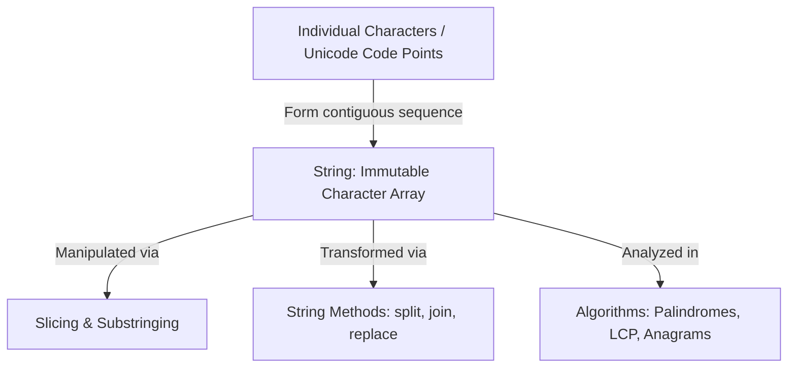
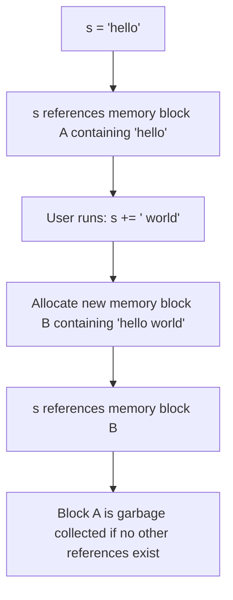
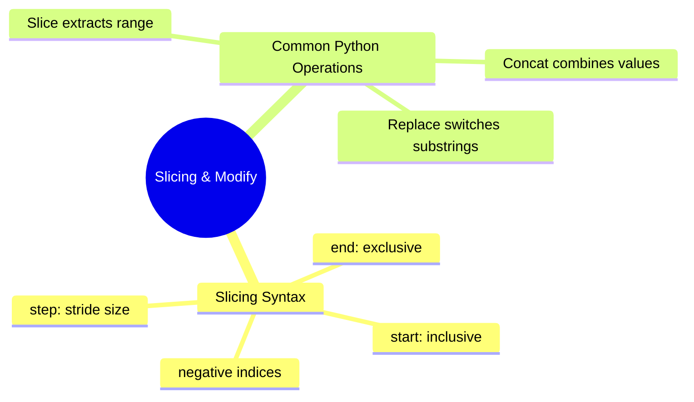
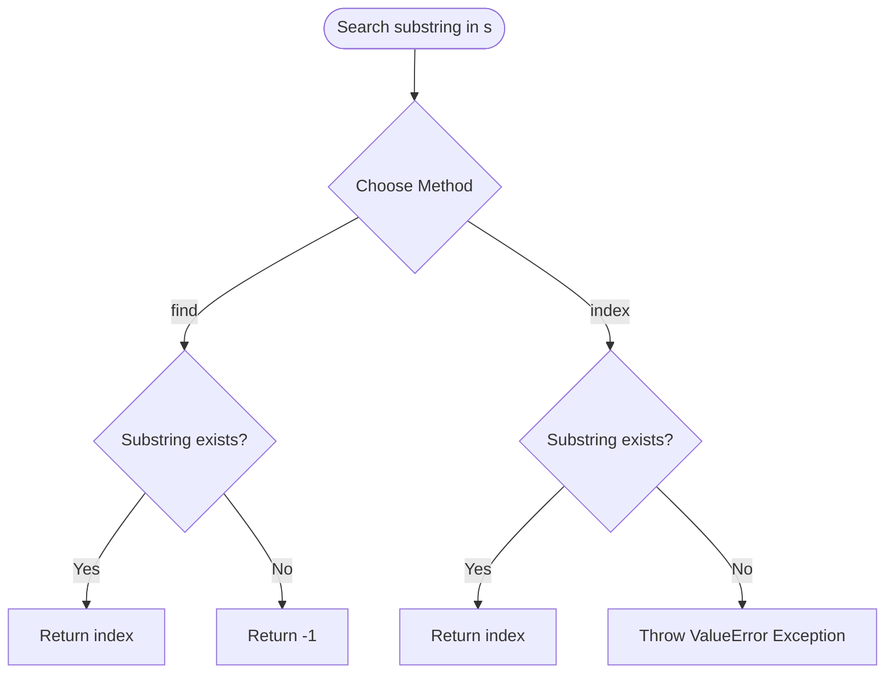
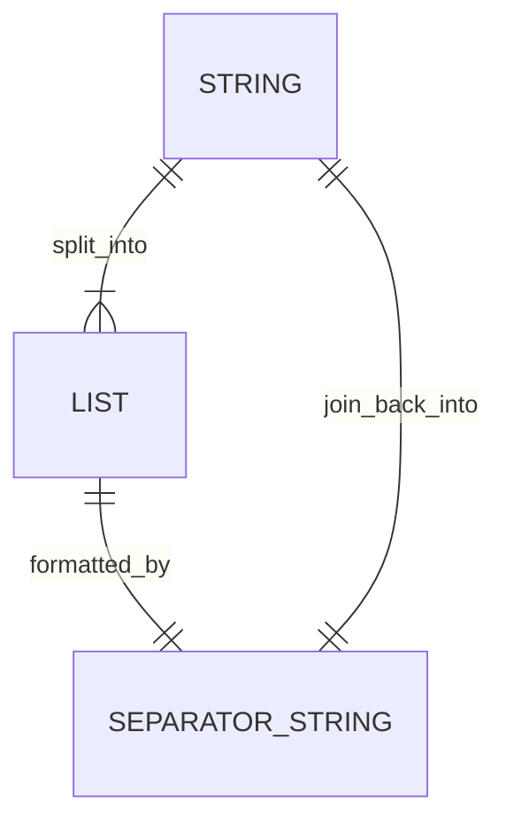
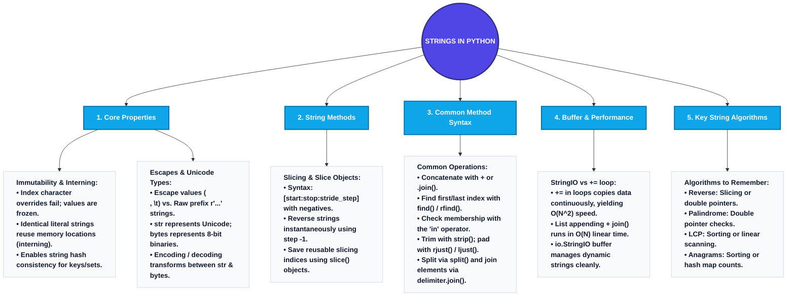

# Strings in Python

This document provides a comprehensive, technically rigorous study guide for **Strings in Python**, focusing on memory layout, core operations, and walking through standard string algorithms.

---

# 1. The Big Picture & Concept Connections

A **String** is a sequence of characters. In Python, strings are fundamental data types used to handle textual information. Python’s string handling has unique behaviors—most notably **strict immutability** and **powerful slicing**—that developers must master.

### Prerequisite Concepts
*   **Sequential Memory (Arrays):** Under the hood, strings are represented as contiguous sequences of character bytes or code points.
*   **Immutability:** Understanding that once a block of memory is assigned to a string, it cannot be modified in place.

### Dependent Concepts
*   **Regular Expressions (Regex):** Pattern matching and advanced text parsing.
*   **String Algorithms:** Substring searching (KMP, Rabin-Karp) and text manipulation.
*   **Dynamic Programming (DP):** Longest Common Subsequence (LCS) or Edit Distance (Levenshtein distance).

### The Big Picture Relationship


---

# 2. Concept 1: String Basics, Immutability & Formatting

## Definition
A **String** in Python is an immutable sequence of Unicode characters. Python does not have a separate "character" type; a single character is simply a string of length 1.

---

## Intuition
Imagine a printed newspaper. If you notice a typo in a word, you cannot magically erase the ink on that page and type a new letter in its place; the page is printed and fixed (immutable). 
To "fix" the typo, you must print an entirely **new edition** of the newspaper with the correct word. 
In Python, any operation that appears to modify a string (like replacement or capitalization) is actually printing a brand-new string in memory.

---

## Detailed Explanation

### 1. Immutability
Attempting to modify a character in a string by index directly raises a `TypeError` in Python:
```python
s = "python"
s[0] = "P"  # TypeError: 'str' object does not support item assignment
```

### 2. Literal Syntax & Escape Characters
Python strings can be enclosed in single (`'`), double (`"`), or triple (`'''` or `"""`) quotes. Triple quotes allow multi-line strings.
*   `\n` : Newline.
*   `\t` : Tab character.
*   `\'` or `\"` : Escaped quotes.
*   **Raw Strings (`r"..."`):** Adding an `r` prefix disables escape character processing. This is extremely useful for Windows file paths or regex patterns:
    ```python
    path = r"C:\new_folder\tab_data"  # '\n' and '\t' are treated as raw text, not escape commands.
    ```

### 3. Formatted String Literals (f-strings)
Python implements formatted string interpolation via **f-strings** (formatted string literals) introduced in Python 3.6, which are prefix-based: `f"Hello {name}"`.

### 4. String Interning (CPython Memory Optimization)
To save memory and speed up comparisons, Python uses a technique called **string interning**. 
*   **How it works:** When Python compiles literal strings that look like identifiers (e.g., alphanumeric strings with underscores), it stores only *one* copy of that string in memory. Multiple variables referencing the same literal will point to the exact same memory address.
*   **The `is` check:** For interned strings, `a is b` evaluates to `True`.
*   **Dynamic Strings:** Strings constructed dynamically at runtime (e.g., via concatenation or input) are *not* automatically interned. To force interning of dynamically created strings, use `sys.intern()`.

### 5. Unicode vs. Bytes (`str` vs. `bytes`)
In Python 3, all standard strings (`str`) are sequences of Unicode code points (handled internally in UTF-8/UTF-16/UTF-32).
*   **`str` (Unicode text):** Human-readable text data (e.g., `"hello"`, `"Python-Café"`).
*   **`bytes` (Raw binary data):** Machine-readable 8-bit bytes (e.g., `b"hello"`).
*   **Encoding:** Converting `str` to `bytes` using `str.encode(encoding="utf-8")`.
*   **Decoding:** Converting `bytes` to `str` using `bytes.decode(encoding="utf-8")`.

---

## Key Components
1.  **Immutability:** String memory cannot be written to post-allocation.
2.  **f-String Expression Interpolation:** Any valid Python expression can be placed inside `{}` within an f-string.
3.  **Raw String Prefix (`r`):** Prevents backslashes from acting as escape characters.

---

## Workflow / Process: Creating and Interpolating Strings
```
Define variables (e.g., name = "Alice")
  |
  v
Compile f-string: f"User: {name.upper()}"
  |
  v
Python evaluates expression inside {} -> "ALICE"
  |
  v
Allocates a new string "User: ALICE" in Heap
```

---

## Examples
*   **Simple Example:** Constructing greeting strings using single/double quotes.
*   **Real-World Example:** Generating database file paths dynamically using raw strings.
*   **Industry Use Case:** Formulating JSON request payloads or SQL logs utilizing f-strings.

---

## Python Implementation
```python
def string_basics_demo():
    # 1. Escaping and Quotes
    single_quote_str = 'Python\'s strings are easy'
    double_quote_str = "Python's strings are easy"
    multiline_str = """Line one
Line two
Line three"""

    # 2. Raw Strings (Windows path example)
    escaped_path = "C:\new_folder\test.txt"  # WARNING: \n and \t will trigger escapes!
    raw_path = r"C:\new_folder\test.txt"     # Correct

    # 3. f-Strings formatting
    name = "Aryan"
    age = 20
    # Evaluate expressions directly inside braces
    formatted = f"Hello {name}, in 5 years you will be {age + 5}."

    print(f"Single Quote Escaped: {single_quote_str}")
    print(f"Raw Path: {raw_path}")
    print(f"f-String Output: {formatted}")

    # 4. String Interning Demonstration
    import sys
    word1 = "data_structure"
    word2 = "data_structure"
    print(f"Literal interning (word1 is word2): {word1 is word2}")  # True
    
    # Dynamic string construction (not interned by default)
    part1 = "data_"
    part2 = "structure"
    dynamic_word = part1 + part2
    print(f"Dynamic string (word1 is dynamic_word): {word1 is dynamic_word}")  # False
    
    # Force interning
    interned_dynamic = sys.intern(dynamic_word)
    print(f"Forced interning (word1 is interned_dynamic): {word1 is interned_dynamic}")  # True

    # 5. Unicode vs. Bytes Demonstration
    unicode_text = "Python-Café"
    utf8_bytes = unicode_text.encode("utf-8")
    decoded_text = utf8_bytes.decode("utf-8")
    
    print(f"Unicode Str: {unicode_text} (Type: {type(unicode_text)})")
    print(f"UTF-8 Bytes: {utf8_bytes} (Type: {type(utf8_bytes)})")
    print(f"Decoded Str: {decoded_text}")

    # Proof of Immutability
    test_str = "hello"
    try:
        test_str[0] = 'H'
    except TypeError as e:
        print(f"\nCaught expected TypeError: {e}")

if __name__ == "__main__":
    string_basics_demo()
```

---

## Advantages & Limitations
### Advantages
*   **Hashability:** Because strings are immutable, their hash values never change. This allows them to be used as keys in dictionaries (`dict`) and elements in sets (`set`).
*   **Thread Safety:** Since they cannot be modified in place, multiple threads can read a string safely without lock mechanisms.

### Limitations
*   **Memory Inefficiency on Concatenation:** Repeatedly adding characters inside a loop (`s += char`) creates a new string copy at each iteration, resulting in $O(N^2)$ time complexity. (Use list appends and `''.join()` instead).

---

## Best Practices
*   Use **f-strings** for all string formatting; they are cleaner and faster than old `%` or `.format()` styles.
*   Use **raw strings (`r"..."`)** for Windows directory paths and regular expressions.

---

## Common Mistakes
*   **Accidentally triggering escape sequences:** Writing `path = "C:\users\admin\new_files"` where `\u`, `\a`, and `\n` generate compilation warnings or format errors.
*   **Forgetting f-Prefix:** Writing `"Hello {name}"` instead of `f"Hello {name}"`, which prints literal curly braces.
*   **Checking dynamic string equality with `is`:** Attempting `if s1 is s2:` instead of `if s1 == s2:`. Dynamic strings aren't interned, so `is` checks reference location rather than content, yielding unexpected `False` results.
*   **The `.title()` possessive trap:** The `.title()` method capitalizes the first letter of *every* word, which includes letters following apostrophes (e.g., `"it's a dog".title()` outputs `"It'S A Dog"`). Use capitalization functions or regex for natural title casing.

---

## Interview Questions & Answers
### Q1: Why are strings immutable in Python?
**Answer:** Immutability guarantees that a string's hash value remains constant, which is a requirement for dictionary keys and set values. It also optimizes memory through **string interning** (where identical literal strings share the same memory location) and ensures thread safety.

---

## Visual Learning

### Mermaid Flowchart: Immutability Memory Swap


---

# 3. Concept 2: String Slicing and Manipulations

This section describes standard string manipulation methods in Python.

## Python String Manipulation Methods

| Operation | Python Syntax | Description | Example |
| :--- | :--- | :--- | :--- |
| **Concatenation** | `+` operator or `join()` | Combines two or more strings. | `s1 + s2` or `''.join([s1, s2])` |
| **Slicing** | `[start:end]` | Extracts a substring from start (inclusive) to end (exclusive). | `s[8:15]` |
| **Replacement (First)**| `replace(old, new, 1)` | Replaces only the first occurrence of `old` with `new`. | `s.replace("a", "o", 1)` |
| **Replacement (All)** | `replace(old, new)` | Replaces all occurrences of `old` with `new` by default. | `s.replace("a", "o")` |

---

## Detailed Explanation: Python's Slicing Engine
Python's slice notation `string[start:end:step]` is a powerful subset of array indexing.
*   `start`: Index where the slice begins (inclusive). Default is 0.
*   `end`: Index where the slice stops (exclusive). Default is the end of the string.
*   `step`: The step increment (stride). Default is 1.
*   **Negative Indexing:** Python supports wrapping indices. `-1` refers to the last character, `-2` to the second to last, etc.
*   **Reversal:** Passing a step of `-1` reverses the string: `string[::-1]`.

### Slice Objects (`slice()`)
Python allows you to declare slices as standalone variables using the built-in `slice()` constructor. This is extremely useful for keeping code DRY when extracting identical positions from multiple inputs (e.g., fixed-width data parsing).
*   **Syntax:** `slice_obj = slice(start, end, step)`
*   **Usage:** `string[slice_obj]`

```
Visualizing Slice of "PYTHON":
Indices:      0     1     2     3     4     5
            +-----+-----+-----+-----+-----+-----+
Characters: |  P  |  Y  |  T  |  H  |  O  |  N  |
            +-----+-----+-----+-----+-----+-----+
Neg Indices:  -6    -5    -4    -3    -2    -1

Slice s[1:4]   --> "YTH"
Slice s[-3:]   --> "HON"
Slice s[::-2]  --> "NHY" (Reverse, stepping by 2)
```

---

## Python Implementation
```python
def string_slicing_demo():
    s = "ComputerScience"
    
    # 1. String Concatenation
    s1 = "Data"
    s2 = "Structures"
    concatenated = s1 + " " + s2  # Or: " ".join([s1, s2])
    
    # 2. String Slicing
    sub_slice = s[8:15]  # "Science"
    
    # 3. Step/Stride parameter
    every_second_char = s[::2]  # "CmuerSec"
    reverse_string = s[::-1]    # "ecneicSretupmoC"
    
    # 4. First and All Occurrences Replacement
    sentence = "apple banana apple grape apple"
    python_replace_first = sentence.replace("apple", "orange", 1)
    python_replace_all = sentence.replace("apple", "orange")
    
    # 5. Using built-in slice() objects
    prefix_slice = slice(0, 8)    # Slice representing [0:8]
    suffix_slice = slice(8, None) # Slice representing [8:]
    print(f"Prefix via Slice Object: {s[prefix_slice]}")  # "Computer"
    print(f"Suffix via Slice Object: {s[suffix_slice]}")  # "Science"
    
    print(f"Slice (8:15): {sub_slice}")
    print(f"Reverse: {reverse_string}")
    print(f"Replace First: {python_replace_first}")
    print(f"Replace All: {python_replace_all}")

if __name__ == "__main__":
    string_slicing_demo()
```

---

## Interview Questions & Answers
### Q1: Write a Python expression to get all characters of a string except the first and last.
**Answer:** `string[1:-1]`. The index `1` skips the first character, and negative index `-1` excludes the last character.

---

## Visual Learning

### Mermaid Mind Map


---

# 4. Concept 3: Search, Check, and Transformation Methods

This section covers search, inspection, and case transformations in Python.

## Python String Search & Inspection Operations

| Operation | Python Method / Syntax | Description | Example |
| :--- | :--- | :--- | :--- |
| **Find First Index** | `s.find(sub)` or `s.index(sub)`| Locates index of first occurrence of `sub`. | `s.find("g")` |
| **Find Last Index** | `s.rfind(sub)` or `s.rindex(sub)`| Locates index of last occurrence of `sub`. | `s.rfind("g")` |
| **Inclusion Check** | `in` operator | Returns `True` if `sub` is present in `s`. | `"Pro" in s` |
| **Prefix Check** | `s.startswith(prefix)` | Returns `True` if `s` begins with `prefix`. | `s.startswith("Py")` |
| **Suffix Check** | `s.endswith(suffix)` | Returns `True` if `s` ends with `suffix`. | `s.endswith("Language")` |

---

## Detailed Explanation: `find()` vs. `index()` in Python
Python provides two ways to locate a substring index:
1.  **`str.find(sub)`:** Searches for `sub` and returns the index of the first occurrence. If the substring is **not found**, it returns **`-1`**.
2.  **`str.index(sub)`:** Performs the same search, but if the substring is **not found**, it raises a **`ValueError`**.

Use `find()` when the search target might not exist and you want to handle it with an conditional check. Use `index()` when the target *must* exist and missing data represents a critical application error.

---

## Python String Transformations & Padding Methods

| Operation | Python Method | Description | Example |
| :--- | :--- | :--- | :--- |
| **Uppercase** | `s.upper()` | Converts all characters to uppercase. | `s.upper()` |
| **Lowercase** | `s.lower()` | Converts all characters to lowercase. | `s.lower()` |
| **Trim Whitespace** | `s.strip()` | Removes leading and trailing whitespaces. | `s.strip()` |
| **Trim Left Only** | `s.lstrip()` | Removes leading whitespaces only. | `s.lstrip()` |
| **Trim Right Only**| `s.rstrip()` | Removes trailing whitespaces only. | `s.rstrip()` |
| **Pad Left (Right-align)** | `s.rjust(width, char)`| Pads the string on the left up to `width`. | `s.rjust(5, "0")` |
| **Pad Right (Left-align)**| `s.ljust(width, char)`| Pads the string on the right up to `width`. | `s.ljust(5, "-")` |

---

## Detailed Explanation: Inspections, Padding, and Case-Folding
Beyond case conversions and trimming, Python provides specialized transformations and boolean checkers:
1.  **Padding Methods:** 
    *   `s.rjust(width, fillchar)` pads the string on the *left* (right-aligns the text).
    *   `s.ljust(width, fillchar)` pads the string on the *right* (left-aligns the text).
    *   `s.center(width, fillchar)` centers the text within the padding.
    *   `s.zfill(width)` pads the string on the left with zeroes (handy for numeric values).
2.  **Case-Folding for Internationalization:** 
    *   While `lower()` works for standard alphabets, standardizing Unicode characters requires `s.casefold()`. For example, the German letter `"ß"` becomes `"ss"` under `.casefold()`, enabling correct case-insensitive matches across foreign languages.
3.  **Boolean Inspection Methods:** 
    *   `s.isalpha()`: Returns `True` if all characters are alphabetic.
    *   `s.isdigit()`: Returns `True` if all characters are digits.
    *   `s.isalnum()`: Returns `True` if all characters are alphanumeric.
    *   `s.isspace()`: Returns `True` if all characters are whitespaces.

---

## Python Implementation
```python
def string_search_transform_demo():
    s = "  Python Programming Language  "
    
    # 1. Trim equivalent
    trimmed = s.strip()  # "Python Programming Language"
    
    # 2. Case conversions
    upper = trimmed.upper()
    lower = trimmed.lower()
    
    # 3. Prefix/Suffix Checks
    has_prefix = trimmed.startswith("Py")      # True
    has_suffix = trimmed.endswith("Language")  # True
    
    # 4. Inclusion Checking
    contains_prog = "Programming" in trimmed   # True
    
    # 5. Search Indices
    first_index_g = trimmed.find("g")          # Index 14 (first 'g' in Programming)
    last_index_g = trimmed.rfind("g")          # Index 25 (last 'g' in Language)
    
    # Handling missing substrings
    missing_find = trimmed.find("Java")        # Returns -1
    
    # 6. Padding Examples
    raw_num = "42"
    padded_left = raw_num.rjust(5, "0")       # "00042" (zfill(5) behaves identically)
    padded_right = raw_num.ljust(5, "-")      # "42---"
    padded_center = "Title".center(15, "*")    # "*****Title*****"
    
    # 7. Boolean Inspections
    is_numeric = "12345".isdigit()             # True
    is_alphabetic = "Python".isalpha()         # True
    is_space = "   ".isspace()                 # True

    # 8. Case folding (International unicode match)
    germ_word1 = "Strasse"
    germ_word2 = "Straße"
    # Matches case-insensitive unicode
    unicode_match = germ_word1.casefold() == germ_word2.casefold()  # True

    print(f"Trimmed: '{trimmed}'")
    print(f"Starts with 'Py'?: {has_prefix}")
    print(f"Contains 'Programming'?: {contains_prog}")
    print(f"First 'g' index: {first_index_g} | Last 'g' index: {last_index_g}")
    print(f"Padded left/right/center: '{padded_left}' | '{padded_right}' | '{padded_center}'")
    print(f"Boolean checks: digits={is_numeric}, alphas={is_alphabetic}, spaces={is_space}")
    print(f"Unicode case-folding match: {unicode_match}")

if __name__ == "__main__":
    string_search_transform_demo()
```

---

## Visual Learning

### Mermaid Flowchart: Substring Searching logic


---

# 5. Concept 4: String Splitting and Joining

Splitting text into list arrays and assembling list arrays back into formatted strings.

## Python String Splitting & Joining Methods

| Operation | Python Syntax | Description | Example |
| :--- | :--- | :--- | :--- |
| **Split String** | `s.split(delimiter)` | Splits a string into a list of substrings. | `s.split(",")` |
| **Join List** | `delimiter.join(list)` | Joins list elements into a single string. | `", ".join(list)` |

---

## Detailed Explanation: The Syntax Inversion of `join()`
In Python, `join()` is a method called on the **Separator String**, taking the list/iterable of strings as the argument:
```python
# Python
"-".join(["a", "b", "c"])  # Returns "a-b-c"
```
### Why is `join()` called on the separator string?
In Python, any iterable (list, tuple, set, generator) containing strings can be joined. By placing `join()` on the string object, Python avoids duplicating the join method across every iterable class interface.

---

## Python Implementation
```python
def split_join_demo():
    csv_line = "apple,banana,orange,grape"
    
    # 1. Splitting string into list
    fruits_list = csv_line.split(",")
    print(f"Splits List: {fruits_list}")
    
    # 2. Joining list back into a formatted string
    # Joining with a custom delimiter
    spaced_string = " | ".join(fruits_list)
    print(f"Joined String: {spaced_string}")
    
    # 3. Split with limit (Maxsplit)
    # Python allows limiting the number of splits
    limited_split = csv_line.split(",", maxsplit=2)
    print(f"Limited Split (max 2): {limited_split}")

if __name__ == "__main__":
    split_join_demo()
```

---

## Visual Learning

### Mermaid Relationship Diagram


---

# 6. Concept 5: Concatenation Performance & StringIO

## Definition
Because Python strings are immutable, adding characters to an existing string using the `+` or `+=` operator inside a loop allocates new memory and copies the old contents. This leads to **quadratic time complexity ($O(N^2)$)**. 

To solve this, Python developers use **list accumulation** or the **`io.StringIO`** class (which acts as a memory-efficient string buffer).

---

## Intuition
Imagine writing a book. 
*   **The Inefficient Way (`+=`):** Every time you write a new character, you copy the entire book by hand onto a fresh piece of paper, adding the new character at the end, and then throw away the old copy. By the time you reach page 300, you are re-copying 300 pages for every single character.
*   **The Efficient Way (`StringIO` / Lists):** You write characters one by one on a scroll (buffer). Only when the book is finished do you print the final consolidated text.

---

## Detailed Explanation
### The $O(N^2)$ Concatenation Pitfall
Let $N$ be the number of characters we want to append. At step $i$ of the loop:
1.  Python allocates a new string block of size $i$.
2.  It copies the previous $i-1$ characters into the new block.
3.  It appends the new character.
The total number of character copy operations is:
$$1 + 2 + 3 + \dots + N = \frac{N(N+1)}{2} = O(N^2)$$

### Efficient Solutions
1.  **List Accumulation (`.join()`):** Collect all string parts in a dynamic array (Python `list`), which has $O(1)$ amortized appends, and join them at the end. Joining does a single $O(N)$ pass to copy all characters to the final string.
2.  **`io.StringIO`:** An in-memory file-like object. It behaves like a file object (supports `write()` and `getvalue()`) but writes directly to a memory buffer, avoiding redundant intermediary allocations.

---

## Key Components
1.  **Immutability Cost:** Memory reallocation overhead of `+=`.
2.  **`io.StringIO`:** The standard library class used to create a mutable string buffer.
3.  **`getvalue()`:** The `StringIO` method that retrieves the consolidated string.

---

## Workflow / Process: StringBuilder buffering via StringIO
```
Instantiate buffer = io.StringIO()
  |
  v
Loop: Call buffer.write(segment) -> Writes to in-memory byte list
  |
  v
Retrieve result: final_str = buffer.getvalue()
  |
  v
Close buffer: buffer.close() -> Frees memory
```

---

## Examples
*   **Simple Example:** Building a string of numbers from 0 to 10,000.
*   **Real-World Example:** Constructing an XML or JSON document payload dynamically.
*   **Industry Use Case:** Buffering streaming text input in log aggregation engines before flushing.

---

## Python Implementation
```python
import io
import time

def compare_concatenations():
    iterations = 50_000
    
    # 1. Inefficient += Concatenation
    start = time.time()
    s = ""
    for i in range(iterations):
        s += "a"
    bad_time = time.time() - start

    # 2. Efficient List Accumulation
    start = time.time()
    list_accumulator = []
    for i in range(iterations):
        list_accumulator.append("a")
    list_str = "".join(list_accumulator)
    list_time = time.time() - start

    # 3. Efficient StringIO Buffer
    start = time.time()
    buffer = io.StringIO()
    for i in range(iterations):
        buffer.write("a")
    stringio_str = buffer.getvalue()
    buffer.close()
    stringio_time = time.time() - start

    print(f"Time for += Loop: {bad_time:.5f} seconds (O(N^2))")
    print(f"Time for List Join: {list_time:.5f} seconds (O(N))")
    print(f"Time for StringIO: {stringio_time:.5f} seconds (O(N))")

if __name__ == "__main__":
    compare_concatenations()
```

---

## Advantages & Limitations
### Advantages of `StringIO`
*   **Familiar File API:** Supports standard file operations (e.g., `write()`, `writelines()`, `seek()`, `read()`), making it easy to swap with file output.
*   **Highly Performant:** Eliminates $O(N^2)$ reallocation cascades.

### Limitations
*   Requires importing the `io` module.
*   For simple joining tasks, a simple `list.append()` + `''.join()` is often more readable and idiomatic in Python.

---

## Best Practices
*   Use `list` accumulator and `''.join()` for basic list-to-string operations.
*   Use `io.StringIO` when your code logic resembles file-writing (e.g., nested generators or printing recursive node states).

---

## Common Mistakes
*   **Forgetting to close the `StringIO` buffer:** Leading to small memory leaks. Use context managers (`with io.StringIO() as buffer:`) to ensure proper clean-up.

---

## Interview Questions & Answers
### Q1: Why is string concatenation in a loop inefficient in Python?
**Answer:** *Refer to the mathematical explanation of O(N^2) copying under the Detailed Explanation section.*

---

## Visual Learning

### Mermaid Flowchart: StringIO vs. Concatenation
```mermaid
flowchart TD
    subgraph Inefficient += Loop
        Alloc1[Loop Step: Alloc new memory] --> Copy1[Copy old text + new char]
        Copy1 --> Free1[Deallocate old memory block]
        Free1 --> Next1[Repeat for every step: O(N^2)]
    end
    
    subgraph Efficient StringIO
        Write[Loop Step: Write to list buffer] --> Append[Appends elements in-place: O(1) avg]
        Append --> Next2[Repeat without allocations]
        Next2 --> GetVal[getvalue: Create final string in a single pass: O(N)]
    end
```

---

# 7. Concept 6: Core String Algorithms

This section walks through common technical coding interview questions involving strings.

---

## Algorithm 1: Reverse a String
**Problem:** Reverse a given string in-place or return a new reversed string.

### Python Implementations
```python
def reverse_string_slicing(s: str) -> str:
    """Uses Python slicing step parameter. Time Complexity: O(N), Space: O(N)"""
    return s[::-1]

def reverse_string_two_pointer(s: str) -> str:
    """Simulates character array swap using a list. Time Complexity: O(N), Space: O(N)"""
    char_list = list(s)
    left, right = 0, len(char_list) - 1
    while left < right:
        char_list[left], char_list[right] = char_list[right], char_list[left]
        left += 1
        right -= 1
    return "".join(char_list)
```

---

## Algorithm 2: Check for Palindrome
**Problem:** Determine if a string reads the same backward as forward, ignoring case and non-alphanumeric characters.

### Python Implementation
```python
def is_palindrome(s: str) -> bool:
    """Checks for palindrome using two-pointers. Time Complexity: O(N), Space: O(1)"""
    left, right = 0, len(s) - 1
    
    while left < right:
        # Skip non-alphanumeric characters
        while left < right and not s[left].isalnum():
            left += 1
        while left < right and not s[right].isalnum():
            right -= 1
            
        if s[left].lower() != s[right].lower():
            return False
            
        left += 1
        right -= 1
    return True
```

---

## Algorithm 3: Find Longest Common Prefix
**Problem:** Write a function to find the longest common prefix string amongst an array of strings.

### Python Implementation
```python
from typing import List

def longest_common_prefix(strs: List[str]) -> str:
    """Finds LCP by sorting. Time: O(M * N log N) where M is str length, Space: O(1)"""
    if not strs:
        return ""
        
    # Sort lexicographically. The common prefix of all strings must be a prefix of first & last
    strs.sort()
    first, last = strs[0], strs[-1]
    
    i = 0
    while i < len(first) and i < len(last) and first[i] == last[i]:
        i += 1
        
    return first[:i]
```

---

## Algorithm 4: Character Frequency Count
**Problem:** Return a count of each character's occurrence in a string.

### Python Implementation
```python
from collections import Counter

def char_frequency(s: str) -> dict:
    """Counts character instances using Counter. Time Complexity: O(N), Space: O(K)"""
    # Option A: Manual Dictionary
    freq = {}
    for char in s:
        freq[char] = freq.get(char, 0) + 1
        
    # Option B: Standard Library Counter (Optimal Python approach)
    # freq = Counter(s)
    
    return freq
```

---

## Algorithm 5: Anagram Check
**Problem:** Check if two strings contain the exact same characters in different orders.

### Python Implementation
```python
def is_anagram(s1: str, s2: str) -> bool:
    """Checks anagrams by sorting or frequency map. Time Complexity: O(N), Space: O(N)"""
    # Option A: Sorting approach. Time: O(N log N)
    # return sorted(s1) == sorted(s2)
    
    # Option B: Hash map frequency count. Time: O(N), Space: O(1) if lowercase alphabet
    if len(s1) != len(s2):
        return False
        
    count = {}
    for char in s1:
        count[char] = count.get(char, 0) + 1
        
    for char in s2:
        if char not in count:
            return False
        count[char] -= 1
        if count[char] == 0:
            del count[char]
            
    return len(count) == 0
```

---

## Verification Test Script
```python
if __name__ == "__main__":
    # Test Palindrome
    print(f"Is 'A man, a plan, a canal: Panama' a palindrome? {is_palindrome('A man, a plan, a canal: Panama')}")
    
    # Test LCP
    print(f"LCP of ['flower', 'flow', 'flight']: {longest_common_prefix(['flower', 'flow', 'flight'])}")
    
    # Test Frequency Count
    print(f"Freq of 'hello': {char_frequency('hello')}")
    
    # Test Anagram
    print(f"Is 'silent' an anagram of 'listen'?: {is_anagram('silent', 'listen')}")
```

---

# 8. Summary & Revision Section

## Comprehensive Revision Notes
*   **Immutability:** Modifying indices throws `TypeError`. Concatenating inside loops is slow; gather segments in a list and join them.
*   **Slicing syntax:** `[start:end:step]` supports negatives (`-1` represents the last item) and reversal (`[::-1]`).
*   **Formatted Strings:** Use `f"..."` strings for easy expression embedding. Use raw strings `r"..."` to disable escape character processing.
*   **Padding & Aligning:** Right-align text using `rjust()`, left-align using `ljust()`, and zero-pad with `zfill()`.
*   **Buffer Optimizations:** Use `io.StringIO` or list-joining methods to compile large amounts of dynamic text inside loops.

---

## Master Mind Map (Conceptual Overview)

