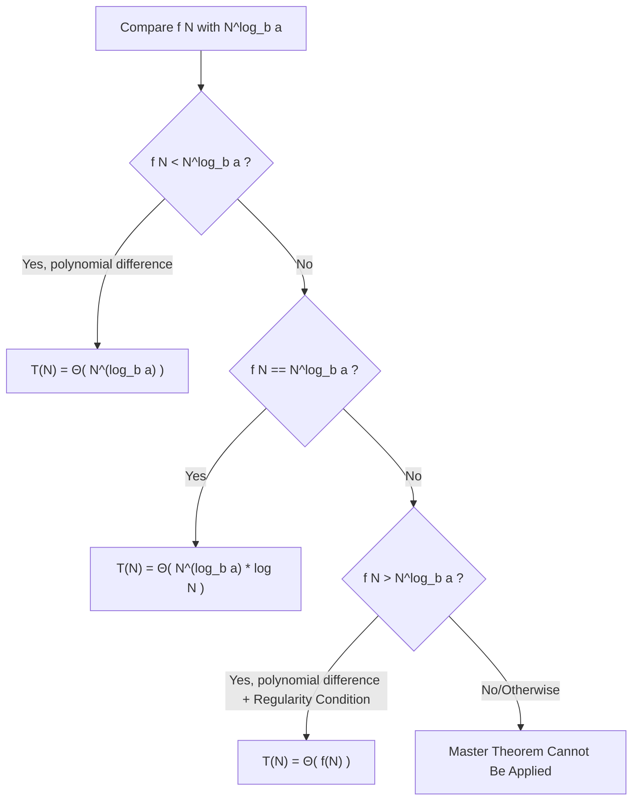
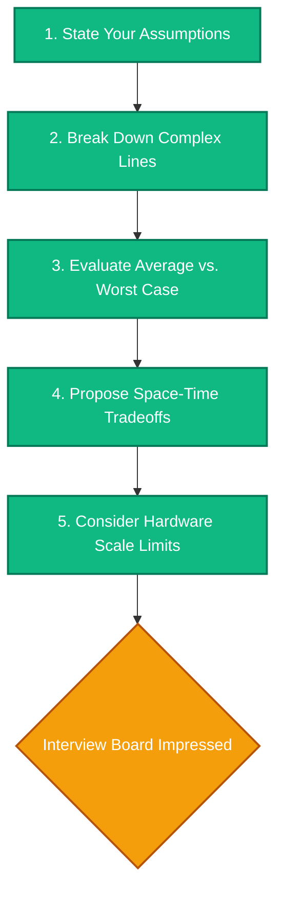

# Time and Space Asymptotic Complexity in Python

This document is a mathematically rigorous, deep-dive reference guide to algorithmic complexity analysis. It is designed to move beyond basic textbook definitions, exposing low-level CPU cache realities, CPython virtual machine memory structures, formal asymptotic proofs, and advanced analysis techniques (like amortized potential functions, Akra-Bazzi recurrences, computational complexity classes, and consistent hashing complexity).

---

# 1. The Big Picture & Concept Connections

Algorithmic analysis is the mathematical foundation of software engineering. It provides a machine-independent way to determine whether a given algorithm will scale to production workloads *before* committing CPU cycles or cloud budget.

```mermaid
flowchart TD
    %% Styling Definitions
    classDef root fill:#4F46E5,color:#FFFFFF,stroke:#312E81,stroke-width:3px,font-weight:bold;
    classDef math fill:#0EA5E9,color:#FFFFFF,stroke:#0369A1,stroke-width:2px,font-weight:bold;
    classDef hw fill:#F59E0B,color:#FFFFFF,stroke:#B45309,stroke-width:2px,font-weight:bold;
    classDef analysis fill:#10B981,color:#FFFFFF,stroke:#047857,stroke-width:2px,font-weight:bold;
    classDef box fill:#F8FAFC,color:#0F172A,stroke:#cbd5e1,stroke-width:1px;

    Root((Complexity Analysis)):::root
    
    %% Main Branches
    Math["1. Mathematical Prerequisites"]:::math
    Hardware["2. Hardware & RAM Models"]:::hw
    Methodologies["3. Analysis Methodologies"]:::analysis
    
    Root --> Math
    Root --> Hardware
    Root --> Methodologies
    
    %% Math Sub-concepts
    Math1["<b>Logarithms & Exponents</b><br/>• log_2(N): Binary search space reduction<br/>• Base change: Why bases are dropped in Big-O"]:::box
    Math2["<b>Algebraic Summations</b><br/>• Arithmetic Series: O(N²) loop sums<br/>• Geometric Series: O(N) tree level sums<br/>• Harmonic Series: O(N log N) sieve loops"]:::box
    Math3["<b>Recurrence Relations</b><br/>• Divide-and-conquer formulations<br/>• Induction & Substitution proofs<br/>• Akra-Bazzi generalized recurrences"]:::box
    
    Math --> Math1
    Math --> Math2
    Math --> Math3
    
    %% Hardware Sub-concepts
    HW1["<b>RAM Model of Computation</b><br/>• Unit-cost operations (arithmetic, read/write)<br/>• Violations of the model in real hardware"]:::box
    HW2["<b>Memory Hierarchies</b><br/>• L1/L2/L3 Cache levels (Latency: 1ns to 20ns)<br/>• Cache lines (64 bytes) and pre-fetching"]:::box
    HW3["<b>Locality of Reference</b><br/>• Spatial Locality: Traversing contiguous arrays<br/>• Temporal Locality: Reusing variables in loops"]:::box
    
    Hardware --> HW1
    Hardware --> HW2
    Hardware --> HW3
    
    %% Methodologies Sub-concepts
    AM1["<b>Asymptotic Notations</b><br/>• O (Upper), Ω (Lower), Θ (Tight)<br/>• o (Strict Upper), ω (Strict Lower)"]:::box
    AM2["<b>Amortized Analysis</b><br/>• Aggregate, Accounting, and Potential methods<br/>• CPython list dynamic array resizing proofs"]:::box
    AM3["<b>Recursion Tree & Master Theorem</b><br/>• Tree levels, leaf nodes, work-per-node sum<br/>• Standard Master Theorem cases and limits"]:::box
    
    Methodologies --> AM1
    Methodologies --> AM2
    Methodologies --> AM3
```



### Prerequisite Concepts in Mathematical Detail

#### A. Logarithms & Exponents
A logarithm answers the question: *To what exponent must we raise a base $b$ to obtain a value $N$?*
$$\log_b(N) = x \iff b^x = N$$
In computer science, we almost exclusively analyze algorithms in base 2 (binary logarithms, written as $\log N$ or $\log_2 N$), because binary decisions (halving the input) are the primary mechanism of efficient search and divide-and-conquer algorithms.

**Why Asymptotic Analysis Ignores the Logarithmic Base:**
By the change of base formula:
$$\log_a N = \frac{\log_b N}{\log_b a}$$
Since $a$ and $b$ are constants, the term $\frac{1}{\log_b a}$ is a constant scaling factor. In asymptotic analysis, all constant scaling factors are dropped (e.g., $O(c \cdot f(N)) = O(f(N))$). Thus, a logarithmic complexity in base 10, base $e$, or base 2 are all asymptotically identical:
$$O(\log_{10} N) = O\left(\frac{\log_2 N}{\log_2 10}\right) = O(\log_2 N)$$

#### B. Summation Algebra & Series Derivations
Summation notation is used to calculate the exact number of execution steps in nested loops or recursive iterations.

1.  **Arithmetic Series:**
    Occurs when the inner loop limits depend linearly on the outer loop index (e.g., step-by-step array comparisons).
    $$S_1 = \sum_{i=1}^{N} i = 1 + 2 + 3 + \dots + N = \frac{N(N+1)}{2} = \frac{N^2}{2} + \frac{N}{2} \approx \Theta(N^2)$$
    
    **Proof by Induction for Sum of Squares ($\sum i^2$):**
    We claim that:
    $$\sum_{i=1}^N i^2 = \frac{N(N+1)(2N+1)}{6}$$
    *   **Base Case ($N=1$):** $1^2 = \frac{1(2)(3)}{6} = 1$. The base case holds.
    *   **Inductive Step:** Assume it holds for $N = k$. We must show it holds for $N = k+1$:
        $$\sum_{i=1}^{k+1} i^2 = \left( \sum_{i=1}^k i^2 \right) + (k+1)^2 = \frac{k(k+1)(2k+1)}{6} + (k+1)^2$$
        Factor out $(k+1)$:
        $$(k+1) \left[ \frac{k(2k+1)}{6} + (k+1) \right] = (k+1) \left[ \frac{2k^2 + k + 6k + 6}{6} \right] = \frac{(k+1)(2k^2 + 7k + 6)}{6}$$
        Factoring $2k^2 + 7k + 6$ yields $(k+2)(2k+3)$:
        $$\sum_{i=1}^{k+1} i^2 = \frac{(k+1)(k+2)(2(k+1)+1)}{6}$$
        This matches the formula for $N = k+1$. $\blacksquare$

    **Proof by Induction for Sum of Cubes ($\sum i^3$):**
    We claim that:
    $$\sum_{i=1}^N i^3 = \left( \frac{N(N+1)}{2} \right)^2$$
    *   **Base Case ($N=1$):** $1^3 = \left(\frac{1(2)}{2}\right)^2 = 1^2 = 1$. The base case holds.
    *   **Inductive Step:** Assume it holds for $N = k$. We must show it holds for $N = k+1$:
        $$\sum_{i=1}^{k+1} i^3 = \left( \sum_{i=1}^k i^3 \right) + (k+1)^3 = \left( \frac{k(k+1)}{2} \right)^2 + (k+1)^3$$
        Factor out $(k+1)^2$:
        $$(k+1)^2 \left[ \frac{k^2}{4} + (k+1) \right] = (k+1)^2 \left[ \frac{k^2 + 4k + 4}{4} \right] = (k+1)^2 \frac{(k+2)^2}{4} = \left( \frac{(k+1)(k+2)}{2} \right)^2$$
        This matches the formula for $N = k+1$. $\blacksquare$
    
2.  **Geometric Series:**
    Occurs when counting the total nodes in a balanced recursion tree where each level multiplies the work.
    $$S_2 = \sum_{i=0}^{k} r^i = 1 + r + r^2 + \dots + r^k = \frac{r^{k+1} - 1}{r - 1}$$
    If $r = 2$ (a binary recursion tree of depth $k$):
    $$\sum_{i=0}^{k} 2^i = 2^{k+1} - 1 \approx O(2^k)$$
    If $r < 1$ (decreasing geometric series), the sum converges to a constant factor of its largest term, which is highly efficient.
    
3.  **Harmonic Series:**
    Occurs in sieve-like algorithms where step sizes increase inside nested loops.
    $$H_N = \sum_{i=1}^{N} \frac{1}{i} = 1 + \frac{1}{2} + \frac{1}{3} + \dots + \frac{1}{N} = \ln N + \gamma + O\left(\frac{1}{N}\right) \approx \Theta(log N)$$
    *(where $\gamma \approx 0.5772$ is the Euler-Mascheroni constant).*

    **Proof of Harmonic Bounds via Integration:**
    Since $f(x) = 1/x$ is a monotonically decreasing function, we can bound the sum using integrals:
    $$\int_{1}^{N+1} \frac{1}{x} dx \le \sum_{i=1}^{N} \frac{1}{i} \le 1 + \int_{1}^{N} \frac{1}{x} dx$$
    Evaluating the integrals yields:
    $$\ln(N+1) \le H_N \le 1 + \ln N$$
    Since both bounds grow logarithmically, $H_N = \Theta(\log N)$. $\blacksquare$

#### C. Limits and L'Hôpital's Rule
To compare the growth rates of two functions $f(N)$ and $g(N)$ as $N \to \infty$, we analyze:
$$L = \lim_{N \to \infty} \frac{f(N)}{g(N)}$$
If $L = \infty$, then $f(N)$ dominates $g(N)$ (i.e., $g(N) = o(f(N))$). If both terms tend to $\infty$, we can apply **L'Hôpital's Rule**, taking derivatives:
$$\lim_{N \to \infty} \frac{f(N)}{g(N)} = \lim_{N \to \infty} \frac{f'(N)}{g'(N)}$$

**Example Proof: Show $N^k = o(2^N)$ for any constant $k > 0$:**
We apply L'Hôpital's Rule repeatedly $k$ times:
$$\lim_{N \to \infty} \frac{N^k}{2^N} = \lim_{N \to \infty} \frac{k N^{k-1}}{2^N \ln 2} = \dots = \lim_{N \to \infty} \frac{k!}{( \ln 2 )^k 2^N} = 0$$
Since the limit converges to $0$, polynomial growth is strictly dominated by exponential growth. $\blacksquare$

#### D. Call Stack Memory Mechanics
When a thread calls a function, the operating system allocates a block of memory called an **activation record** (or **stack frame**) on the call stack. This frame stores:
*   Function parameters (arguments passed in).
*   Local variables declared inside the function.
*   The return address (instruction pointer to resume execution in the parent function).

```
High Memory Address
       +----------------------------+
       |   Parent Stack Frame       |
       +----------------------------+
       |   Local Variables          |
       |   Parameters               |  <-- Parent Frame
       |   Return Address           |
       +----------------------------+
       |   Child Stack Frame        |
       +----------------------------+
       |   Local Variables          |
       |   Parameters               |  <-- Active Frame (Currently executing)
       |   Return Address           |
       +----------------------------+
Low Memory Address
```

*   **Iteration vs. Recursion:** Iterative loops reuse the *same* stack frame over and over, modifying variables in-place ($O(1)$ auxiliary stack space). Recursive functions push a new stack frame onto the stack for every nested call.
*   **Depth Limit:** If a recursive algorithm calls itself $N$ times without returning, the call stack grows by $N$ frames. In CPython, the default stack depth limit is set to 1000. Going past this raises a `RecursionError` to prevent memory corruption (stack overflow).

---

# 2. Asymptotic Notation Rigor: The 1% Standard

Many software engineers hold the incorrect belief that "Big-O represents worst-case, Big-Omega represents best-case, and Big-Theta represents average-case." This is mathematically false. 

**Case Analysis** (Worst, Best, Average) and **Asymptotic Bounds** (Upper, Lower, Tight) are orthogonal concepts:
*   **Case Analysis** describes the scenario or *input configuration* (e.g., sorting an already sorted array vs. a reversed array).
*   **Asymptotic Bounds** are mathematical classes of functions used to describe the growth rate of the step-count function ($f(N)$) for a *given* scenario.

For instance, we can analyze the *best-case* runtime of Insertion Sort and state that it is asymptotically bounded by $O(N)$ (an upper bound on the best case) and $\Omega(N)$ (a lower bound on the best case), meaning it is tightly bounded by $\Theta(N)$.

---

## The Five Asymptotic Notations

Mathematically, let $f(N)$ and $g(N)$ be non-negative real-valued functions defined on the set of natural numbers.

```
       Step count f(N)
         ^
         |                    /  c * g(N) [Big-O: Upper Bound]
         |                  /
         |                 *   f(N) [Actual complexity function]
         |               /
         |             /
         |            /     *  c2 * h(N) [Big-Omega: Lower Bound]
         |          /
         +---------*----------------------------> Input Size N
                  n0  (Threshold where bounds hold true)
```

### 1. Big-O ($O$): Asymptotic Upper Bound
We write $f(N) = O(g(N))$ if there exist positive constants $c$ and $n_0$ such that:
$$0 \le f(N) \le c \cdot g(N) \quad \text{for all } N \ge n_0$$
*Intuition:* $f(N)$ grows no faster than $g(N)$ when $N$ gets large, up to a constant factor.

**Limit Definition:**
$$f(N) = O(g(N)) \iff \lim_{N \to \infty} \frac{f(N)}{g(N)} = L \quad \text{where } 0 \le L < \infty$$

---

### 2. Big-Omega ($\Omega$): Asymptotic Lower Bound
We write $f(N) = \Omega(g(N))$ if there exist positive constants $c$ and $n_0$ such that:
$$0 \le c \cdot g(N) \le f(N) \quad \text{for all } N \ge n_0$$
*Intuition:* $f(N)$ grows at least as fast as $g(N)$ when $N$ gets large.

**Limit Definition:**
$$f(N) = \Omega(g(N)) \iff \lim_{N \to \infty} \frac{f(N)}{g(N)} = L \quad \text{where } L > 0 \text{ (including } L = \infty\text{)}$$

---

### 3. Big-Theta ($\Theta$): Asymptotic Tight Bound
We write $f(N) = \Theta(g(N))$ if there exist positive constants $c_1, c_2,$ and $n_0$ such that:
$$0 \le c_1 \cdot g(N) \le f(N) \le c_2 \cdot g(N) \quad \text{for all } N \ge n_0$$
*Intuition:* $f(N)$ grows at the exact same rate as $g(N)$ (sandwiching it between two constant multipliers).

**Limit Definition:**
$$f(N) = \Theta(g(N)) \iff \lim_{N \to \infty} \frac{f(N)}{g(N)} = L \quad \text{where } 0 < L < \infty$$

---

### 4. Little-o ($o$): Strict Asymptotic Upper Bound
We write $f(N) = o(g(N))$ if for every positive constant $c > 0$, there exists a constant $n_0 > 0$ such that:
$$0 \le f(N) < c \cdot g(N) \quad \text{for all } N \ge n_0$$
*Intuition:* $f(N)$ grows strictly slower than $g(N)$ (equivalent to a "less-than" relation $<$).

**Limit Definition:**
$$f(N) = o(g(N)) \iff \lim_{N \to \infty} \frac{f(N)}{g(N)} = 0$$

---

### 5. Little-omega ($\omega$): Strict Asymptotic Lower Bound
We write $f(N) = \omega(g(N))$ if for every positive constant $c > 0$, there exists a constant $n_0 > 0$ such that:
$$0 \le c \cdot g(N) < f(N) \quad \text{for all } N \ge n_0$$
*Intuition:* $f(N)$ grows strictly faster than $g(N)$ (equivalent to a "greater-than" relation $>$).

**Limit Definition:**
$$f(N) = \omega(g(N)) \iff \lim_{N \to \infty} \frac{f(N)}{g(N)} = \infty$$

---

## Proofs of Asymptotic Properties

### Theorem 1: Transitivity of Big-O
*If $f(N) = O(g(N))$ and $g(N) = O(h(N))$, then $f(N) = O(h(N))$.*

**Proof:**
1.  By definition of $f(N) = O(g(N))$, there exist positive constants $c_1$ and $n_1$ such that:
    $$f(N) \le c_1 \cdot g(N) \quad \text{for all } N \ge n_1$$
2.  By definition of $g(N) = O(h(N))$, there exist positive constants $c_2$ and $n_2$ such that:
    $$g(N) \le c_2 \cdot h(N) \quad \text{for all } N \ge n_2$$
3.  Let $n_0 = \max(n_1, n_2)$. For all $N \ge n_0$, both inequalities hold true simultaneously. We can substitute the second inequality into the first:
    $$f(N) \le c_1 \cdot g(N) \le c_1 \cdot (c_2 \cdot h(N)) \quad \text{for all } N \ge n_0$$
4.  Simplifying the constants:
    $$f(N) \le (c_1 \cdot c_2) \cdot h(N) \quad \text{for all } N \ge n_0$$
5.  Let $c_3 = c_1 \cdot c_2$. Since $c_1$ and $c_2$ are positive constants, $c_3$ is a positive constant. Thus, we have:
    $$f(N) \le c_3 \cdot h(N) \quad \text{for all } N \ge n_0$$
    which matches the definition of $f(N) = O(h(N))$. $\blacksquare$

### Theorem 2: Equivalence of Theta
*$f(N) = \Theta(g(N)) \iff f(N) = O(g(N)) \text{ and } f(N) = \Omega(g(N))$.*

**Proof:**
*   **Direction 1 ($\Rightarrow$):** Assume $f(N) = \Theta(g(N))$. By definition, there exist positive constants $c_1, c_2,$ and $n_0$ such that:
    $$c_1 \cdot g(N) \le f(N) \le c_2 \cdot g(N) \quad \text{for all } N \ge n_0$$
    From this joint inequality, we can extract two separate inequalities:
    1.  $f(N) \le c_2 \cdot g(N)$ for all $N \ge n_0$, which proves $f(N) = O(g(N))$.
    2.  $c_1 \cdot g(N) \le f(N)$ for all $N \ge n_0$, which proves $f(N) = \Omega(g(N))$.
*   **Direction 2 ($\Leftarrow$):** Assume $f(N) = O(g(N))$ and $f(N) = \Omega(g(N))$.
    1.  Since $f(N) = O(g(N))$, there exist positive constants $c_A$ and $n_A$ such that $f(N) \le c_A \cdot g(N)$ for all $N \ge n_A$.
    2.  Since $f(N) = \Omega(g(N))$, there exist positive constants $c_B$ and $n_B$ such that $c_B \cdot g(N) \le f(N)$ for all $N \ge n_B$.
    3.  Let $n_0 = \max(n_A, n_B)$. For all $N \ge n_0$, both inequalities hold:
        $$c_B \cdot g(N) \le f(N) \le c_A \cdot g(N)$$
    4.  Setting $c_1 = c_B$ and $c_2 = c_A$, we satisfy the formal definition of $f(N) = \Theta(g(N))$. $\blacksquare$

---

# 3. Amortized Complexity Analysis

In standard complexity analysis, we look at the worst-case time of a *single* function call. However, this is often overly pessimistic when analyzing algorithms that perform an expensive cleanup or allocation step infrequently, while keeping the majority of calls extremely cheap. **Amortized Analysis** averages the time taken by a sequence of operations over the entire sequence.

> [!WARNING]
> Amortized complexity is NOT average-case complexity. Average-case analysis relies on probability distribution assumptions of inputs. Amortized complexity guarantees the average performance of a sequence of operations in the *worst-case* scenario, with no probability assumptions.

---

## The Three Formal Methods of Amortized Analysis

### 1. The Aggregate Method
We show that for a sequence of $k$ operations, the total worst-case time $T(k)$ is bounded. The amortized cost per operation is then:
$$T_{\text{amortized}} = \frac{T(k)}{k}$$
This method treats all operations equally, assigning them the same amortized cost.

---

### 2. The Accounting (Banker's) Method
We assign different "amortized costs" (charges) to different operations. 
*   If the amortized cost of an operation exceeds its actual physical cost, we store the excess difference as "credit" (deposited in a bank account associated with specific elements in the data structure).
*   If the actual cost of an operation exceeds its amortized cost, we withdraw credit from the bank account to pay for the expensive operation.
*   **Condition for Validity:** The total credit in the system must remain non-negative at all times:
    $$\sum_{i=1}^{k} a_i \ge \sum_{i=1}^{k} c_i$$
    *(where $a_i$ is the amortized cost, and $c_i$ is the actual cost of operation $i$).*

---

### 3. The Potential (Physicist's) Method
Instead of placing credits on individual elements, we represent the "credit" of the entire data structure as a single state-based mathematical value called a **Potential Function** ($\Phi$).
Let $D_0$ be the initial state of the data structure. Let $D_i$ be the state after the $i$-th operation, which has actual cost $c_i$. The amortized cost $a_i$ of the $i$-th operation is defined as:
$$a_i = c_i + \Phi(D_i) - \Phi(D_{i-1})$$
The total amortized cost for $k$ operations is:
$$\sum_{i=1}^{k} a_i = \sum_{i=1}^{k} \left( c_i + \Phi(D_i) - \Phi(D_{i-1}) \right) = \sum_{i=1}^{k} c_i + \Phi(D_k) - \Phi(D_0)$$
If we define a potential function such that $\Phi(D_k) \ge \Phi(D_0)$ for all states $D_k$, then:
$$\sum_{i=1}^{k} c_i \le \sum_{i=1}^{k} a_i$$
Thus, the sum of amortized costs is guaranteed to be a valid upper bound on the actual execution costs.

---

## Case Study 1: Python List Append (Dynamic Array Resizing)

In Python, lists are implemented as dynamic arrays (contiguous blocks of memory references). When elements are appended, the array eventually runs out of pre-allocated slots and must resize itself.

### CPython Memory Allocation Strategy
When resizing, CPython does not allocate just one extra slot (which would make every append take $O(N)$ time). Instead, it over-allocates memory to provide breathing room. The over-allocation formula in CPython (located in `Objects/listobject.c`) is:
$$\text{new\_allocated} = \text{size} + (\text{size} \gg 3) + (\text{size} < 9 ? 3 : 6)$$
This translates to a growth factor of roughly $1.125\times$ to $1.25\times$. Let's trace the allocation steps starting from an empty list:
*   Size 0: Allocated 0
*   Append 1st item: Resizes to 4 (allocated size is 4)
*   Append 2nd, 3rd, 4th item: Actual cost is $O(1)$ (slots already allocated)
*   Append 5th item: Resizes. New allocation = $4 + (4 \gg 3) + 3 = 4 + 0 + 3 = 7$.
*   Append 8th item: Resizes. New allocation = $7 + (7 \gg 3) + 3 = 7 + 0 + 3 = 10$.

```
CPython Array Expansion Timeline:
Slot Index:  0   1   2   3   4   5   6   7   8   9
Alloc 1:    [X] [ ] [ ] [ ]                         (Allocated: 4, Size: 1)
Alloc 2:    [X] [X] [X] [X]                         (Allocated: 4, Size: 4)
Alloc 3:    [X] [X] [X] [X] [X] [ ] [ ]             (Allocated: 7, Size: 5 - Resized!)
```

### Amortized Cost Proof: Append is $O(1)$

#### A. Proof via Accounting Method
Let the actual cost of writing an element into an empty pre-allocated slot be $1$ unit. Let the actual cost of a resize operation be $K$ units (copying $K$ elements from the old memory buffer to the new memory buffer).
1.  We charge an **amortized cost of 3 units** for every `list.append()` operation.
2.  When we append an element to the array:
    *   We spend $1$ unit of cost to physically write the item into the array slot.
    *   We save the remaining $2$ units of credit. We store $1$ unit on the newly added element, and we hand $1$ unit of credit to one of the older elements that has already been copied in the past but has no credits left.
3.  When the array reaches its capacity $N$ and must expand, it has exactly $N/2$ elements that have accumulated $2$ credits each since the last expansion. The total accumulated credit is:
    $$\text{Total Credit} = 2 \times \frac{N}{2} = N \text{ credits}$$
4.  The cost to resize and copy $N$ elements is exactly $N$ units of work. We can fully pay for this copying using the accumulated $N$ credits in our bank account.
5.  Since the credit balance never drops below zero, the amortized cost per append is bounded by the constant $3$, yielding $O(1)$ amortized complexity.

#### B. Proof via Potential Method
Let $S_i$ be the number of elements in the list after the $i$-th append, and $C_i$ be the total capacity (allocated size) of the list after the $i$-th append.
We define the Potential Function $\Phi$ as:
$$\Phi(D_i) = 2 \cdot S_i - C_i$$

*   **Property 1:** Initially, $S_0 = 0$ and $C_0 = 0$, so $\Phi(D_0) = 0$.
*   **Property 2:** Since the array is always at least half-full (except immediately after resizing to a size larger than 0, but $C_i \le 2 \cdot S_i$ always holds), we have $\Phi(D_i) \ge 0$ for all $i$.

We calculate the amortized cost $a_i$ of the $i$-th append. There are two cases:

**Case 1: The append does not trigger a resize (i.e., $S_i \le C_{i-1}$)**
Here, the actual cost $c_i = 1$ (simple memory write), and capacity remains unchanged ($C_i = C_{i-1}$).
$$a_i = c_i + \Phi(D_i) - \Phi(D_{i-1})$$
$$a_i = 1 + (2 \cdot S_i - C_i) - (2 \cdot S_{i-1} - C_{i-1})$$
Since $S_i = S_{i-1} + 1$ and $C_i = C_{i-1}$:
$$a_i = 1 + 2(S_{i-1} + 1) - C_i - 2 \cdot S_{i-1} + C_i = 1 + 2 = 3$$

**Case 2: The append triggers a resize (i.e., $S_{i-1} = C_{i-1}$)**
The capacity grows from $C_{i-1}$ to $C_i = 2 \cdot C_{i-1}$ (simplifying the factor to 2 for mathematical convenience).
The actual cost of the operation is $c_i = S_{i-1} + 1$ (copying $S_{i-1}$ elements + inserting the new element).
$$a_i = c_i + \Phi(D_i) - \Phi(D_{i-1})$$
$$a_i = (S_{i-1} + 1) + (2 \cdot S_i - C_i) - (2 \cdot S_{i-1} - C_{i-1})$$
Substitute $S_i = S_{i-1} + 1$ and $C_i = 2 \cdot C_{i-1} = 2 \cdot S_{i-1}$:
$$a_i = S_{i-1} + 1 + 2(S_{i-1} + 1) - 2 \cdot S_{i-1} - 2 \cdot S_{i-1} + S_{i-1}$$
$$a_i = S_{i-1} + 1 + 2 \cdot S_{i-1} + 2 - 4 \cdot S_{i-1} + S_{i-1}$$
$$a_i = (1 + 2 - 4 + 1)S_{i-1} + 3 = 0 \cdot S_{i-1} + 3 = 3$$

In both cases, the amortized cost is exactly $3$ steps. Thus, the amortized complexity of list append is $O(1)$. $\blacksquare$

---

## Case Study 2: Array Shrinking and the Thrashing Trap

If a dynamic array shrinks dynamically when elements are popped, a naive deallocation strategy can destroy performance stability.
*   **The Trap:** Shrink the array to half its capacity when it becomes less than half-full.
*   **Thrashing Scenario:** Consider a list at capacity $N$. We execute alternating operations: `append()`, `pop()`, `append()`, `pop()`, $\dots$
    *   The `append()` triggers a resize to $2N$. Time cost: $O(N)$ copies.
    *   The next `pop()` reduces size to $N-1$ (which is $< 2N/2$), triggering a shrink back to $N$. Time cost: $O(N)$ copies.
    *   The sequence of $k$ operations takes $O(k \cdot N)$ total time. The amortized cost per operation degrades to $O(N)$!

### The Solution: Hysteresis (Asymmetric Shrink Thresholds)
CPython lists solve this by deallocating lazily. They shrink only when the allocated size drops below half of the allocated capacity, and they shrink to a size slightly larger than the current active elements count:
```c
/* CPython list deallocation threshold */
if (size < allocated >> 1) {
    new_allocated = size + (size >> 3) + (size < 9 ? 3 : 6);
    // Resize memory downward
}
```
Because the shrink threshold and growth thresholds are separated by an asymmetric buffer (hysteresis), any resize operation is guaranteed to be followed by at least $\Omega(N)$ cheap $O(1)$ operations before another resize can be triggered, maintaining a valid $O(1)$ amortized cost.

---

# 4. The Core Complexity Classes & Python Internals

Different algorithms scale differently. The following table represents the key complexity classes, ordering them by efficiency.

| Class | Notation | Mathematical Growth Speed | CPython Implementation & Memory Internals |
| :--- | :--- | :--- | :--- |
| **Constant** | $O(1)$ | Flat line. Independent of input. | Index access in list (`arr[i]`), accessing value in set (`set_obj`), hash table insertions (average). |
| **Logarithmic** | $O(\log N)$ | Flattens quickly. Slow growth. | Binary Search. Splitting data blocks by constant factors. |
| **Square Root** | $O(\sqrt{N})$ | Slowly rising curve. | Bounded prime factor search (`while i * i <= n`). |
| **Linear** | $O(N)$ | Steady diagonal line. | Single list scan, copying list, summing items, string search (naive). |
| **Linearithmic** | $O(N \log N)$| Moderate growth. | Timsort (Python's sorting algorithm), Merge Sort, Heap Sort. |
| **Quadratic** | $O(N^2)$ | Sharp parabolic curve. | Nested iteration loops, Bubble Sort, pairwise matrix comparison. |
| **Cubic** | $O(N^3)$ | Extremely steep curve. | Floyd-Warshall all-pairs shortest path, naive matrix multiplication. |
| **Exponential** | $O(2^N)$ | Explosive growth. Unscalable. | Naive recursive Fibonacci, generating power set, recursive TSP. |
| **Factorial** | $O(N!)$ | Near-instant computer crash. | Generating permutations of a list, brute-force TSP. |
| **Double Exponential**| $O(2^{2^N})$ | Uncomputable for $N \ge 6$. | Complete structural analysis of certain parsing grammars. |

---

## Python Built-in Operations Complexity Matrix

As a 1% engineer, you must know the under-the-hood cost of the native Python functions. The following matrix shows average-case vs. worst-case complexities, explaining *why* they behave that way based on CPython implementation.

| Data Structure | Operation | Average Complexity | Worst Complexity | CPython Internal C-level Mechanism |
| :--- | :--- | :--- | :--- | :--- |
| **List** | `append()` | $O(1)$ (Amortized) | $O(N)$ | Resizes memory array, copying elements. Normal appends are O(1) writes. |
| **List** | `insert(0, val)` | $O(N)$ | $O(N)$ | Shifts all elements in memory array forward by one address pointer. |
| **List** | `pop(0)` | $O(N)$ | $O(N)$ | Shifts all elements backward by one address slot to keep memory contiguous. |
| **List** | `pop()` (End) | $O(1)$ | $O(1)$ | Decreases the list size reference tracker (`ob_size`) by 1. No memory shifting. |
| **List** | `x in list` | $O(N)$ | $O(N)$ | Linear pointer scan from start to end (calls `strcmp` or basic equality check). |
| **List** | `arr[a:b]` (Slice) | $O(k)$ | $O(k)$ | Copies $k = b - a$ object references to a newly allocated list memory segment. |
| **Dict** | `dict[key]` (Get) | $O(1)$ | $O(N)$ | Computes hash, maps to slot. Worst case occurs during dense hash collisions. |
| **Dict** | `in dict` | $O(1)$ | $O(N)$ | Probe hash table index. Linear scan only occurs if all keys crash into the same bucket. |
| **Set** | `set.add(val)` | $O(1)$ | $O(N)$ | Operates identically to dictionary (uses hash lookup table with dummy values). |
| **Set** | `s1 & s2` (Intersect) | $O(\min(len(s1), len(s2)))$ | $O(A \times B)$ | Scans the smaller set, querying containment inside the larger set. |
| **Set** | `s1 \| s2` (Union) | $O(len(s1) + len(s2))$ | $O(len(s1) + len(s2))$ | Creates a copy of `s1` and adds all elements of `s2` into the hash table. |
| **Deque** | `appendleft(val)`| $O(1)$ | $O(1)$ | Allocates a new block in doubly-linked list of fixed-size blocks (no shifting). |
| **Deque** | `popleft()` | $O(1)$ | $O(1)$ | Frees block pointer if block is empty. O(1) head pointer update. |
| **Heapq** | `heappush(h, x)` | $O(\log N)$ | $O(\log N)$ | Appends element to bottom of binary tree array, bubbles up ($O(\log N)$ steps). |
| **Heapq** | `heappop(h)` | $O(\log N)$ | $O(\log N)$ | Replaces head with last element, bubbles down to restore min-heap property. |
| **Heapq** | `heapify(lst)` | $O(N)$ | $O(N)$ | Implements Floyd's heap construction (bubbles down from bottom-up nodes). |

---

## CPython Internals: Raymond Hettinger's Compact Dictionary
Before Python 3.6, dictionaries were sparse hash tables consisting of an array of 24-byte entries containing:
`[hash_value, key_pointer, value_pointer]`
This wasted substantial memory because roughly 1/3 of the hash table remained empty to avoid excessive hash collisions.

In Python 3.6+, dictionaries transitioned to a compact layout:
1.  **Indices Array:** A small, sparse array of bytes (e.g., `[0, -1, 1, 2, -1, 3]`) representing hash buckets.
2.  **Entries Array:** A dense, packed array containing only active key-value entries:
    `[[hash0, k0, v0], [hash1, k1, v1], [hash2, k2, v2]]`

```
Old Structure (Sparse):
[Bucket 0: hash, key, val] -> [Bucket 1: Empty] -> [Bucket 2: hash, key, val]

New Structure (Compact):
Indices: [0, -1, 1, -1]   (Sparse byte array)
Entries: 0: [hash0, k0, v0]  (Packed contiguously)
         1: [hash1, k1, v1]
```

*   **Memory Impact:** Reduces dictionary memory footprint by 30% to 95%.
*   **Asymptotic Impact:** Retains $O(1)$ average query lookup time, but speeds up dictionary iteration (`for k, v in d.items()`) from scanning sparse tables to scanning contiguous memory blocks, improving cache efficiency.

---

# 5. Mathematical Series & Advanced Loop Analysis

## 1. Advanced Loop Counting Rules

### Case A: Multiplication / Division Increment
```python
def multiplicative_loop(n: int):
    i = 1
    while i < n:
        # Basic Operation
        i *= 3
```
*   **Step Calculation:** Let $k$ be the number of loop runs. The value of $i$ after $k$ runs is $3^k$. The loop terminates when $3^k \ge N$.
*   Solving for $k$:
    $$3^k = N \implies k = \log_3 N$$
*   Complexity: $O(\log N)$

---

### Case B: Decreasing Division Increment
```python
def division_loop(n: int):
    i = n
    while i > 1:
        # Basic Operation
        i //= 2
```
*   **Step Calculation:** $i$ values track as $N, N/2, N/4, \dots, N/2^k$. Loop terminates when $i \le 1$.
    $$\frac{N}{2^k} = 1 \implies 2^k = N \implies k = \log_2 N$$
*   Complexity: $O(\log N)$

---

### Case C: Nested Dependent Variable Steps
```python
def dependent_nested_loops(n: int):
    for i in range(n):
        for j in range(i * i):
            pass
```
*   **Step Calculation:** The outer loop executes $N$ times. For each iteration $i$, the inner loop executes $i^2$ times.
    $$\text{Total steps} = \sum_{i=1}^{N-1} i^2 = \frac{(N-1)(N)(2N-1)}{6} \approx \Theta(N^3)$$
*   Complexity: $O(N^3)$

---

### Case D: Harmonic Multiples Loop
```python
def harmonic_loop(n: int):
    for i in range(1, n):
        for j in range(i, n, i):
            # Inner loop increments by i on each iteration
```
*   **Step Calculation:**
    *   When $i=1$, inner loop runs $N$ times.
    *   When $i=2$, inner loop runs $N/2$ times.
    *   When $i=3$, inner loop runs $N/3$ times.
    *   Total iterations:
        $$T(N) = N + \frac{N}{2} + \frac{N}{3} + \dots + \frac{N}{N} = N \left( 1 + \frac{1}{2} + \frac{1}{3} + \dots + \frac{1}{N} \right)$$
    *   This is the Harmonic Series:
        $$T(N) = N \cdot H_N \approx N \log N$$
*   Complexity: $O(N \log N)$

---

## 2. Spatial Locality, CPU Caching, & The Cache Line Performance Trap

Asymptotic analysis assumes the **RAM Model of Computation**, which treats all memory access as equal-cost ($O(1)$). In modern computer architecture, this model fails due to the vast speed difference between registers/caches and system RAM.

```
+-------------------------------------------------------+
|  CPU Core                                             |
|  +--------------------+                               |
|  | Registers          | <--- Access time: < 0.5 ns     |
|  +--------------------+                               |
|  | L1 Cache (32 KB)   | <--- Access time: ~1 ns        |
|  +--------------------+                               |
|  | L2 Cache (512 KB)  | <--- Access time: ~4 ns        |
|  +--------------------+                               |
+-------------------------------------------------------+
|  L3 Cache (Shared, 16-64 MB)   <--- Access time: ~15 ns|
+-------------------------------------------------------+
|  System Memory (DRAM, 16-64 GB) <--- Access time: ~60 ns|
+-------------------------------------------------------+
```

When a CPU requests an address from RAM, it does not fetch just that single memory address. Instead, it reads a whole block of contiguous memory (typically **64 bytes**), called a **Cache Line**, into the L1 cache.
*   **Spatial Locality:** If you read index $0$ of an array, index $1, 2, 3$ are loaded into cache automatically. Accessing them is extremely fast (~1ns).
*   **Pointer Chasing in CPython:** In Python, a list is an array of memory address pointers to separate integer objects scattered around heap memory. Traversing it involves "pointer chasing," causing frequent cache misses.

### Benchmark: Row-Major vs. Column-Major Matrix Traversal
Row-major order reads elements contiguously. Column-major jumps by large stride intervals, breaking spatial locality and triggering massive cache-line misses.

```python
import time

def locality_test():
    size = 2000
    # Nested lists representing a 2000x2000 matrix
    matrix = [[1] * size for _ in range(size)]
    
    # 1. Row-Major Traversal (Contiguous memory access)
    start_row = time.perf_counter()
    row_sum = 0
    for r in range(size):
        for c in range(size):
            row_sum += matrix[r][c]
    row_time = time.perf_counter() - start_row
    
    # 2. Column-Major Traversal (Strided memory access, cache line jumps)
    start_col = time.perf_counter()
    col_sum = 0
    for c in range(size):
        for r in range(size):
            col_sum += matrix[r][c]
    col_time = time.perf_counter() - start_col
    
    print(f"Row-major: {row_time:.4f}s | Column-major: {col_time:.4f}s")
```
Even though both traversals perform exactly $2000^2 = 4,000,000$ additions (same asymptotic complexity $O(N^2)$), the Column-Major traversal takes significantly longer due to hardware cache line misses.

---

# 6. Recursion & Recurrence Relations

When an algorithm uses divide-and-conquer recursion, we model its execution steps using a **Recurrence Relation**.

---

## The Master Theorem

The Master Theorem provides a cookbook solution for recurrences of the form:
$$T(N) = a T\left(\frac{N}{b}\right) + f(N)$$
*   $N$: Size of the problem.
*   $a$: Number of subproblems in the recursion ($a \ge 1$).
*   $b$: Factor by which subproblem size is reduced ($b > 1$).
*   $f(N)$: Cost of the work done outside recursive calls (e.g., dividing and merging steps).

We compare the function $f(N)$ with the term $N^{\log_b a}$.



### The Three Master Cases

#### Case 1: Subproblems Dominate (Leaf heavy)
If $f(N) = O(N^{\log_b a - \epsilon})$ for some constant $\epsilon > 0$:
$$T(N) = \Theta\left(N^{\log_b a}\right)$$
*Explanation:* The cost of solving the subproblems at the leaves dominates the total cost.

---

#### Case 2: Balanced Work (Uniform tree)
If $f(N) = \Theta(N^{\log_b a})$:
$$T(N) = \Theta\left(N^{\log_b a} \cdot \log N\right)$$
*General Case 2 Expansion:* If $f(N) = \Theta(N^{\log_b a} \log^k N)$ for $k \ge 0$, then $T(N) = \Theta(N^{\log_b a} \log^{k+1} N)$.

---

#### Case 3: Partitioning / Merging Dominates (Root heavy)
If $f(N) = \Omega(N^{\log_b a + \epsilon})$ for some constant $\epsilon > 0$, and if $a \cdot f(N/b) \le c \cdot f(N)$ for some constant $c < 1$ and all sufficiently large $N$ (the Regularity Condition):
$$T(N) = \Theta(f(N))$$
*Explanation:* The work done at the root (dividing and merging) dominates the total cost.

---

### Worked Master Theorem Examples

#### Example 1: Merge Sort
$$T(N) = 2 T\left(\frac{N}{2}\right) + \Theta(N)$$
*   $a = 2$, $b = 2$, $f(N) = N^1$.
*   Compute $N^{\log_b a} = N^{\log_2 2} = N^1$.
*   Since $f(N) = N^1 = \Theta(N^1)$, we fall into **Case 2** (with $k=0$).
*   Result: $T(N) = \Theta(N \log N)$.

#### Example 2: Binary Search
$$T(N) = T\left(\frac{N}{2}\right) + \Theta(1)$$
*   $a = 1$, $b = 2$, $f(N) = N^0 = 1$.
*   Compute $N^{\log_b a} = N^{\log_2 1} = N^0 = 1$.
*   Since $f(N) = \Theta(1)$, we fall into **Case 2** (with $k=0$).
*   Result: $T(N) = \Theta(\log N)$.

#### Example 3: Strassen's Matrix Multiplication
$$T(N) = 7 T\left(\frac{N}{2}\right) + O(N^2)$$
*   $a = 7$, $b = 2$, $f(N) = N^2$.
*   Compute $N^{\log_b a} = N^{\log_2 7} \approx N^{2.81}$.
*   Compare $f(N) = N^2$ with $N^{2.81}$. Since $N^2 = O(N^{2.81 - \epsilon})$ for $\epsilon \le 0.81$, we fall into **Case 1**.
*   Result: $T(N) = \Theta(N^{\log_2 7}) \approx \Theta(N^{2.81})$.

#### Example 4: Karatsuba Integer Multiplication
$$T(N) = 3 T\left(\frac{N}{2}\right) + O(N)$$
*   $a = 3$, $b = 2$, $f(N) = N^1$.
*   Compute $N^{\log_b a} = N^{\log_2 3} \approx N^{1.58}$.
*   Since $f(N) = O(N^{1.58 - \epsilon})$ for $\epsilon \le 0.58$, we fall into **Case 1**.
*   Result: $T(N) = \Theta(N^{\log_2 3}) \approx \Theta(N^{1.59})$.

#### Example 5: Root-Heavy Recurrence
$$T(N) = 4 T\left(\frac{N}{2}\right) + N^3$$
*   $a = 4$, $b = 2$, $f(N) = N^3$.
*   Compute $N^{\log_b a} = N^{\log_2 4} = N^2$.
*   Compare $f(N) = N^3$ with $N^2$. Since $N^3 = \Omega(N^{2 + \epsilon})$ for $\epsilon = 1$, we check the **Regularity Condition**:
    $$a \cdot f\left(\frac{N}{b}\right) \le c \cdot f(N) \implies 4 \cdot \left(\frac{N}{2}\right)^3 = \frac{4 N^3}{8} = \frac{1}{2} N^3 \le c \cdot N^3$$
    This holds true for $c = 1/2 < 1$. Thus, we fall into **Case 3**.
*   Result: $T(N) = \Theta(N^3)$.

---

## The Akra-Bazzi Theorem (Beyond the Master Theorem)

When divide-and-conquer recurrences contain non-uniform subproblems (e.g., $T(N) = T(N/2) + T(N/4) + f(N)$), the Master Theorem fails. We apply the **Akra-Bazzi Theorem**.

### Theorem Statement
For a recurrence of the form:
$$T(N) = \sum_{i=1}^{k} a_i T(b_i N) + f(N)$$
where $a_i > 0$ and $0 < b_i < 1$ are constants, we first find the unique real number $p$ that satisfies:
$$\sum_{i=1}^{k} a_i b_i^p = 1$$
Once $p$ is determined, the asymptotic growth of $T(N)$ is given by:
$$T(N) = \Theta\left( N^p \left( 1 + \int_{1}^{N} \frac{f(u)}{u^{p+1}} du \right) \right)$$

### Worked Akra-Bazzi Example:
$$T(N) = T\left(\frac{N}{2}\right) + T\left(\frac{N}{4}\right) + N$$
*   $k = 2$, $a_1 = 1, b_1 = 1/2$, $a_2 = 1, b_2 = 1/4$, $f(N) = N$.
1.  **Find $p$:**
    $$a_1 b_1^p + a_2 b_2^p = 1 \implies 1 \cdot \left(\frac{1}{2}\right)^p + 1 \cdot \left(\frac{1}{4}\right)^p = 1$$
    Let $x = (1/2)^p$. Then:
    $$x + x^2 = 1 \implies x^2 + x - 1 = 0$$
    Using the quadratic formula:
    $$x = \frac{-1 \pm \sqrt{1 - 4(1)(-1)}}{2} = \frac{-1 + \sqrt{5}}{2} \approx 0.618 \quad (\text{Golden Ratio conjugate})$$
    Since $(1/2)^p \approx 0.618$:
    $$p = \log_{1/2}(0.618) \approx 0.694$$
2.  **Evaluate the integral:**
    $$T(N) = \Theta\left( N^p \left( 1 + \int_{1}^{N} \frac{u}{u^{p+1}} du \right) \right) = \Theta\left( N^p \left( 1 + \int_{1}^{N} u^{-p} du \right) \right)$$
    Since $p \approx 0.694 < 1$, integrating $u^{-p}$ yields:
    $$\int_{1}^{N} u^{-p} du = \left[ \frac{u^{1-p}}{1-p} \right]_1^N \approx \Theta(N^{1-p})$$
3.  **Combine terms:**
    $$T(N) = \Theta\left( N^p \left( 1 + N^{1-p} \right) \right) = \Theta\left( N^p + N^1 \right)$$
    Since $p \approx 0.694 < 1$, the linear term $N^1$ dominates.
    $$T(N) = \Theta(N)$$
*   **Result:** Time Complexity is $O(N)$.

---

## The Recursion Tree Method

For recurrences with uneven branching, we draw the recursion tree, find the cost at each level, and sum them.

### Case Study: Uneven Divide-and-Conquer
$$T(N) = T\left(\frac{N}{3}\right) + T\left(\frac{2N}{3}\right) + C N$$

```
                           CN                        Level 0: Cost = CN
                       /        \
                  C(N/3)        C(2N/3)              Level 1: Cost = CN
                 /      \       /      \
             C(N/9)  C(2N/9) C(2N/9)  C(4N/9)        Level 2: Cost = CN
```
*   **Cost at Level $d$:** Summing elements across level $d$ yields exactly $CN$.
*   **Tree Height:** The tree is unbalanced.
    *   The shortest path to a leaf is on the left: $N \to \frac{N}{3} \to \frac{N}{9} \to \dots \to 1 \implies \text{height} = \log_3 N$.
    *   The longest path is on the right: $N \to \frac{2N}{3} \to \frac{4N}{9} \to \dots \to 1 \implies \text{height} = \log_{3/2} N$.
*   **Total Work Bounds:**
    *   Lower Bound: The tree is completely full up to level $\log_3 N$.
        $$\text{Lower Bound} = C N \cdot \log_3 N = \Omega(N \log N)$$
    *   Upper Bound: The tree terminates at level $\log_{3/2} N$.
        $$\text{Upper Bound} = C N \cdot \log_{3/2} N = O(N \log N)$$
*   Since upper and lower bounds are asymptotically identical, the complexity is $\Theta(N \log N)$.

---

## Substitution Method (Inductive Proof)

We guess the complexity bound and use mathematical induction to prove it.

### Recurrence
$$T(N) = 2 T\left(\frac{N}{2}\right) + N \quad \text{for } N > 1, \quad T(1) = 1$$
We guess that $T(N) \le c N \log_2 N$ for a constant $c$.

#### Base Case
For $N=2$:
$$T(2) = 2 \cdot T(1) + 2 = 2(1) + 2 = 4$$
Our formula:
$$c \cdot 2 \log_2 2 = 2c$$
If we pick $c \ge 2$, then $T(2) \le 2c$ holds true.

#### Inductive Step
Assume the hypothesis holds for all values up to $k = N/2$. That is, $T(N/2) \le c \left(\frac{N}{2}\right) \log_2\left(\frac{N}{2}\right)$.
We substitute this assumption into the recurrence relation for $T(N)$:
$$T(N) = 2 T\left(\frac{N}{2}\right) + N$$
$$T(N) \le 2 \left( c \left(\frac{N}{2}\right) \log_2\left(\frac{N}{2}\right) \right) + N$$
$$T(N) \le c N \log_2\left(\frac{N}{2}\right) + N$$
Using the property of logarithms $\log(A/B) = \log A - \log B$:
$$T(N) \le c N (\log_2 N - \log_2 2) + N$$
$$T(N) \le c N (\log_2 N - 1) + N$$
$$T(N) \le c N \log_2 N - c N + N$$
$$T(N) \le c N \log_2 N - N(c - 1)$$
To satisfy our inductive guess $T(N) \le c N \log_2 N$, we require:
$$- N(c - 1) \le 0 \implies c \ge 1$$
Since our base case requires $c \ge 2$, any constant $c \ge 2$ validates our proof. Thus, $T(N) = O(N \log N)$. $\blacksquare$

---

## Tail Call Optimization (TCO) & Generator Trampolines in Python

### What is Tail Call Optimization (TCO)?
If a function returns the direct result of its recursive call without performing any further mathematical operations, it is in **tail-position**:
```python
def tail_recursive_factorial(n, accumulator=1):
    if n <= 1:
        return accumulator
    # Tail Call: recursive call is returned directly
    return tail_recursive_factorial(n - 1, n * accumulator)
```
In languages that support TCO (like Scheme or Scala), the compiler reuses the parent frame instead of allocating a new stack frame. This reduces recursive space complexity from $O(N)$ to $O(1)$.

### Why Python Does Not Support TCO
Guido van Rossum (creator of Python) explicitly rejected TCO in Python. His primary arguments are:
1.  **Debugging Tracebacks:** TCO destroys stack frames. If an exception occurs, the traceback history is lost, making debugging call stacks difficult.
2.  **Introspection:** Functions like `sys._getframe()` rely on call stack integrity.

### Implementing a Generator-Based Trampoline
We can bypass the stack frame depth limit in Python by yielding subproblems as generators.

```python
# Trampoline wrapper function
def trampoline(f):
    def wrapped(*args, **kwargs):
        g = f(*args, **kwargs)
        # Continue executing while the generator yields a recursive step
        while isinstance(g, tuple) and len(g) > 0 and callable(g[0]):
            g = g[0](*g[1], **g[2])
        return g
    return wrapped

# Trampolined Factorial (O(1) stack frames, handles N > 1000)
def factorial_trampoline_generator(n: int):
    def step(curr_n, acc):
        if curr_n <= 1:
            return acc
        # Instead of calling step(), we yield it as a tuple
        return step, (curr_n - 1, acc * curr_n), {}
    
    return trampoline(step)(n, 1)

if __name__ == "__main__":
    # Standard recursion would crash at N = 2000
    import sys
    sys.setrecursionlimit(1000)
    
    res = factorial_trampoline_generator(2000)
    print(f"Trampolined Factorial calculated successfully!")
```

---

# 7. Space Complexity & Memory Profiling

Space complexity measures the memory (RAM) allocated by an algorithm relative to input size $N$.

$$\text{Total Space Complexity} = \text{Input Space} + \text{Auxiliary Space}$$

*   **Input Space:** Memory occupied by the input variables.
*   **Auxiliary Space:** Extra memory allocated by the algorithm during execution (e.g., temporary variables, stack frames).

---

## Memory Layout of PyObject Headers in CPython

In low-level languages like C, a 64-bit integer takes exactly **8 bytes** of memory. In Python, everything is an object (wrapped in a C struct called `PyObject`).

### The Struct Structure of an Integer in CPython (`PyLongObject`)
```
+-------------------------------------------------+
| ob_refcnt (8 bytes)  - Reference count tracker  |
+-------------------------------------------------+
| ob_type   (8 bytes)  - Pointer to type object   |
+-------------------------------------------------+
| ob_size   (8 bytes)  - Size of digits array     |
+-------------------------------------------------+
| ob_digit  (4 bytes+) - Array of digit values    |
+-------------------------------------------------+
```
Total memory occupied by a single integer in Python is at least **28 bytes** (24 bytes header + 4 bytes digit).

### Dynamic Memory Allocation Benchmark
```python
import sys

# Get memory size of an empty list
empty_list = []
print(sys.getsizeof(empty_list))  # Output: 56 bytes (alloc overhead)

# List of 1,000,000 integers
# 1M pointers (8MB) + 1M PyInt Objects (28MB) = ~36 MB of memory
```

---

## Generator-Based Memory Optimization

If we process datasets sequentially, loading a large file or list into memory consumes $O(N)$ auxiliary space. We can optimize this to $O(1)$ space using **Generators**.

```python
# Out-of-place memory list mapping: O(N) Space
def square_numbers_list(n: int) -> list:
    result = []
    for i in range(n):
        result.append(i * i)  # Allocates list memory in heap
    return result

# In-place generator stream: O(1) Space
def square_numbers_generator(n: int):
    for i in range(n):
        yield i * i  # Suspends execution, returning item on request
```

---

# 8. Real-World Complexity Traps & Python Gotchas

## Gotcha 1: Quadratic String Concatenation
Since strings in Python are immutable, adding two strings together creates a new string copy.
```python
# Trap: O(N^2) Time Complexity
def naive_string_join(words: list) -> str:
    s = ""
    for w in words:
        s += w  # Copies entire string s on every single iteration
    return s

# Correct: O(N) Time Complexity
def optimized_string_join(words: list) -> str:
    return "".join(words)  # Calculates total size, pre-allocates buffer, copies once
```

---

## Gotcha 2: The Hidden $O(N)$ Copy in List Slicing
Slicing in Python does not return a "view" of the array. It copies the requested references to a new list.
```python
# Trap: O(N^2) naive binary search
def slow_binary_search(arr: list, target: int) -> bool:
    if not arr:
        return False
    mid = len(arr) // 2
    if arr[mid] == target:
        return True
    elif arr[mid] < target:
        # Slicing copies elements, taking O(N) time!
        return slow_binary_search(arr[mid+1:], target)
    else:
        return slow_binary_search(arr[:mid], target)
```

---

# 9. Practice Problems & Detailed Derivations

### Problem 1: Step Divisor Nested Loop
Determine the time complexity of the following code:
```python
def solve_p1(n: int):
    count = 0
    i = n
    while i > 0:
        for j in range(i):
            count += 1
        i //= 2
```

#### Step-by-Step Derivations:
*   The outer loop counter $i$ values are: $N, N/2, N/4, N/8, \dots, 1$.
*   For each step of $i$, the inner loop executes exactly $i$ times.
*   The total number of steps is the sum of these executions:
    $$\text{Total Steps} = N + \frac{N}{2} + \frac{N}{4} + \frac{N}{8} + \dots + 1$$
*   Factor out $N$:
    $$\text{Total Steps} = N \left( 1 + \frac{1}{2} + \frac{1}{4} + \frac{1}{8} + \dots + \frac{1}{N} \right)$$
*   The terms in the parentheses form a geometric series that converges:
    $$\sum_{k=0}^{\infty} \left(\frac{1}{2}\right)^k = 2$$
*   Therefore:
    $$\text{Total Steps} \le 2N \implies \Theta(N)$$
*   **Result:** Time Complexity is $O(N)$. Space Complexity is $O(1)$.

---

### Problem 2: Squaring Loop Index
Determine the time complexity of the following code:
```python
def solve_p2(n: int):
    count = 0
    i = 2
    while i < n:
        count += 1
        i = i * i
```

#### Step-by-Step Derivations:
*   Let $k$ be the number of loop iterations.
*   Trace the value of index variable $i$:
    *   $k = 0 \implies i = 2$
    *   $k = 1 \implies i = 2^2 = 4$
    *   $k = 2 \implies i = (2^2)^2 = 2^4 = 16$
    *   $k = 3 \implies i = (2^4)^2 = 2^8 = 256$
    *   After $k$ iterations, the value of $i$ is $2^{2^k}$.
*   The loop terminates when $i \ge N$:
    $$2^{2^k} = N$$
*   Take the logarithm base 2 of both sides:
    $$2^k = \log_2 N$$
*   Take the logarithm base 2 of both sides again:
    $$k = \log_2(\log_2 N)$$
*   **Result:** Time Complexity is $O(\log \log N)$. Space Complexity is $O(1)$.

---

### Problem 3: Double Nested Square Root Outer Loop
Determine the time complexity of the following code:
```python
def solve_p3(n: int):
    count = 0
    i = 1
    while i * i < n:
        for j in range(n):
            count += 1
        i += 1
```

#### Step-by-Step Derivations:
*   The outer loop runs while $i^2 < N$, which means it runs exactly $\sqrt{N}$ times.
*   The inner loop is independent of $i$. It runs exactly $N$ times for every single iteration of the outer loop.
*   Total operations:
    $$\text{Total Steps} = \sum_{i=1}^{\sqrt{N}} N = N \cdot \sqrt{N} = N^{1.5}$$
*   **Result:** Time Complexity is $O(N \sqrt{N})$ or $O(N^{1.5})$. Space Complexity is $O(1)$.

---

### Problem 4: Recurrence Tree for Triple Split
Solve the following recurrence relation:
$$T(N) = 3 T\left(\frac{N}{3}\right) + N \log N$$

#### Step-by-Step Derivations:
*   We check if we can apply the Master Theorem:
    *   $a = 3$, $b = 3$, $f(N) = N \log N$.
    *   Compute $N^{\log_b a} = N^{\log_3 3} = N^1$.
*   Compare $f(N) = N \log N$ with $N^1$.
    *   $f(N)$ is asymptotically larger than $N^1$, but is it *polynomially* larger?
    *   For polynomial difference, we need $f(N) = \Omega(N^{1 + \epsilon})$ for some $\epsilon > 0$.
    *   However, $\frac{N \log N}{N} = \log N$, which grows slower than any polynomial $N^{\epsilon}$.
*   Since the growth difference is logarithmic rather than polynomial, the standard Master Theorem Cases 1 and 3 do not apply.
*   We use the **Generalized Case 2** rule:
    *   If $f(N) = \Theta(N^{\log_b a} \log^k N)$ with $k \ge 0$, then $T(N) = \Theta(N^{\log_b a} \log^{k+1} N)$.
    *   Here, $N^{\log_b a} = N$, and $f(N) = N \log^1 N$ (so $k=1$).
    *   Applying the formula:
        $$T(N) = \Theta\left(N \log^{1+1} N\right) = \Theta\left(N \log^2 N\right)$$
*   **Result:** Time Complexity is $O(N \log^2 N)$.

---

### Problem 5: Array Reducer Pop
Determine the time complexity of the following code:
```python
def solve_p5(arr: list):
    n = len(arr)
    for i in range(n):
        arr.pop(0)
```

#### Step-by-Step Derivations:
*   The loop runs $N$ times.
*   Inside the loop, `arr.pop(0)` is executed.
*   As shown in the Python complexity matrix, popping the 0-th element of a CPython list forces all remaining elements to shift left by one index to maintain memory contiguity.
*   If list size is $K$, `pop(0)` takes $O(K)$ steps.
*   Total operations:
    $$\text{Total Steps} = N + (N - 1) + (N - 2) + \dots + 1 = \frac{N(N+1)}{2}$$
*   **Result:** Time Complexity is $O(N^2)$. Space Complexity is $O(1)$ auxiliary.

---

### Problem 6: Recursive Grid Traversal without Caching
Determine the time and space complexity of the following code:
```python
def solve_p6(r: int, c: int) -> int:
    if r == 0 or c == 0:
        return 1
    return solve_p6(r - 1, c) + solve_p6(r, c - 1)
```

#### Step-by-Step Derivations:
*   This represents a grid path-finding recursion without caching.
*   Every call to `solve_p6` spawns two recursive calls, creating a binary recursion tree.
*   The depth of the tree is $(r + c)$ because each step decrements either row index $r$ or column index $c$ by 1.
*   The total number of nodes in a binary tree of height $H = r + c$ is $2^H = 2^{r + c}$.
*   **Result:** Time Complexity is $O(2^{r + c})$. Space Complexity is $O(r + c)$ due to stack frame allocations along the deepest call path.

---

### Problem 7: Recursive Grid Traversal with Memoization
Determine the time and space complexity of the following memoized code:
```python
def solve_p7(r: int, c: int, memo: dict = None) -> int:
    if memo is None:
        memo = {}
    state = (r, c)
    if state in memo:
        return memo[state]
    if r == 0 or c == 0:
        return 1
    memo[state] = solve_p7(r - 1, c, memo) + solve_p7(r, c - 1, memo)
    return memo[state]
```

#### Step-by-Step Derivations:
*   With memoization, the algorithm solves each grid cell state $(i, j)$ exactly once.
*   The total unique states in the grid are $(r + 1) \times (c + 1) \approx r \cdot c$.
*   Subsequent calls for a previously solved state return in $O(1)$ hash table lookup time.
*   **Result:** Time Complexity is $O(r \cdot c)$. Space Complexity is $O(r \cdot c)$ to store resolved states in the hash dictionary, plus $O(r + c)$ stack frame memory depth.

---

### Problem 8: Standard Naive Merge Sort with Slice Copies
Determine the time and space complexity of this naive implementation:
```python
def naive_merge_sort(arr: list) -> list:
    if len(arr) <= 1:
        return arr
    mid = len(arr) // 2
    # Copying arrays via slicing
    left = naive_merge_sort(arr[:mid])
    right = naive_merge_sort(arr[mid:])
    return merge(left, right)

def merge(l: list, r: list) -> list:
    res = []
    i = j = 0
    while i < len(l) and j < len(r):
        if l[i] < r[j]:
            res.append(l[i])
            i += 1
        else:
            res.append(r[j])
            j += 1
    res.extend(l[i:])
    res.extend(r[j:])
    return res
```

#### Step-by-Step Derivations:
*   The recurrence relation is:
    $$T(N) = 2 T\left(\frac{N}{2}\right) + f(N)$$
*   Inside the function, before recursive calls, we slice the array: `arr[:mid]` and `arr[mid:]`.
*   Slicing copies half of the array, taking $O(N)$ operations.
*   Merging also takes $O(N)$ operations.
*   The total non-recursive work $f(N) = O(N)$.
*   Using Master Theorem Case 2: $T(N) = \Theta(N \log N)$.
*   **Space Complexity Analysis:**
    *   At each level of the recursion tree, we allocate slice arrays.
    *   The recursion tree has depth $\log N$. At the deepest level, the sum of all allocated temporary slices is $N$ elements.
    *   **Result:** Time Complexity is $O(N \log N)$. Space Complexity is $O(N)$ (requires allocation of temporary output buffers).

---

### Problem 9: Incremental Power Increment Loop
Determine the time complexity of the following code:
```python
def solve_p9(n: int):
    count = 0
    i = 1
    while i < n:
        for j in range(i):
            count += 1
        i *= 2
```

#### Step-by-Step Derivations:
*   The outer loop counter $i$ doubles on each step: $1, 2, 4, 8, \dots, 2^k$.
*   For each step, the inner loop runs exactly $i$ times.
*   The total number of execution steps is the sum of a geometric progression:
    $$\text{Total Steps} = 1 + 2 + 4 + 8 + \dots + 2^k$$
    *(where $2^k$ is the largest power of 2 less than $N$).*
*   The sum of this geometric series is:
    $$\sum_{j=0}^{k} 2^j = 2^{k+1} - 1$$
*   Since $2^k < N$, we have $2^{k+1} < 2N$.
*   Thus:
    $$\text{Total Steps} < 2N - 1 \implies O(N)$$
*   **Result:** Time Complexity is $O(N)$. Space Complexity is $O(1)$.

---

### Problem 10: Fibonacci Bottom-Up Space Complexity
Determine the time and space complexity of the iterative Fibonacci calculator:
```python
def solve_p10(n: int) -> int:
    if n <= 1:
        return n
    prev2, prev1 = 0, 1
    for i in range(2, n + 1):
        curr = prev1 + prev2
        prev2 = prev1
        prev1 = curr
    return prev1
```

#### Step-by-Step Derivations:
*   The loop runs from $2$ to $N$, which takes exactly $N-1$ iterations.
*   Only three variables (`prev2`, `prev1`, `curr`) are maintained in memory. No new heap structures or stack frames are created during the iteration.
*   **Result:** Time Complexity is $O(N)$. Space Complexity is $O(1)$.

---

### Problem 11: Complexity of the Sieve of Eratosthenes
Determine the time complexity of finding all prime numbers up to $N$.
```python
def sieve(n: int) -> list:
    is_prime = [True] * (n + 1)
    is_prime[0] = is_prime[1] = False
    for p in range(2, int(n**0.5) + 1):
        if is_prime[p]:
            for i in range(p * p, n + 1, p):
                is_prime[i] = False
    return [i for i in range(n + 1) if is_prime[i]]
```

#### Step-by-Step Derivations:
*   The outer loop runs up to $\sqrt{N}$. The inner loop is executed only if $p$ is prime.
*   For each prime $p$, the inner loop runs roughly $N/p$ times.
*   The total number of inner loop executions across all primes up to $N$ is:
    $$\text{Total Operations} \approx \sum_{p \le N} \frac{N}{p} = N \sum_{p \le N} \frac{1}{p}$$
*   By Mertens' Second Theorem, the sum of the reciprocals of prime numbers grows as:
    $$\sum_{p \le N} \frac{1}{p} = \ln(\ln N) + M + O\left(\frac{1}{\ln N}\right)$$
    *(where $M \approx 0.2614$ is the Meissel-Mertens constant).*
*   Therefore, the total time complexity is $O(N \log \log N)$.
*   **Result:** Time Complexity is $O(N \log \log N)$. Space Complexity is $O(N)$ to store the boolean state tracker.

---

### Problem 12: Disjoint Set (Union-Find) with Path Compression and Rank
What is the complexity of $M$ operations on a Union-Find structure with $N$ elements?
```python
class UnionFind:
    def __init__(self, n):
        self.parent = list(range(n))
        self.rank = [0] * n

    def find(self, i):
        # Path compression
        if self.parent[i] != i:
            self.parent[i] = self.find(self.parent[i])
        return self.parent[i]

    def union(self, i, j):
        root_i = self.find(i)
        root_j = self.find(j)
        if root_i != root_j:
            # Union by rank
            if self.rank[root_i] < self.rank[root_j]:
                self.parent[root_i] = root_j
            elif self.rank[root_i] > self.rank[root_j]:
                self.parent[root_j] = root_i
            else:
                self.parent[root_j] = root_i
                self.rank[root_i] += 1
```

#### Step-by-Step Derivations:
*   When using both **Path Compression** and **Union by Rank/Size**, the amortized cost per operation is bounded by $O(\alpha(N))$.
*   $\alpha(N)$ is the **Inverse Ackermann Function**. It grows so slowly that for any practical input $N$ (even $N = 10^{600}$, which is larger than the number of atoms in the observable universe), we have:
    $$\alpha(N) \le 4$$
*   Therefore, in practice, Union-Find operations run in amortized constant time $O(1)$.
*   **Result:** Time Complexity is $O(M \cdot \alpha(N)) \approx O(M)$ amortized. Space Complexity is $O(N)$.

---

### Problem 13: Median of Medians Selection Algorithm
Solve the recurrence for the deterministic linear selection algorithm:
$$T(N) = T\left(\frac{N}{5}\right) + T\left(\frac{7N}{10}\right) + C N$$

#### Step-by-Step Derivations:
*   The algorithm divides $N$ elements into groups of 5. It finds the median of each group ($O(N)$ cost), then calls itself recursively to find the median of the medians: $T(N/5)$.
*   It partitions the array around this pivot. In the worst case, the size of the larger partition is at most $7N/10$. This triggers the second recurrence call: $T(7N/10)$.
*   We check if the sum of subproblem coefficients is less than 1:
    $$\frac{1}{5} + \frac{7}{10} = \frac{2}{10} + \frac{7}{10} = \frac{9}{10} < 1$$
*   Using Akra-Bazzi or solving the recursion tree:
    *   Since $1/5 + 7/10 < 1$, the work at the root ($CN$) dominates the recursive subproblems.
    *   Level 0 work: $CN$.
    *   Level 1 work: $C(N/5) + C(7N/10) = \frac{9}{10} CN$.
    *   Level 2 work: $\left(\frac{9}{10}\right)^2 CN$.
    *   Summing levels:
        $$\text{Total Cost} = C N \sum_{i=0}^{\infty} \left(\frac{9}{10}\right)^i = C N \left(\frac{1}{1 - 0.9}\right) = 10 C N \implies \Theta(N)$$
*   **Result:** Time Complexity is $O(N)$. Space Complexity is $O(N)$ due to stack frames.

---

### Problem 14: Balanced Segment Tree Construction and Range Query
Analyze the time complexity of building a Segment Tree and executing a range sum query.
```python
class SegmentTree:
    def __init__(self, arr):
        self.n = len(arr)
        self.tree = [0] * (4 * self.n)
        self.build(arr, 0, 0, self.n - 1)

    def build(self, arr, node, start, end):
        if start == end:
            self.tree[node] = arr[start]
            return
        mid = (start + end) // 2
        self.build(arr, 2 * node + 1, start, mid)
        self.build(arr, 2 * node + 2, mid + 1, end)
        self.tree[node] = self.tree[2 * node + 1] + self.tree[2 * node + 2]

    def query(self, node, start, end, l, r):
        if r < start or end < l:
            return 0
        if l <= start and end <= r:
            return self.tree[node]
        mid = (start + end) // 2
        p1 = self.query(2 * node + 1, start, mid, l, r)
        p2 = self.query(2 * node + 2, mid + 1, end, l, r)
        return p1 + p2
```

#### Step-by-Step Derivations:
*   **Build operation:** The tree is binary, built from $N$ leaf nodes. The recurrence is $T(N) = 2T(N/2) + O(1)$, which yields $O(N)$ total operations.
*   **Query operation:** A range query $[l, r]$ splits the tree. At any level of the segment tree, we visit at most 4 nodes. Since the height of the tree is bounded by $\log_2 N$, the query visits at most $4 \log_2 N$ nodes.
*   **Result:** Build is $O(N)$. Query is $O(\log N)$. Space Complexity is $O(N)$ (the tree array consumes $4N$ slots).

---

### Problem 15: Segment Tree Point Update
Analyze point updates in a segment tree:
```python
    def update(self, node, start, end, idx, val):
        if start == end:
            self.tree[node] = val
            return
        mid = (start + end) // 2
        if start <= idx <= mid:
            self.update(2 * node + 1, start, mid, idx, val)
        else:
            self.update(2 * node + 2, mid + 1, end, idx, val)
        self.tree[node] = self.tree[2 * node + 1] + self.tree[2 * node + 2]
```

#### Step-by-Step Derivations:
*   An update target index `idx` lies in either the left sub-tree or the right sub-tree.
*   Thus, the recursion does not branch; it traverses a single path down to the leaf node.
*   The path length is equal to the tree height: $\log_2 N$.
*   **Result:** Time Complexity is $O(\log N)$. Space Complexity is $O(\log N)$ stack frames.

---

### Problem 16: Kruskal's Minimum Spanning Tree Algorithm
Analyze the time complexity of Kruskal's MST algorithm for a graph $G = (V, E)$.
```python
def kruskal(vertices: int, edges: list) -> list:
    # edges list contains tuples: (weight, u, v)
    edges.sort()  # Sort edges by weight
    uf = UnionFind(vertices)
    mst = []
    for weight, u, v in edges:
        if uf.find(u) != uf.find(v):
            uf.union(u, v)
            mst.append((u, v, weight))
    return mst
```

#### Step-by-Step Derivations:
*   **Edge Sorting:** Sorting $|E|$ edges takes $O(|E| \log |E|)$ comparisons. Since $|E| \le |V|^2$ in simple graphs, $\log |E| \le 2 \log |V| = \Theta(\log |V|)$. Thus, sorting takes $O(|E| \log |V|)$ time.
*   **Disjoint Set Operations:** For each edge in the sorted list, we perform two `find()` operations and possibly one `union()` operation. In total, we do $O(|E|)$ Union-Find operations. Using path compression and union by rank, this takes $O(|E| \cdot \alpha(|V|))$ operations.
*   **Sum of Costs:**
    $$\text{Total Time} = O(|E| \log |V| + |E| \cdot \alpha(|V|))$$
    Since $\alpha(|V|)$ grows much slower than $\log |V|$, the sorting step dominates.
*   **Result:** Time Complexity is $O(|E| \log |V|)$ (or $O(|E| \log |E|)$). Space Complexity is $O(|V|)$ to maintain the disjoint set.

---

### Problem 17: Dijkstra's Single-Source Shortest Path Algorithm
Compare the complexity of Dijkstra's algorithm using a Binary Heap vs. a Fibonacci Heap.

#### Step-by-Step Derivations:
Dijkstra's algorithm performs three primary graph operations:
1.  **Insert all vertices** into the priority queue: executed $|V|$ times.
2.  **Extract-Min** (fetch closest unvisited node): executed $|V|$ times.
3.  **Decrease-Key** (relax adjacent edges and update distance): executed at most $|E|$ times.

*   **Case A: Binary Heap Priority Queue**
    *   Insert: $O(\log |V|)$ time.
    *   Extract-Min: $O(\log |V|)$ time.
    *   Decrease-Key: $O(\log |V|)$ time.
    *   Total Complexity:
        $$\text{Total} = |V| \cdot O(\log |V|) + |E| \cdot O(\log |V|) = O((|V| + |E|) \log |V|)$$
*   **Case B: Fibonacci Heap Priority Queue**
    *   Insert: $O(1)$ amortized time.
    *   Extract-Min: $O(\log |V|)$ amortized time.
    *   Decrease-Key: $O(1)$ amortized time (this is why Fibonacci Heaps exist!).
    *   Total Complexity:
        $$\text{Total} = |V| \cdot O(\log |V|) + |E| \cdot O(1) = O(|E| + |V| \log |V|)$$

#### Practical 1% Engineer Takeaway:
Although Fibonacci Heaps yield a better theoretical time complexity for dense graphs ($|E| \approx |V|^2$), they are almost **never used in practice**. Fibonacci Heap operations have massive constant factors and complex pointer manipulation overhead that make them slower than Binary Heaps for all realistic graphs.

---

# 10. Computational Complexity Theory: The P vs. NP Spectrum

Top software engineers know when to stop trying to optimize an exact solution because a problem is mathematically intractable.

```
       PSPACE (Polynomial Space) - e.g., Chess, QBF
         |
      NP-Hard (At least as hard as NP-Complete) - e.g., Halting Problem
         |
      NP-Complete (Hardest verification class) - e.g., 3-SAT, TSP
         |
      NP (Nondeterministic Polynomial verification) - e.g., Subset Sum
         |
      P (Deterministic Polynomial solution) - e.g., Shortest Path
```

### 1. The Complexity Classes

#### A. Class P (Polynomial Time)
Problems that can be solved on a deterministic Turing machine (a standard computer CPU) in time $O(N^k)$ for some constant $k$.
*   *Examples:* Shortest path (Dijkstra), Primality testing (AKS), Matrix multiplication.

#### B. Class NP (Nondeterministic Polynomial Time)
Decision problems where a candidate solution (certificate) can be *verified* in polynomial time, even if finding the solution initially is difficult.
*   *Examples:* Sudoku puzzle verification, Subset Sum (checking if a subset adds up to zero).

#### C. NP-Complete
The hardest problems in NP. A problem $X$ is NP-Complete if:
1.  $X$ is in NP.
2.  Every problem in NP can be reduced to $X$ in polynomial time.
*   *If P $\neq$ NP:* NP-Complete problems require exponential time in the worst case. If you find a polynomial solution for just one NP-Complete problem, you prove P = NP, solving computer science's greatest mystery.
*   *Examples:* 3-SAT, Traveling Salesperson decision problem, Knapsack problem, Graph Coloring.

#### D. NP-Hard
Problems that are at least as hard as the hardest problems in NP, but do not need to be in NP (they do not need to be decision problems with yes/no answers).
*   *Examples:* The halting problem, optimization version of Traveling Salesperson.

#### E. PSPACE
Problems that can be solved using memory space bounded by a polynomial $O(N^k)$, regardless of the execution time complexity.
*   *Examples:* Finding the optimal move in Chess or Go, solving Quantified Boolean Formulas (QBF).

### 2. The Practical Software Engineering Takeaway
If you are asked to write an algorithm to find the absolute shortest route to visit 50 client offices (Traveling Salesperson Optimization), recognizing that the problem is NP-Hard prevents you from writing a naive nested loop that will run for billions of years ($O(N!)$).

Instead, you immediately pivot to:
1.  **Approximation Algorithms:** algorithms that run in polynomial time and are guaranteed to be within a certain ratio of the optimal solution (e.g., Christofides' 1.5-approximation for TSP).
2.  **Heuristics:** algorithms that find good solutions quickly but have no mathematical guarantees (e.g., Simulated Annealing, Genetic Algorithms, 2-Opt local search).
3.  **Solvers:** using highly optimized Integer Linear Programming (ILP) or SAT solvers (like Gurobi or Z3).

---

# 11. System Design Scale & Distributed Complexity

Large-scale applications process datasets that cannot fit in a single machine's RAM. We must extend complexity models to distributed systems.

---

## 1. Consistent Hashing
In distributed cache systems (like Memcached), Consistent Hashing maps keys to database servers on a logical ring.

```
Consistent Hashing Ring Layout:
         [Server A (V-Node 0)]  at angle 45°
              /         \
   [Key 2]   /           \   [Key 1]
            |             |
  [Server C (V-Node 2)]  [Server B (V-Node 1)] at angle 180°
             \           /
              \         /
         [Server A (V-Node 3)] at angle 270°
```

*   **Virtual Nodes ($V$):** To ensure uniform balance, each physical server is represented by multiple virtual nodes on the ring.
*   **Query Lookup:** To find which server holds key $K$:
    1.  Compute hash $H = \text{hash}(K)$.
    2.  Find the closest virtual node index on the ring that is $\ge H$.
    3.  This is done via Binary Search on the sorted ring array containing $V$ virtual nodes.
*   **Complexity:**
    *   Lookup: $O(\log V)$ where $V = \text{physical\_servers} \times \text{virtual\_nodes\_per\_server}$.
    *   Node Addition/Removal: Requires redistributing $O(N/P)$ keys (where $N$ is total keys and $P$ is physical servers), which is far superior to standard mod-based hashing ($O(N)$ redistribution).

---

## 2. External Merge Sort (Disk Out-of-Core Sorting)
When sorting 10TB of data on a machine with 64GB of RAM, we cannot use quicksort or Timsort directly because the data cannot fit in memory. We must use **External Merge Sort**.

```
Pass 1: Read 64GB chunks, sort in memory using Timsort, write sorted runs to disk.
[ 64GB Run 1 ] [ 64GB Run 2 ] ... [ 64GB Run 160 ]

Pass 2: Load head blocks of all runs, merge using Min-Heap, stream output to disk.
Run 1  Head Block -> [ Min-Heap ] -> Sorted Output Stream (Disk)
Run 2  Head Block -> [  Size:  ]
Run 160 Head Block -> [  160   ]
```

*   **Algorithm Steps:**
    1.  **Run Generation:** Read 64GB chunks of data, sort in memory, and write them back to disk as $M$ sorted files (runs).
    2.  **Multi-way Merge:** Load the first block of all $M$ runs into memory. Use a Min-Heap of size $M$ to continuously stream the smallest elements to the final output file, reading subsequent blocks from disk as runs empty.
*   **Complexity:**
    *   Let $B$ be the block size, and $M$ be the memory limit.
    *   I/O Complexity: $O\left( \frac{N}{B} \log_{M/B} \left(\frac{N}{M}\right) \right)$ disk reads/writes.
    *   CPU Time Complexity: $O(N \log N)$ comparisons.

---

# 12. Interview Strategy: Communicating Like a Top 1% Engineer

During technical interviews, resolving time and space complexity is not just about shouting out a final Big-O class. Interviewers evaluate your system-level thinking and communication patterns.



### The 1% Playbook

1.  **State Your Assumptions Explicitly:**
    Before giving the complexity, state what $N$ represents (e.g., "Assuming $N$ is the number of rows, and $M$ is the number of columns...").
2.  **State the Big-O Bounds of Built-ins:**
    Show you know what happens under the hood. Instead of writing code and calling it O(N), call out the CPython cost: *"Since we are executing a membership check `x in list` inside the loop, that line introduces an $O(k)$ linear scan at the C-level, shifting our total time to quadratic."*
3.  **Differentiate Average-Case and Worst-Case Scenarios:**
    Especially when discussing hash-map lookups or quicksort partitions. Explain that hash maps are $O(1)$ average-case, but can degrade to $O(N)$ if hash collisions occur.
4.  **Introduce Space-Time Trade-offs Early:**
    Proactively present options: *"We can solve this in-place using $O(1)$ auxiliary space at the cost of $O(N^2)$ time, or optimize time to $O(N)$ by caching elements inside a Set, which will consume $O(N)$ memory."*
5.  **Address Scale and Out-of-Core Processing Constraints:**
    Demonstrate real-world engineering pragmatism. Ask what happens if the input size exceeds RAM: *"If this list grows to 500 million records, it will not fit in the call stack or RAM. We should transition from recursive array copies to a generator-based stream, processing chunks iteratively to maintain an $O(1)$ active memory footprint."*
