# Linear Search in Python: Complete Mastery Guide

This document is a comprehensive, curriculum-grade study guide to **Linear Search** and its related pattern variations. It covers array and string scanning, low-level boundary check optimizations (Sentinel Search), multi-dimensional matrix search, optimal double selection, remainder maps, and two-pointer difference algorithms.

---

# 1. The Big Picture & Concept Connections

Searching is the fundamental operation of retrieving a specific record or validating the presence of a value within a collection. Linear Search is the simplest, most intuitive search strategy: it scans elements sequentially from start to end until a match is found.

```mermaid
flowchart TD
    %% Styling Definitions
    classDef root fill:#4F46E5,color:#FFFFFF,stroke:#312E81,stroke-width:3px,font-weight:bold;
    classDef concepts fill:#0EA5E9,color:#FFFFFF,stroke:#0369A1,stroke-width:2px,font-weight:bold;
    classDef variant fill:#10B981,color:#FFFFFF,stroke:#047857,stroke-width:2px,font-weight:bold;
    classDef box fill:#F8FAFC,color:#0F172A,stroke:#cbd5e1,stroke-width:1px;

    Root((LINEAR SEARCH)):::root
    
    %% Main Branches
    Concepts["1. Core Concepts"]:::concepts
    Optimizations["2. Optimizations"]:::concepts
    Variants["3. Advanced Variants"]:::concepts
    
    Root --> Concepts
    Root --> Optimizations
    Root --> Variants
    
    %% Sub-concepts
    Concepts1["<b>Sequential Scanning</b><br/>• Scan index by index (O(N) time)<br/>• Average check count: N / 2"]:::box
    Concepts2["<b>Array vs. String</b><br/>• contiguous memory traversal<br/>• character sequence matching"]:::box
    Concepts3["<b>Real-Life Analogy</b><br/>• Finding a card in an unsorted deck<br/>• Scanning a page for a name"]:::box
    
    Concepts --> Concepts1
    Concepts --> Concepts2
    Concepts --> Concepts3
    
    %% Optimizations
    Opt1["<b>Sentinel Linear Search</b><br/>• Places target at the array's end<br/>• Eliminates loop boundary checks"]:::box
    Opt2["<b>Two-Pointer Traversals</b><br/>• Scanning from both ends simultaneously<br/>• Valid Difference Pairs in O(N) time"]:::box
    
    Optimizations --> Opt1
    Optimizations --> Opt2
    
    %% Advanced Variants
    Var1["<b>Min-Max Pair Selection</b><br/>• Naive: 2N - 2 comparisons<br/>• Optimal: 1.5N - 2 using element pairs"]:::box
    Var2["<b>Remainder Mapping</b><br/>• Count pairs with sum divisible by K<br/>• Frequency hashing reduces O(N²) to O(N)"]:::box
    Var3["<b>K-th Occurrence Search</b><br/>• Tracking search counts in streams"]:::box
    
    Variants --> Var1
    Variants --> Var2
    Variants --> Var3
```



### Prerequisite Concepts
Before diving into Linear Search, ensure you are comfortable with:
*   **Asymptotic Bounds ($O(1)$ and $O(N)$):** Understanding constant time operations (index access) vs. linear loops.
*   **Loop Control Statements:** Iteration using `for` and `while` loops, and termination keywords (`break`, `return`).
*   **Python Sequentials:** Accessing and indexing lists and strings.

### Dependent Concepts
The search principles established here directly build toward:
*   **Binary Search:** Upgrading search complexity to $O(\log N)$ on sorted data.
*   **Two-Pointer Patterns:** Using multiple indices to traverse arrays from both directions.
*   **Hash-Map Hashing:** Speeding up search lookup times to $O(1)$ average.

---

# 2. Concept 1: What is Linear Search? (The Basics)

## Definition
**Linear Search** (also known as sequential search) is a method for finding a target value within a list by examining each element sequentially from index $0$ to $N - 1$ until a match is found or the end of the collection is reached.

---

## Intuition
Imagine you have a shuffled deck of cards and you are looking for the Ace of Spades. Because the cards are unsorted, looking at the middle card does not tell you whether to look left or right. Your only logical option is to look at the cards one by one, from top to bottom, until you find the Ace of Spades.
*   If the Ace is the first card, you find it immediately ($1$ comparison).
*   If it is the last card (or not in the deck), you must check every card ($N$ comparisons).

---

## Detailed Explanation
In computer systems, a list (array) is stored in contiguous memory addresses. A linear search starts a pointer at the base address of the list and increments the pointer by the size of the data type on each iteration, comparing the dereferenced value with the target.

```
Array: [ 4 | 2 | 7 | 1 | 9 | 3 ]   Target: 1
Index:   0   1   2   3   4   5

Step 1: Check Index 0 (Val 4) -> No Match
Step 2: Check Index 1 (Val 2) -> No Match
Step 3: Check Index 2 (Val 7) -> No Match
Step 4: Check Index 3 (Val 1) -> Match Found! Return index 3.
```

---

## Python Implementations & Source Code Links
The complete source code for standard array, string, and matrix searches is located in [5_1_linear_search.py](file:///d:/study/dsa_with_python/1_Arrays/5_1_linear_search.py).

### 1. Standard Array Search
Searches a python list for a target value.
```python
def linear_search_array(arr: list, target) -> int:
    for idx in range(len(arr)):
        if arr[idx] == target:
            return idx
    return -1
```

### 2. Standard Character String Search
Strings are sequences of characters. We scan index by index:
```python
def linear_search_string(s: str, target: str) -> int:
    for idx in range(len(s)):
        if s[idx] == target:
            return idx
    return -1
```

### 3. Linear Search in 2D Array (Matrix)
When searching a two-dimensional grid, we must scan row-by-row and column-by-column:
```python
def linear_search_2d(matrix: list, target) -> tuple:
    for r in range(len(matrix)):
        for c in range(len(matrix[r])):
            if matrix[r][c] == target:
                return (r, c)
    return (-1, -1)
```

---

## Complexity Analysis
*   **Time Complexity:**
    *   **Best Case:** $O(1)$ (target is at index 0).
    *   **Worst Case:** $O(N)$ (target is at the last index or not present).
    *   **Average Case:** $O(N)$ (on average, we scan half the list: $N/2$ checks).
*   **Space Complexity:** $O(1)$ auxiliary (only uses loop counter variables).

---

## Advantages & Disadvantages
### Advantages
*   **Zero prerequisites:** Does not require the data to be sorted.
*   **Simplicity:** Trivial to write and debug.
*   **Memory efficient:** Runs in-place with no extra heap allocation.
*   **Fast for small N:** Low constant overhead; can beat $O(\log N)$ binary search for tiny lists (e.g., $N < 10$) due to CPU branch prediction.

### Disadvantages
*   **Unscalable:** Extremely slow for large lists ($N > 10^5$ items). A list of $10^9$ elements requires up to a billion checks, taking seconds instead of microseconds.

---

# 3. Concept 2: Sentinel Linear Search

## Definition
**Sentinel Linear Search** is an optimization of the standard linear search that reduces the number of conditional checks executed on each iteration of the loop.

---

## Intuition & Explanation
In a standard linear search, two checks are executed in every loop iteration:
1.  Is the index within array boundaries? (`idx < len(arr)`)
2.  Is the current element equal to the target? (`arr[idx] == target`)

Sentinel search eliminates check #1. By placing the target element *as a sentinel* at the very end of the array, we guarantee that the loop will terminate even without boundary checks. Once the loop ends, we check whether the index found points to the sentinel index or an actual element inside the original array.

```
Original Array: [ 4 | 2 | 7 | 1 | 9 | 3 ]   Target: 7
Step 1: Set last element to Sentinel. Saved original last element (3).
Array becomes:  [ 4 | 2 | 7 | 1 | 9 | 7 ]
Step 2: Run loop checking only (Val != 7) -> halts at Index 2.
Step 3: Restore last element to 3.
Step 4: Verify if Index 2 is within bounds (yes) -> Return index 2.
```

---

## Python Source Code
This optimized implementation is located in [5_1_linear_search.py](file:///d:/study/dsa_with_python/1_Arrays/5_1_linear_search.py).
```python
def sentinel_linear_search(arr: list, target) -> int:
    n = len(arr)
    if n == 0:
        return -1
    
    # Save the last element, replace it with target as the sentinel
    last = arr[n - 1]
    arr[n - 1] = target
    
    idx = 0
    # No boundary check (idx < n) inside the loop!
    while arr[idx] != target:
        idx += 1
        
    # Restore the original last element
    arr[n - 1] = last
    
    # Check if a match was found in the actual array body
    if idx < n - 1 or arr[n - 1] == target:
        return idx
    return -1
```

---

## Complexity Analysis
*   **Time Complexity:** $O(N)$ (reduces the constant factor overhead by running 1 comparison instead of 2 per loop step).
*   **Space Complexity:** $O(1)$ auxiliary.

---

# 4. Concept 3: K-th Occurrence Search

## Definition
**K-th Occurrence Search** is a search variant where we track the occurrences of a target element and return the position of its $K$-th occurrence.

---

## Intuition & Explanation
Instead of halting at the first match, we increment a match counter. Only when the match counter reaches $K$ do we terminate and return the index. This is useful in text editors (e.g., finding the 3rd occurrence of the word "the" in a paragraph).

---

## Python Source Code
The complete implementation is located in [5_2_kth_character.py](file:///d:/study/dsa_with_python/1_Arrays/5_2_kth_character.py).
```python
def find_kth_character(s: str, target: str, k: int) -> int:
    if k <= 0 or len(target) != 1:
        return -1
        
    occurrence_count = 0
    for idx in range(len(s)):
        if s[idx] == target:
            occurrence_count += 1
            if occurrence_count == k:
                return idx
    return -1
```

---

# 5. Concept 4: Optimal Smallest and Largest Number Selection

## Definition
Given an unsorted array, we find the minimum and maximum elements simultaneously using the minimum possible number of comparisons.

---

## Explanation: Standard vs. Optimal Pairing
*   **Naive Approach:** Search for the minimum value (takes $N-1$ comparisons). Search for the maximum value separately (takes $N-1$ comparisons).
    $$\text{Total Comparisons} = 2N - 2$$
*   **Optimal Approach (Pairwise Comparison):** Instead of comparing every element to both min and max, we process elements in pairs.
    1.  Compare the two elements in the pair (1 comparison).
    2.  Compare the larger element to the global max (1 comparison).
    3.  Compare the smaller element to the global min (1 comparison).
    This takes 3 comparisons for every 2 elements.
    $$\text{Total Comparisons} = \frac{3(N - 2)}{2} + 1 \approx 1.5N - 2$$
    This reduces comparisons by 25%.

---

## Python Source Code
The implementations are located in [5_3_smallest_largest.py](file:///d:/study/dsa_with_python/1_Arrays/5_3_smallest_largest.py).
```python
def find_min_max_optimal(arr: list) -> tuple:
    n = len(arr)
    if n == 0: return (None, None)
    if n == 1: return (arr[0], arr[0])
    
    # Initialize min and max based on first pair
    if arr[0] < arr[1]:
        min_val, max_val = arr[0], arr[1]
    else:
        min_val, max_val = arr[1], arr[0]
        
    for i in range(2, n - 1, 2):
        val1, val2 = arr[i], arr[i + 1]
        if val1 < val2:
            if val1 < min_val: min_val = val1
            if val2 > max_val: max_val = val2
        else:
            if val2 < min_val: min_val = val2
            if val1 > max_val: max_val = val1
            
    # Handle the last remaining odd element
    if n % 2 != 0:
        last = arr[n - 1]
        if last < min_val: min_val = last
        elif last > max_val: max_val = last
        
    return (min_val, max_val)
```

---

# 6. Concept 5: Smallest Absolute Difference

## Definition
Find the pair of elements in an array with the minimum absolute difference $|A - B|$.

---

## Detailed Explanation & Complexities
*   **Brute Force ($O(N^2)$):** Compare every element to every other element.
*   **Unsorted Array ($O(N \log N)$):** Sort the array in ascending order. The elements closest to each other will now be adjacent. We scan the sorted array once, calculating the difference between adjacent elements: `arr[i] - arr[i-1]`.
*   **Sorted Array ($O(N)$):** If the array is pre-sorted, we bypass the sorting step and perform a single linear scan of adjacent elements.

---

## Python Source Code
The implementations are located in [5_4_smallest_absolute_difference.py](file:///d:/study/dsa_with_python/1_Arrays/5_4_smallest_absolute_difference.py).
```python
def smallest_abs_diff_sorted(sorted_arr: list) -> int:
    n = len(sorted_arr)
    if n < 2: return float('inf')
    
    min_diff = float('inf')
    for i in range(1, n):
        diff = sorted_arr[i] - sorted_arr[i - 1]
        if diff < min_diff:
            min_diff = diff
    return min_diff
```

---

# 7. Concept 6: Pairs Divisible Sum

## Definition
Given an array and an integer $K$, find the count of pairs $(i, j)$ with $i < j$ such that the sum of the pair is divisible by $K$:
$$(arr[i] + arr[j]) \pmod K == 0$$

---

## Intuition & Explanation (Remainder Hash Map)
*   **Brute Force ($O(N^2)$):** Check every pair using two nested loops.
*   **Optimized Approach ($O(N + K)$):**
    By modular arithmetic properties:
    $$(A + B) \pmod K == 0 \iff (A \pmod K + B \pmod K) \pmod K == 0$$
    Let $r = A \pmod K$. The complement remainder needed is $k - r$.
    *   If $r = 0$, the complement is also $0$.
    *   If $r = K/2$ (when $K$ is even), the complement is also $K/2$.
    *   For other remainders, we pair elements with remainder $r$ with elements with remainder $K-r$.
    We can count the frequency of each remainder in a single pass of the array, then calculate the combinations.

---

## Python Source Code
The implementation is located in [5_5_pairs_divisible_sum.py](file:///d:/study/dsa_with_python/1_Arrays/5_5_pairs_divisible_sum.py).
```python
def count_pairs_divisible_optimized(arr: list, k: int) -> int:
    if k <= 0: return 0
    remainder_freq = [0] * k
    for num in arr:
        remainder_freq[num % k] += 1
        
    pair_count = 0
    # Pairs among remainder 0 elements: nC2
    freq0 = remainder_freq[0]
    pair_count += (freq0 * (freq0 - 1)) // 2
    
    for r in range(1, (k // 2) + 1):
        if r == k - r:
            freq_mid = remainder_freq[r]
            pair_count += (freq_mid * (freq_mid - 1)) // 2
        else:
            pair_count += remainder_freq[r] * remainder_freq[k - r]
            
    return pair_count
```

---

# 8. Concept 7: Find Valid Pair

## Definition
Given an array and a target difference $D$, find a pair $(arr[i], arr[j])$ such that:
$$|arr[i] - arr[j]| == D$$

---

## Intuition & Explanation
We search for two numbers whose difference is $D$.
*   **Hash Set Approach (Unsorted Array):**
    We iterate through the array. For each element `num`, we search the hash set for `num - D` and `num + D`. If found, we return the pair. If not, we add `num` to the set.
    *   *Complexity:* $O(N)$ time, $O(N)$ auxiliary space.
*   **Two-Pointer Approach (Sorted Array):**
    If the array is sorted, we can avoid extra memory. We initialize two pointers: `left = 0` and `right = 1`.
    *   If the difference `arr[right] - arr[left] < D`, we move the `right` pointer forward to increase the difference.
    *   If the difference is `> D`, we move the `left` pointer forward to decrease the difference.
    *   If `arr[right] - arr[left] == D`, we found a match.
    *   *Complexity:* $O(N)$ time, $O(1)$ auxiliary space.

---

## Python Source Code
The implementations are located in [5_6_valid_pair.py](file:///d:/study/dsa_with_python/1_Arrays/5_6_valid_pair.py).
```python
def find_valid_pair_sorted(sorted_arr: list, target_diff: int) -> tuple:
    target_diff = abs(target_diff)
    n = len(sorted_arr)
    if n < 2: return None
    
    left, right = 0, 1
    while left < n and right < n:
        if left == right:
            right += 1
            continue
            
        diff = sorted_arr[right] - sorted_arr[left]
        if diff == target_diff:
            return (sorted_arr[left], sorted_arr[right])
        elif diff < target_diff:
            right += 1
        else:
            left += 1
    return None
```

---

# 9. Key Guidelines, Common Mistakes & Best Practices

*   **Sentinel Search Cleanup:** When using sentinel search, always restore the original element at the end of the array before checking if the index is valid. Leaving the sentinel in place results in data corruption.
*   **Avoid Nested Loop Traps:** For sum or difference lookup problems, do not default to nested loops ($O(N^2)$). Always check if you can use a Hash Set ($O(N)$ time, $O(N)$ space) or sort the array to apply two-pointer logic ($O(N \log N)$ time, $O(1)$ space).
*   **Integer Division midpoints:** In Python, always use integer division `//` when calculating indices (e.g., `(low + high) // 2`). Using `/` yields float values, which are invalid indices.
*   **Handling Negative Modulo:** In Python, `num % k` always returns a value in the range `[0, k-1]`, even if `num` is negative. This differs from C++/Java where modulo results can be negative, requiring an extra correction step: `(num % k + k) % k`.

---

# 10. 1% Engineer Interview Questions & Answers

### Q1: Can Sentinel Linear Search improve the worst-case asymptotic time complexity of standard Linear Search?
**Answer:** No. Sentinel search does not change the worst-case complexity class, which remains $O(N)$ since it must still inspect up to $N$ elements. It only improves the **constant factor** of the execution time by eliminating index out-of-bounds boundary checks from the loop condition. This yields a minor performance improvement in real-world benchmarks, but does not affect asymptotic scaling.

---

### Q2: How does the optimal pairwise min-max algorithm reduce comparisons from $2N - 2$ to $1.5N - 2$?
**Answer:** The optimal algorithm processes elements in pairs. Instead of comparing each element to the current min and then the current max (which takes 2 comparisons per element), it compares the two elements of the pair first (taking 1 comparison). The larger of the two is compared only to the current max (1 comparison) and the smaller only to the current min (1 comparison). This yields a total of 3 comparisons for every 2 elements (average of 1.5 comparisons per element), reducing comparisons by 25%.

---

### Q3: Why is the Two-Pointer approach preferred over the Hash Set approach for finding a valid difference pair if the input array is already sorted?
**Answer:** While both approaches run in $O(N)$ time, the Hash Set approach requires allocating $O(N)$ auxiliary memory to store elements in the hash set. The Two-Pointer approach operates in-place using only two index variables, achieving $O(1)$ space complexity.
