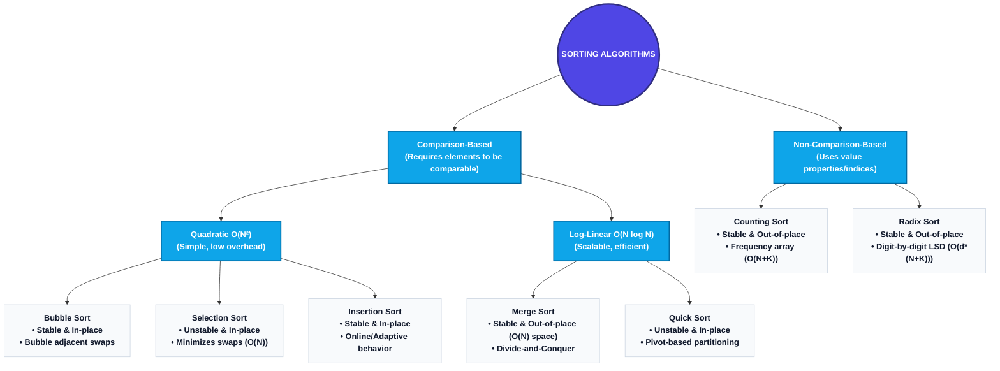

# Sorting in Python: Complete Mastery Guide

This study guide provides a comprehensive, production-grade reference to **Sorting Algorithms** and key related patterns in Python. It covers stability, in-place behavior, quadratic comparison-based sorts (Bubble, Selection, Insertion), log-linear divide-and-conquer sorts (Merge, Quick), linear non-comparison-based sorts (Counting, Radix), optimal sorting of small inputs (Sort Three Integers), and the Next Greater Element (NGE) problem pattern.

---

# 1. The Big Picture & Concept Connections

Sorting is the process of arranging elements in a collection in a specific order (ascending or descending). It is one of the most fundamental operations in computer science, serving as a prerequisite to optimize other algorithms like Binary Search, Kruskal's MST, and double-pointer coordinate traversals.



### Prerequisite Concepts & Core Fundamentals
Before diving into sorting algorithms, a top 1% engineer must master the following low-level system and algorithmic prerequisites:

#### 1. Recursion, Stack Frames, and Call Stack Space Complexity
Recursion is the mechanism where a function calls itself to solve smaller subproblems.
*   **Stack Frames:** Every active function invocation allocates a stack frame on the thread's call stack. A stack frame stores local variables, parameter values, the return address, and CPU register states.
*   **The Depth Limit & Stack Overflow:** The call stack has a fixed size (often 1MB to 8MB depending on OS settings). If a recursive call goes too deep without hitting a base case, it throws a `RecursionError` (Stack Overflow).
*   **Stack Space Math:** Space complexity of recursion is proportional to the **maximum depth** of the call tree, NOT the total number of calls. 
    *   *Balanced recursion* (e.g., Merge Sort splitting $N \to N/2$): The tree depth is $\log_2 N$. Thus, stack space is $O(\log N)$.
    *   *Unbalanced recursion* (e.g., Quick Sort partitioning with the minimum element): The tree depth is $N$. Stack space degrades to $O(N)$, which can crash on large $N$ (e.g., $N \ge 10^4$).

#### 2. CPU Cache Locality & Memory Hierarchy
Modern processors use a hierarchy of fast, small caches (L1, L2, L3) to bridge the speed gap with slower Main Memory (DRAM).
*   **Spatial Locality:** Accessing memory addresses close to each other. When the CPU requests a single integer (e.g., `arr[i]`), it fetches a contiguous chunk of memory called a **Cache Line** (typically 64 bytes) into the L1 cache. Accessing `arr[i+1]` next is extremely fast ($O(1)$ CPU cycles) because it is already in the cache (a **cache hit**).
*   **Temporal Locality:** Accessing the same memory address multiple times in a short window.
*   **Impact on Sorting:**
    *   **Quick Sort** is exceptionally fast in real-world benchmarks because it scans contiguous elements sequentially (high spatial locality).
    *   **Heap Sort**, although having the same $O(N \log N)$ worst-case time complexity, performs poorly in practice because parent-child access jumps indexes randomly ($i \to 2i + 1$), causing constant **cache misses**.
    *   **Merge Sort** requires allocating separate memory buffers and copying elements, which increases cache footprint and hurts locality.

#### 3. Strict Weak Ordering & Comparators
A comparator determines the relative order of elements. Mathematically, comparison operators must satisfy the axioms of a **Strict Weak Ordering** to prevent infinite loops or undefined behavior during sorting:
1.  **Irreflexivity:** $a < a$ must always be `False`.
2.  **Asymmetry:** If $a < b$ is `True`, then $b < a$ must be `False`.
3.  **Transitivity:** If $a < b$ and $b < c$, then $a < c$ must be `True`.
4.  **Transitivity of Incomparability:** If $a$ is incomparable with $b$ ($a \not< b$ and $b \not< a$), and $b$ is incomparable with $c$, then $a$ must be incomparable with $c$.

*If these rules are violated (e.g., a buggy custom `__lt__` method that returns `True` for equal items), the sorting algorithm's invariants will fail, potentially leading to incorrect ordering or infinite recursion.*

#### 4. Divide and Conquer Design Pattern
This algorithm design paradigm breaks a large problem into smaller, independent subproblems recursively:
1.  **Divide:** Partition the problem into smaller instances of the same problem (e.g., splitting a list in half).
2.  **Conquer:** Solve the subproblems recursively (base case: size $\le 1$).
3.  **Combine:** Merge the subproblem solutions to solve the original instance.
*   **The Master Theorem:** We analyze such algorithms using recurrence relations like:
    $$T(N) = aT(N/b) + f(N)$$
    For Merge Sort, this is $T(N) = 2T(N/2) + O(N)$, which solves to $O(N \log N)$ by the Master Theorem.

---

### Dependent Concepts
The concepts mastered in this module are used directly in:
*   **Binary Search ($O(\log N)$):** Requires the array to be pre-sorted.
*   **Greedy Scheduling Algorithms:** Often requires sorting intervals or tasks by end-times.
*   **K-way Merge & Heap Operations:** Merging multiple sorted streams in $O(N \log K)$ time.

---

# 2. Core Concepts: Stability & In-place Sorting

Before analyzing specific algorithms, you must master two key properties used to evaluate sorting techniques: **Stability** and **In-place** behavior.

### Stability
A sorting algorithm is **stable** if it preserves the original relative order of elements with equal keys (values).
*   **Visual Intuition:** Suppose we have a list of cards: $[5\color{red}\heartsuit, 3\color{blue}\spadesuit, 5\color{green}\clubsuit]$. The $5\color{red}\heartsuit$ comes before $5\color{green}\clubsuit$ in the input.
    *   **Stable Sort Result:** $[3\color{blue}\spadesuit, 5\color{red}\heartsuit, 5\color{green}\clubsuit]$ ($5\color{red}\heartsuit$ remains before $5\color{green}\clubsuit$).
    *   **Unstable Sort Result:** $[3\color{blue}\spadesuit, 5\color{green}\clubsuit, 5\color{red}\heartsuit]$ (relative order changed).
*   **Why it matters:** In real-world data, we often sort objects by multiple attributes. For example, sorting a list of employees by *First Name*, and then sorting them by *Department*. A stable sort ensures that employees in the same department remain alphabetized by their first name.

### In-Place Behavior
An algorithm is **in-place** (or in-situ) if it updates the input array directly and requires only a constant amount of auxiliary memory ($O(1)$ space, excluding recursion stack frames).
*   **Why it matters:** If you are sorting 10 gigabytes of data on a machine with 12 gigabytes of RAM, an out-of-place algorithm (like Merge Sort) that requires an extra $O(N)$ memory buffer will cause out-of-memory crashes or thrashing. An in-place algorithm (like Quick Sort or Heap Sort) will run successfully.

### Summary Classification Table
| Algorithm | Best-Case Time | Average-Case Time | Worst-Case Time | Space Complexity | Stable? | In-place? |
| :--- | :--- | :--- | :--- | :--- | :--- | :--- |
| **Bubble Sort** | $O(N)$ (optimized) | $O(N^2)$ | $O(N^2)$ | $O(1)$ | **Yes** | **Yes** |
| **Selection Sort**| $O(N^2)$ | $O(N^2)$ | $O(N^2)$ | $O(1)$ | **No** | **Yes** |
| **Insertion Sort**| $O(N)$ | $O(N^2)$ | $O(N^2)$ | $O(1)$ | **Yes** | **Yes** |
| **Merge Sort** | $O(N \log N)$ | $O(N \log N)$ | $O(N \log N)$ | $O(N)$ | **Yes** | **No** |
| **Quick Sort** | $O(N \log N)$ | $O(N \log N)$ | $O(N^2)$ | $O(\log N)$ (stack) | **No** | **Yes** |
| **Counting Sort** | $O(N + K)$ | $O(N + K)$ | $O(N + K)$ | $O(N + K)$ | **Yes** | **No** |
| **Radix Sort** | $O(d(N + K))$| $O(d(N + K))$ | $O(d(N + K))$ | $O(N + K)$ | **Yes** | **No** |

---

# 3. Concept 1: Sorting Three Integers (No Arrays/Loops)

## Definition & Intuition
Sorting exactly three numbers $\{a, b, c\}$ using raw comparison logic. Instead of running a general sorting algorithm (which introduces function calls, loop overhead, or array allocations), we use a minimal **decision tree** to sort them using a maximum of 3 comparisons and swaps.

## Python Source Code
The complete implementation is located in [6_1_sort_three_integers.py](file:///d:/study/dsa_with_python/6_1_sort_three_integers.py).
```python
def sort_three_integers(a: int, b: int, c: int) -> tuple:
    # Comparison 1: Ensure a <= b
    if a > b:
        a, b = b, a
    # Comparison 2: Ensure b <= c
    if b > c:
        b, c = c, b
        # Comparison 3: Since c changed, we must re-ensure a <= b
        if a > b:
            a, b = b, a
    return (a, b, c)
```

## Complexity Analysis
*   **Time Complexity:** $O(1)$ constant time (exactly 2 to 3 comparisons).
*   **Space Complexity:** $O(1)$ constant space (no variables or structures allocated).

---

# 4. Concept 2: Bubble Sort

## Definition
**Bubble Sort** is a simple comparison-based sorting algorithm that repeatedly steps through the list, compares adjacent elements, and swaps them if they are in the wrong order. This process is repeated until no swaps are needed, causing the largest elements to "bubble" to the end of the array.

## Intuition & Step-by-Step Explanation
Imagine bubble sort as bubbles of gas rising in a liquid: larger bubbles rise to the surface faster. 
1.  Start at index $0$. Compare `arr[0]` and `arr[1]`. If `arr[0] > arr[1]`, swap them.
2.  Move to next index, compare `arr[1]` and `arr[2]`. Swap if necessary.
3.  Continue to the end of the unsorted segment. After the first full pass, the largest element is guaranteed to be at the last index.
4.  Repeat this process for the remaining $N-1$ elements.

```
Array: [ 5 | 1 | 4 | 2 | 8 ]
Pass 1:
Compare 5 & 1 -> Swap:  [ 1 | 5 | 4 | 2 | 8 ]
Compare 5 & 4 -> Swap:  [ 1 | 4 | 5 | 2 | 8 ]
Compare 5 & 2 -> Swap:  [ 1 | 4 | 2 | 5 | 8 ]
Compare 5 & 8 -> OK:    [ 1 | 4 | 2 | 5 | 8 ] (8 is sorted)
```

## Early Termination Optimization
In a standard bubble sort, the algorithm will run through all passes even if the array becomes fully sorted early. We optimize this by maintaining a boolean flag `swapped`. If a pass completes without making a single swap, the array is already sorted, and we terminate early.

## Python Source Code
The complete implementation is located in [6_2_bubble_sort.py](file:///d:/study/dsa_with_python/6_2_bubble_sort.py).
```python
def bubble_sort_optimized(arr: list) -> list:
    n = len(arr)
    for i in range(n):
        swapped = False
        # Last i elements are already sorted, no need to re-check them
        for j in range(0, n - i - 1):
            if arr[j] > arr[j + 1]:
                arr[j], arr[j + 1] = arr[j + 1], arr[j]
                swapped = True
        # If no elements were swapped in the inner loop, array is sorted
        if not swapped:
            break
    return arr
```

## Complexity Analysis
*   **Time Complexity:**
    *   **Best Case:** $O(N)$ time (when input is already sorted; optimized version exits after 1 pass).
    *   **Average Case:** $O(N^2)$ time.
    *   **Worst Case:** $O(N^2)$ time (when input is reverse-sorted; requires $N(N-1)/2$ comparisons).
*   **Space Complexity:** $O(1)$ auxiliary (updates list elements in-place).

---

# 5. Concept 3: Selection Sort

## Definition
**Selection Sort** is an in-place comparison sort. It divides the array into a sorted prefix and an unsorted suffix. It repeatedly finds the minimum element from the unsorted suffix and swaps it with the first element of the unsorted suffix.

## Intuition & Step-by-Step Explanation
1.  Assume index $0$ is the start of the unsorted subarray.
2.  Scan the remainder of the array to locate the minimum element.
3.  Swap this minimum element with the element at index $0$.
4.  Move the boundary of the sorted prefix forward by 1 index and repeat until the array is fully sorted.

```
Array: [ 29 | 72 | 98 | 13 | 87 ]
Iteration 1: Find min in unsorted [29, 72, 98, 13, 87] -> Min is 13.
             Swap 13 with 29 -> [ 13 | 72 | 98 | 29 | 87 ]
Iteration 2: Find min in unsorted [72, 98, 29, 87] -> Min is 29.
             Swap 29 with 72 -> [ 13 | 29 | 98 | 72 | 87 ]
Iteration 3: Find min in unsorted [98, 72, 87] -> Min is 72.
             Swap 72 with 98 -> [ 13 | 29 | 72 | 98 | 87 ]
Iteration 4: Find min in unsorted [98, 87] -> Min is 87.
             Swap 87 with 98 -> [ 13 | 29 | 72 | 87 | 98 ]
```

## Why Selection Sort is Unstable
Selection sort is unstable because it swaps elements across large distances.
*   **Example:** $[4\color{red}\text{A}, 4\color{blue}\text{B}, 1]$.
    1.  The minimum element is $1$.
    2.  We swap $1$ with the first element $4\color{red}\text{A}$.
    3.  The array becomes $[1, 4\color{blue}\text{B}, 4\color{red}\text{A}]$.
    4.  Notice that the relative order of $4\color{red}\text{A}$ and $4\color{blue}\text{B}$ has been reversed.

## Python Source Code
The complete implementation is located in [6_3_selection_sort.py](file:///d:/study/dsa_with_python/6_3_selection_sort.py).
```python
def selection_sort(arr: list) -> list:
    n = len(arr)
    for i in range(n - 1):
        min_idx = i
        for j in range(i + 1, n):
            if arr[j] < arr[min_idx]:
                min_idx = j
        # Swap the found minimum element with the first element of unsorted part
        if min_idx != i:
            arr[i], arr[min_idx] = arr[min_idx], arr[i]
    return arr
```

## Complexity Analysis
*   **Time Complexity:** Always $O(N^2)$ (best, average, and worst case). Selection sort does not benefit from sorted inputs; it must scan the remaining elements to find the minimum.
*   **Space Complexity:** $O(1)$ auxiliary.
*   **Key Advantage:** It minimizes the total number of write operations. Bubble sort performs up to $O(N^2)$ swaps, whereas selection sort performs at most $O(N)$ swaps.

---

# 6. Concept 4: Next Greater Element (NGE)

## Definition
Given an array of integers, the **Next Greater Element (NGE)** for each element is the first element to its right that is strictly greater than it. If no greater element exists to its right, output `-1` for that position.

## Intuition & Connection to Selection Sort
While selection sort scans the right suffix to find the *minimum* element, NGE searches the right suffix for the *first greater* element. 
*   **Brute Force ($O(N^2)$):** For each element `arr[i]`, scan elements from `i + 1` to `N - 1` until you find `arr[j] > arr[i]`.
*   **Optimal Monotonic Stack ($O(N)$):** By traversing from right to left, we can maintain a stack of elements in decreasing order. We pop elements smaller than the current element (since they can never be the next greater element for any element to the left) and record the stack top as the NGE.

## Python Source Code
The complete implementations are located in [6_4_nge.py](file:///d:/study/dsa_with_python/6_4_nge.py).
```python
# Optimal O(N) Monotonic Stack Implementation (Right-to-Left Traversal)
def next_greater_element(arr: list) -> list:
    n = len(arr)
    result = [-1] * n
    stack = []  # Stores values
    
    for i in range(n - 1, -1, -1):
        # Pop elements from stack that are smaller than or equal to current element
        while stack and stack[-1] <= arr[i]:
            stack.pop()
            
        # If stack is not empty, the top element is the next greater element
        if stack:
            result[i] = stack[-1]
            
        # Push current element onto stack
        stack.append(arr[i])
        
    return result
```

## Complexity Analysis
*   **Time Complexity:**
    *   **Brute Force:** $O(N^2)$ time.
    *   **Monotonic Stack:** $O(N)$ time. Although there is a nested loop, each element is pushed onto the stack exactly once and popped at most once, resulting in $2N$ total operations.
*   **Space Complexity:**
    *   **Brute Force:** $O(1)$ auxiliary space.
    *   **Monotonic Stack:** $O(N)$ auxiliary space (for the stack).

---

# 7. Concept 5: Insertion Sort

## Definition
**Insertion Sort** is an in-place, stable sorting algorithm that builds the final sorted array one item at a time. It behaves like sorting a hand of playing cards: you pick up a card, compare it to the sorted cards in your hand, and insert it into its correct position.

## Intuition & Step-by-Step Explanation
1.  Assume the element at index $0$ is sorted.
2.  Pick the next element `key` at index `i`.
3.  Compare `key` with elements in the sorted subarray to its left (from `i-1` down to `0`).
4.  Shift all elements larger than `key` one position to the right to make space.
5.  Insert `key` into its correct position.

```
Array: [ 12 | 11 | 13 | 5 | 6 ]
Key = 11: Compare with 12 -> Shift 12:  [ 12 | 12 | 13 | 5 | 6 ] -> Insert: [ 11 | 12 | 13 | 5 | 6 ]
Key = 13: Compare with 12 -> No Shift:                                  -> Insert: [ 11 | 12 | 13 | 5 | 6 ]
Key = 5:  Shift 13, 12, 11:              [ 11 | 11 | 12 | 13 | 6 ] -> Insert: [ 5 | 11 | 12 | 13 | 6 ]
Key = 6:  Shift 13, 12, 11:              [ 5 | 11 | 11 | 12 | 13 ] -> Insert: [ 5 | 6 | 11 | 12 | 13 ]
```

## Shifting vs Swapping
*   *Swapping* (like in Bubble Sort) requires 3 writes per exchange: `temp = a; a = b; b = temp`.
*   *Shifting* (used in Insertion Sort) requires only 1 write per shift, saving significant execution overhead.

## Python Source Code
The complete implementation is located in [6_5_insertion_sort.py](file:///d:/study/dsa_with_python/6_5_insertion_sort.py).
```python
def insertion_sort(arr: list) -> list:
    for i in range(1, len(arr)):
        key = arr[i]
        j = i - 1
        # Shift elements of arr[0..i-1] that are greater than key
        while j >= 0 and arr[j] > key:
            arr[j + 1] = arr[j]
            j -= 1
        arr[j + 1] = key
    return arr
```

## Complexity Analysis
*   **Time Complexity:**
    *   **Best Case:** $O(N)$ time (when array is already sorted, the inner loop never runs).
    *   **Average Case:** $O(N^2)$ time.
    *   **Worst Case:** $O(N^2)$ time (when array is reverse-sorted).
*   **Space Complexity:** $O(1)$ auxiliary.
*   **Key Strength:** Excellent for **online sorting** (sorting data as it is received). If new elements are added dynamically to a pre-sorted list, insertion sort can insert them in $O(N)$ time.

---

# 8. Concept 6: Merge Sort

## Definition
**Merge Sort** is a comparison-based sorting algorithm that uses the **Divide and Conquer** design paradigm. It recursively splits the array into two halves, sorts each half, and then merges the two sorted halves back together.

## Intuition & Step-by-Step Explanation
1.  **Divide:** Split the array of size $N$ into two subarrays of size $N/2$ at the midpoint index.
2.  **Conquer:** Recursively apply Merge Sort to both halves until the subarrays have size 1 (which are sorted by definition).
3.  **Combine:** Merge the two sorted subarrays back into a single sorted array.

```
                  [ 38 | 27 | 43 | 3 | 9 | 82 | 10 ]
                       /                    \
             [ 38 | 27 | 43 | 3 ]       [ 9 | 82 | 10 ]
                 /          \               /        \
            [38 | 27]     [43 | 3]       [9 | 82]    [10]
             /     \       /     \       /     \      |
           [38]   [27]   [43]    [3]   [9]    [82]   [10]
             \     /       \     /       \     /      |
            [27 | 38]     [3 | 43]       [9 | 82]    [10]
                 \          /                \       /
             [ 3 | 27 | 38 | 43 ]         [ 9 | 10 | 82 ]
                      \                         /
                  [ 3 | 9 | 10 | 27 | 38 | 43 | 82 ]
```

## Python Source Code
The complete implementation is located in [6_6_merge_sort.py](file:///d:/study/dsa_with_python/6_6_merge_sort.py).
```python
def merge_sort(arr: list) -> list:
    if len(arr) <= 1:
        return arr
        
    mid = len(arr) // 2
    left_half = merge_sort(arr[:mid])
    right_half = merge_sort(arr[mid:])
    
    return merge_sorted_arrays(left_half, right_half)

def merge_sorted_arrays(left: list, right: list) -> list:
    merged = []
    i = j = 0
    
    # Compare elements from left and right arrays and merge them in order
    while i < len(left) and j < len(right):
        if left[i] <= right[j]:  # <= preserves stability
            merged.append(left[i])
            i += 1
        else:
            merged.append(right[j])
            j += 1
            
    # Append any remaining elements
    merged.extend(left[i:])
    merged.extend(right[j:])
    return merged
```

## Complexity Analysis
*   **Time Complexity:** Always $O(N \log N)$ (best, average, and worst cases). The recursion tree has a height of $\log_2 N$, and at each levels of recursion, the total merge cost is $O(N)$.
*   **Space Complexity:** $O(N)$ auxiliary space. The merge operation requires creating temporary list buffers to store the merged elements.

---

# 9. Concept 7: Quick Sort

## Definition
**Quick Sort** is an in-place, divide-and-conquer sorting algorithm. It selects an element as a **pivot** and partitions the array around it, placing smaller elements to its left and larger elements to its right. It then recursively sorts the subarrays.

## Partitioning Schemes
There are two classic partitioning schemes:

### Lomuto Partitioning
*   **Strategy:** The pivot is typically selected as the last element of the subarray. A pointer `i` tracks the boundary of elements smaller than the pivot, while another pointer `j` scans the subarray.
*   **Swaps:** Performs more swaps than Hoare's scheme.
```
Lomuto Partition Step: Pivot = 5
Array: [ 2 | 8 | 7 | 1 | 3 | 5 ]
         i   j
Step 1: 2 < 5 -> Increment i, swap arr[i] with arr[j]: [ 2 | 8 | 7 | 1 | 3 | 5 ]
Step 2: 8 > 5 -> OK.
Step 3: 7 > 5 -> OK.
Step 4: 1 < 5 -> Increment i, swap arr[i] with arr[j]: [ 2 | 1 | 7 | 8 | 3 | 5 ]
Step 5: 3 < 5 -> Increment i, swap arr[i] with arr[j]: [ 2 | 1 | 3 | 8 | 7 | 5 ]
End: Swap pivot (5) with arr[i+1]:                    [ 2 | 1 | 3 | 5 | 7 | 8 ]
```

### Hoare Partitioning
*   **Strategy:** Uses two pointers starting at opposite ends of the subarray. They move toward each other until they find a pair of elements that are out of order relative to the pivot, then swap them.
*   **Swaps:** Performs roughly 3x fewer swaps than Lomuto's scheme on average.

## Prevent Worst-Case Behavior
If we always choose the first or last element as the pivot, Quick Sort degenerates to $O(N^2)$ time when sorting an already-sorted or reverse-sorted array. To prevent this, we use **random pivot selection** or **median-of-three pivot selection** (choosing the median of the first, middle, and last elements).

## Python Source Code
The complete implementations are located in [6_7_quick_sort.py](file:///d:/study/dsa_with_python/6_7_quick_sort.py).
```python
def quick_sort_lomuto(arr: list, low: int, high: int):
    if low < high:
        p_idx = partition_lomuto(arr, low, high)
        quick_sort_lomuto(arr, low, p_idx - 1)
        quick_sort_lomuto(arr, p_idx + 1, high)

def partition_lomuto(arr: list, low: int, high: int) -> int:
    pivot = arr[high]
    i = low - 1
    for j in range(low, high):
        if arr[j] <= pivot:
            i += 1
            arr[i], arr[j] = arr[j], arr[i]
    arr[i + 1], arr[high] = arr[high], arr[i + 1]
    return i + 1
```

## Complexity Analysis
*   **Time Complexity:**
    *   **Best & Average Case:** $O(N \log N)$ (when partition splits the array roughly in half).
    *   **Worst Case:** $O(N^2)$ (when partition splits the array into sizes $0$ and $N-1$, e.g., already sorted array without randomized pivot selection).
*   **Space Complexity:** $O(\log N)$ average auxiliary space due to recursive call stack frames; $O(N)$ worst-case.

---

# 10. Concept 8: Counting Sort (Non-Comparison)

## Definition
**Counting Sort** is a non-comparison-based sorting algorithm that runs in $O(N + K)$ linear time, where $K$ is the range of values in the input. It works by counting the frequency of each distinct value, then calculating the prefix sums to place elements directly into their sorted positions.

## Intuition: Stable vs. Unstable Counting Sort
*   **Unstable Version:** Count the frequencies of each element, then iterate through the frequency array and overwrite the original array. This is simple, but discards stability and association with key-value objects.
*   **Stable Version (Accumulate Count):**
    1.  Count occurrences of each element in a `count` array.
    2.  Compute the cumulative sum (prefix sum) of the `count` array. This gives the starting position of each element in the output array.
    3.  Iterate through the input array **in reverse order** (right-to-left) to place each element in the output array at the position indicated by the prefix sum, then decrement the count.

```
Input:  [ 4 | 2 | 2 | 8 | 3 | 3 ]
Count Array: [0, 0, 2, 2, 1, 0, 0, 0, 1]  (Indices 0..8)
Accumulate Count: [0, 0, 2, 4, 5, 5, 5, 5, 6] (Prefix Sums)
Place elements in reverse order to preserve stability.
```

## Python Source Code
The complete implementation is located in [6_8_counting_sort.py](file:///d:/study/dsa_with_python/6_8_counting_sort.py).
```python
def counting_sort_stable(arr: list) -> list:
    if not arr:
        return arr
        
    max_val = max(arr)
    min_val = min(arr)
    range_of_elements = max_val - min_val + 1
    
    count = [0] * range_of_elements
    output = [0] * len(arr)
    
    # 1. Store counts relative to min_val to support negative numbers
    for num in arr:
        count[num - min_val] += 1
        
    # 2. Accumulate counts (Prefix Sums)
    for i in range(1, len(count)):
        count[i] += count[i - 1]
        
    # 3. Build output array in reverse order to maintain stability
    for i in range(len(arr) - 1, -1, -1):
        num = arr[i]
        output[count[num - min_val] - 1] = num
        count[num - min_val] -= 1
        
    return output
```

## Complexity Analysis & Limitations
*   **Time Complexity:** $O(N + K)$ where $N$ is the number of elements and $K$ is the range of values ($max - min + 1$).
*   **Space Complexity:** $O(N + K)$ auxiliary space to store counts and the output array.
*   **Critical Limitation:** Counting sort becomes inefficient if the range of values $K$ is much larger than the size of the array $N$ (e.g., sorting an array of size 5 containing values `[1, 2, 10000000]`).

---

# 11. Concept 9: Radix Sort

## Definition
**Radix Sort** is a non-comparison sorting algorithm that sorts numbers digit-by-digit, starting from the least significant digit (LSD) to the most significant digit (MSD). It uses a stable sorting algorithm (typically Counting Sort) as a subroutine to sort the digits at each position.

## Intuition & Step-by-Step Explanation
Sorting digit-by-digit from right to left works because the sorting subroutine is stable.
*   **Pass 1 (1s Digit):** Sort numbers by their units digit (e.g., `170`, `90`, `802` -> `170`, `90` sorted by 0, `802` sorted by 2).
*   **Pass 2 (10s Digit):** Sort numbers by their tens digit. Since the sorting is stable, numbers with the same tens digit retain their units digit order.
*   **Pass 3 (100s Digit):** Sort by hundreds digit.

```
Input: [ 170 | 45 | 75 | 90 | 802 | 24 | 2 | 66 ]
Sort by 1s digit:   [ 170 | 90 | 802 | 2 | 24 | 45 | 75 | 66 ]
Sort by 10s digit:  [ 802 | 2 | 24 | 45 | 66 | 170 | 75 | 90 ]
Sort by 100s digit: [ 2 | 24 | 45 | 66 | 75 | 90 | 170 | 802 ] (Fully sorted!)
```

## Python Source Code
The complete implementation is located in [6_9_radix_sort.py](file:///d:/study/dsa_with_python/6_9_radix_sort.py).
```python
def radix_sort(arr: list) -> list:
    if not arr:
        return arr
        
    max_val = max(arr)
    # Perform counting sort for every digit position (1, 10, 100, ...)
    exp = 1
    while max_val // exp > 0:
        counting_sort_for_radix(arr, exp)
        exp *= 10
    return arr

def counting_sort_for_radix(arr: list, exp: int):
    n = len(arr)
    output = [0] * n
    count = [0] * 10  # Base 10 digits (0-9)
    
    # Store frequency of digit occurrences
    for i in range(n):
        digit = (arr[i] // exp) % 10
        count[digit] += 1
        
    # Accumulate count array (Prefix Sums)
    for i in range(1, 10):
        count[i] += count[i - 1]
        
    # Build output array in reverse order to preserve stability
    for i in range(n - 1, -1, -1):
        digit = (arr[i] // exp) % 10
        output[count[digit] - 1] = arr[i]
        count[digit] -= 1
        
    # Copy sorted output back to the original array
    for i in range(n):
        arr[i] = output[i]
```

## Complexity Analysis
*   **Time Complexity:** $O(d \cdot (N + B))$ where $d$ is the number of digits in the maximum element, $N$ is the number of elements, and $B$ is the base of the number system (e.g., base 10).
*   **Space Complexity:** $O(N + B)$ auxiliary space.

# 12. Patterns & Problem Solving Techniques: Algorithm Selection Framework

When facing an algorithmic problem, choosing the correct sorting strategy or leveraging the properties of sorted data is key. This section provides a decision matrix and maps common problem-solving patterns.

## Algorithm Selection Decision Matrix
Use this flowchart to identify the optimal sorting algorithm based on constraints:

```mermaid
flowchart TD
    Q1{Are keys integers in a<br/>small, known range K?}
    Q1 -- Yes --> Q2{Is memory constraint tight?}
    Q2 -- No --> Counting[<b>Counting/Radix Sort</b><br/>O(N + K) time, O(N + K) space]
    Q2 -- Yes --> ComparisonSort
    
    Q1 -- No --> ComparisonSort
    
    ComparisonSort{What are the stability &<br/>space constraints?}
    ComparisonSort --> SpaceOpt{Tight space constraints?<br/>O(1) auxiliary space}
    
    SpaceOpt -- No --> StableOpt{Do equal keys need to<br/>preserve relative order?}
    StableOpt -- Yes --> Merge[<b>Merge Sort</b><br/>O(N log N) time, O(N) space]
    StableOpt -- No --> Quick[<b>Quick Sort</b><br/>O(N log N) average, O(log N) space]
    
    SpaceOpt -- Yes --> AdaptiveOpt{Is input mostly sorted or<br/>very small N < 50?}
    AdaptiveOpt -- Yes --> Insertion[<b>Insertion Sort</b><br/>O(N) best/adaptive, O(1) space]
    AdaptiveOpt -- No --> WriteOpt{Are memory writes expensive<br/>e.g. Flash/EEPROM?}
    WriteOpt -- Yes --> Selection[<b>Selection Sort</b><br/>O(N²) time, O(N) swaps max, O(1) space]
    WriteOpt -- No --> Quick
```

### Algorithm Summary & Selection Scenarios
1.  **Use Insertion Sort if:**
    *   The data is already *nearly sorted* (runs in $O(N)$ time).
    *   You are performing *online sorting* (data arrives element by element).
    *   The dataset is very small ($N < 50$) because its constant factors are extremely low.
2.  **Use Selection Sort if:**
    *   Memory write cycles are highly restricted (e.g. writing to EEPROM/Flash memory) since it guarantees a maximum of $O(N)$ swaps.
3.  **Use Merge Sort if:**
    *   A guaranteed *stable* sort is required.
    *   You are sorting linked lists (can merge in-place without $O(N)$ auxiliary array buffers).
    *   You are performing *external sorting* (data is too large to fit in RAM).
4.  **Use Quick Sort if:**
    *   General in-memory sorting of arrays where average-case $O(N \log N)$ is desired with the absolute lowest constant factor overhead and high CPU cache locality.
5.  **Use Counting / Radix Sort if:**
    *   The keys are non-negative integers and the range $K$ is small ($K \approx O(N)$). Radix Sort can extend this to larger ranges by sorting base-10 digit-by-digit.

---

## 4 Core Problem Solving Patterns Utilizing Sorting

### Pattern 1: Sorting as a Preprocessing Step
Before executing other logic, sorting is often used to bring identical or similar elements adjacent to each other.
*   **Axiom:** If $A_i \le A_{i+1}$, then the elements closest to $A_i$ must be its direct neighbors.
*   **Applications:**
    *   *Finding Duplicates:* Sort the array; duplicate elements will be adjacent ($arr[i] == arr[i-1]$), reducing lookup from $O(N^2)$ to $O(N \log N)$.
    *   *Smallest Difference Pair:* Finding $|A - B| \to \min$. Sorting ensures the minimum difference is between adjacent elements `arr[i] - arr[i-1]`.
    *   *Anagram Grouping:* Sort characters of each string; anagrams will have identical sorted representations (e.g., "eat", "tea", "ate" all sort to "aet").

### Pattern 2: Two-Pointer Converging Search
Once an array is sorted, we can search for combinations (e.g., pairs, triplets) by initializing pointers at opposite ends (`left = 0`, `right = N-1`) and moving them inward.
*   **The Logic:**
    *   If `arr[left] + arr[right] < target`: To increase the sum, we must increment `left`.
    *   If `arr[left] + arr[right] > target`: To decrease the sum, we must decrement `right`.
*   **Applications:**
    *   *Two-Sum (Sorted Array):* Solved in $O(N)$ time and $O(1)$ space.
    *   *Three-Sum:* Sort the array, fix one element `i`, and run two-pointer search on the remaining subarray in $O(N^2)$ time.

### Pattern 3: Divide & Conquer Partitioning (Quick-Select)
Using Quick Sort's partitioning scheme (Lomuto or Hoare) without recursively sorting both halves.
*   **The Logic:**
    *   When we partition an array around a pivot, the pivot is placed in its exact final sorted position $K$.
    *   If our target index is $< K$, we discard the right side and partition only the left side.
    *   If our target index is $> K$, we discard the left side and partition only the right side.
*   **Applications:**
    *   *K-th Largest/Smallest Element:* Solves in $O(N)$ average time (compared to $O(N \log N)$ if fully sorted).

### Pattern 4: Frequency Bucket Allocation
Instead of comparing elements, map values directly to indices or buckets.
*   **The Logic:**
    *   If keys represent bounded ranges, count frequencies to partition elements without comparisons.
*   **Applications:**
    *   *Sort Array of 0s, 1s, 2s (Dutch National Flag):* A three-way partition variant of Quick Sort that sorts in a single pass ($O(N)$ time, $O(1)$ space).
    *   *Custom Rank Sorting:* Sorting elements by frequency of occurrences.

---

# 13. Key Guidelines, Common Mistakes & Best Practices

*   **Recursion Stack Safety:** When implementing recursive algorithms like Quick Sort or Merge Sort, beware of recursion depth limits. On large arrays, ensure Quick Sort partitions elements in-place and tail-recursively processes the smaller subarray first to bound the call stack depth to $O(\log N)$.
*   **In-Place Swap Pitfall:** When implementing Selection Sort or Bubble Sort, avoid unnecessary swapping if the indices are identical (i.e. check `if min_idx != i:` before swapping) to save CPU writes.
*   **Stable Partitioning Requirement:** Standard Quick Sort is unstable because it swaps elements across the partition boundary. If stability is strictly required, use Merge Sort instead.
*   **Counting Sort Integer Range Check:** Never apply Counting Sort unless you know that the range of numbers is small. If $max(arr) - min(arr) > 10^7$, memory exhaustion is highly likely.

---

# 14. 1% Engineer Interview Questions & Answers

### Q1: Why is Selection Sort preferred over Bubble Sort when write operations are expensive (such as when writing to EEPROM or Flash memory)?
**Answer:** Both algorithms have $O(N^2)$ time complexity. However, Bubble Sort performs a swap adjacent-by-adjacent, resulting in up to $O(N^2)$ swap operations (writes) in the worst case. Selection Sort only performs at most $O(N)$ swap operations because it finds the absolute minimum element from the unsorted suffix first and performs exactly one swap per outer loop iteration.

---

### Q2: How does randomized pivot selection prevent Quick Sort from degrading to $O(N^2)$ worst-case time complexity?
**Answer:** Quick Sort's worst case occurs when the partition splits the array into highly unbalanced subproblems of size $0$ and $N-1$, which occurs when the pivot is consistently selected as the minimum or maximum element (e.g., sorting an already sorted list with a fixed first-element pivot). Selecting a pivot randomly ensures that the probability of choosing an extreme element as a pivot at every step is mathematically negligible ($O(2^{-N})$). This guarantees an average-case performance of $O(N \log N)$ regardless of the initial order of the input array.

---

### Q3: Why is Merge Sort preferred over Quick Sort for sorting Linked Lists, while Quick Sort is preferred for Arrays?
**Answer:** 
1.  **Linked Lists:** Linked list nodes are scattered in memory, meaning they do not support $O(1)$ random access. Merge Sort is highly efficient for linked lists because it can merge lists by updating pointer links in-place without requiring $O(N)$ auxiliary memory.
2.  **Arrays:** Quick Sort has excellent **locality of reference** (cache locality) because it accesses adjacent elements sequentially during partitioning. Merge Sort requires copying elements to a temporary array, which hurts cache performance and introduces dynamic memory allocation overhead.

---

### Q4: Explain how a Monotonic Stack solves the Next Greater Element (NGE) problem in $O(N)$ time.
**Answer:** A monotonic stack maintains elements in a sorted order. By traversing the array from right to left, the stack stores candidate "next greater" values. For each element `x`, we pop all elements from the stack that are smaller than or equal to `x`, because they are blocked by `x` and can never be the next greater element for any element to the left of `x`. The element remaining on top of the stack is the first element to the right of `x` that is greater than `x`. Since every element is pushed onto the stack exactly once and popped at most once, the total operations are bounded by $2N$, yielding $O(N)$ time.
