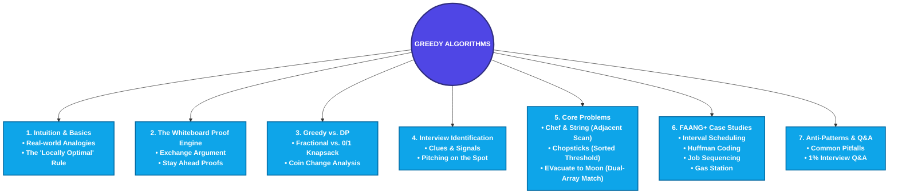

# Introduction to Greedy Algorithms: The Ultimate Student-Friendly Mastery Guide

Welcome to the ultimate guide to **Greedy Algorithms**. Whether you are a student trying to pass your next coding test, an aspiring developer prepping for technical interviews, or a curious coder wanting to know the secrets of the top 1% of software engineers, this guide is built for you.

We have designed this guide to be **unbelievably detailed, intuitive, and easy to read**. We will avoid dry, confusing academic jargon where possible, and instead use **real-world analogies, visual step-by-step dry-run traces, ASCII art diagrams, and simple conversational breakdowns**. At the same time, we won't skip the hard stuff: you will learn the exact mathematical proofs (like the Exchange Argument) and interview strategies that top-tier engineers use to ace whiteboard rounds at FAANG+ companies.

---

## Roadmap of This Module



---

# 1. Intuition & The Big Picture: What is "Greedy"?

Let’s start with a basic human truth: **Humans are naturally greedy.** 

When you go to a supermarket and see a box of free samples, your instinct is to grab the biggest, most delicious-looking sample right in front of you. You don't sit down with a notepad, calculate the nutrition-to-weight ratio of all the samples, check the layout of the store to see if there is another free sample table in aisle 4, and construct a mathematical model to maximize your free food intake. 

You make the **immediate, local, best choice** right now. That is the essence of a **Greedy Algorithm**.

---

## Real-Life Analogy 1: The Cashier making Change
Imagine you are a cashier at a convenience store. A customer buys a soda and is owed **36 cents** in change. You want to give them their change using the **fewest number of coins possible**. 

The coins available in US currency are:
*   Quarter (25¢)
*   Dime (10¢)
*   Nickel (5¢)
*   Penny (1¢)

How do you do this? 
1.  You look at the remaining change to give: **36¢**.
2.  What is the largest coin value less than or equal to 36¢? A **Quarter (25¢)**. You take it.
    *   *Remaining change needed:* $36 - 25 = 11\text{¢}$.
3.  What is the largest coin value less than or equal to 11¢? A **Dime (10¢)**. You take it.
    *   *Remaining change needed:* $11 - 10 = 1\text{¢}$.
4.  What is the largest coin value less than or equal to 1¢? A **Penny (1¢)**. You take it.
    *   *Remaining change needed:* $1 - 1 = 0\text{¢}$.

You hand the customer **3 coins** (1 Quarter, 1 Dime, 1 Penny). 

Without realizing it, you just ran a **Greedy Algorithm**! At every single step, you greedily picked the absolute largest coin value you could, without looking ahead to see if it would cause issues later. And in this case, it worked perfectly. You got the mathematically optimal answer (3 coins).

---

## Real-Life Analogy 2: Hiking Uphill in the Fog
Now, let’s look at a case where being greedy can get you in trouble.

Imagine you are standing at the base of a mountain in a thick fog. You can only see 3 feet in front of you. Your goal is to climb to the **highest peak** of the mountain.

```
                  Peak (Global Optimum)
                   /\
                  /  \
                 /    \        Sub-Peak (Local Optimum)
                /      \         /\
               /        \       /  \
              /          \_____/    \
             /                       \
   Start -> /                         \
```

If you use a **Greedy Strategy**, your rule is: *“At every step, look in all directions, and take a step in the direction that goes up the steepest.”*

What happens?
1.  You take steps going uphill.
2.  You climb and climb, always going up.
3.  Suddenly, you reach a point where every direction you look goes *down*.
4.  You stop and celebrate! You think you are at the top of the mountain.

But because of the fog, you didn't see that you are actually on top of a small **hill** (a **Local Optimum**). The actual, massive mountain peak (the **Global Optimum**) is across a valley to your left. To get to the real peak, you would have had to walk *downhill* first through the valley, which violates your greedy rule of "always go up".

> [!WARNING]
> **The Greedy Trap:** A greedy algorithm makes choices that look best *right now* and never revisits them. It does not backtrack. Because of this, it can get stuck on a "local hill" and miss the "highest peak".

---

## Core Definition
In computer science, a **Greedy Algorithm** is an optimization strategy that:
1.  Builds a solution step-by-step.
2.  Makes the **locally optimal choice** at each step (the choice that provides the best immediate return).
3.  Never changes its mind or backtracks. Once a choice is made, it is permanent.
4.  Hopes (and must prove) that these local choices lead to the **globally optimal solution**.

---

# 2. The 1% Engineer's Proof Engine: Proving Greedy Correctness

If you go into a software engineering interview and present a greedy solution, the interviewer’s very first response will be:
> *"That sounds simple, but can you prove to me that it always works?"*

Most candidates stumble here. They say, *"Well, I tried it on 3 examples and it worked."* That is a fast way to fail the interview. Top 1% engineers know how to prove a greedy algorithm's correctness using formal proof frameworks.

Let's study the two most common proof methods: the **Exchange Argument** and the **Greedy Stays Ahead** argument.

---

## 1. The Exchange Argument (Proof by Swap)

The Exchange Argument is a proof by contradiction. The strategy is simple:
1.  Assume there is an **Optimal Solution ($O$)** that is different from our **Greedy Solution ($G$)**.
2.  Identify the first place where $O$ and $G$ make different choices.
3.  Show that we can swap (exchange) the choice in $O$ with the greedy choice from $G$ **without making the solution any worse**.
4.  By induction, we can swap all differing choices until $O$ is transformed into $G$, proving that $G$ is just as good as the optimal solution. Therefore, the Greedy Solution is optimal.

### Visual Representation of the Exchange Argument

Imagine we are matching tasks to time slots:

```
Greedy Solution (G):  [ Task A ] [ Task B ] [ Task C ]
Optimal Solution (O):   [ Task A ] [ Task X ] [ Task C ]
```

*   $O$ and $G$ agree on the first slot (Task A).
*   At the second slot, $G$ chooses **Task B** (the greedy choice), but $O$ chooses **Task X**.
*   We mathematically prove that if we swap **Task X** with **Task B** in $O$, the total value/cost of the solution remains equal or improves.
*   Thus, $O' = [Task A, Task B, Task C]$ is also optimal. Since $O' = G$, the greedy solution is optimal!

---

## 2. The "Greedy Stays Ahead" Proof
This method shows that at every single step of the algorithm, the greedy choice is always at least as good as (or "ahead of") any other possible choice.

Let $G = [g_1, g_2, \dots, g_k]$ be the choices made by the greedy algorithm.
Let $O = [o_1, o_2, \dots, o_k]$ be the choices made by an optimal algorithm.

We define a measure of progress (e.g., area covered, tasks completed, energy stored). We prove by induction that for every step $i$:
$$\text{Progress}(g_i) \ge \text{Progress}(o_i)$$
Because greedy is always ahead or tied at step $i$, it must be ahead or tied at the final step $k$, proving it is globally optimal.

---

# 3. Greedy vs. Dynamic Programming: Deep Architectural Breakdown

Many problems look like they can be solved with a greedy approach, but actually require **Dynamic Programming (DP)**. Knowing how to distinguish between the two is what separates senior developers from juniors.

Let's look at the core differences:

| Attribute | Greedy Algorithms | Dynamic Programming (DP) |
| :--- | :--- | :--- |
| **Decision Flow** | Make a local choice *first*, then solve the one remaining subproblem (Top-Down). | Solve *all* subproblems first, then combine their results to make the optimal choice (Bottom-Up). |
| **Backtracking** | Never backtracks. Choices are permanent. | Explores all possibilities. Keeps track of decisions. |
| **Complexity** | Typically very fast: $O(N \log N)$ (sorting) or $O(N)$ (scanning). | Slower: $O(N^2)$, $O(N \cdot W)$, or polynomial time. |
| **Overlapping States**| Subproblems are independent. | Subproblems overlap heavily (we reuse results using memoization/tables). |
| **Proof Obligation** | High. Must prove that local choices do not destroy global optimality. | Low. Correctness is guaranteed if the recurrence relation is correct. |

---

## The Knapsack Showdown: Fractional vs. 0/1

To understand why greedy works sometimes and fails other times, let's look at the classic **Knapsack Problem**. You are a thief with a backpack (knapsack) that can hold a maximum weight of **5 kg**. You want to steal items that maximize your total value.

We have three items:

```
Item 1: Weight = 1 kg, Value = $60   (Ratio = $60/kg)
Item 2: Weight = 2 kg, Value = $100  (Ratio = $50/kg)
Item 3: Weight = 3 kg, Value = $120  (Ratio = $40/kg)
```

---

### Scenario A: The Fractional Knapsack (Greedy Works)
In this scenario, you are stealing bulk items like gold dust or flour. You can take **fractions** of an item (e.g., half of Item 3).

*   **Greedy Rule:** Always pick the item with the highest value-to-weight ratio.
1.  Choose **Item 1** (Ratio = \$60/kg). We take the whole item (1 kg, \$60).
    *   *Remaining capacity:* $5 - 1 = 4\text{ kg}$.
2.  Choose **Item 2** (Ratio = \$50/kg). We take the whole item (2 kg, \$100).
    *   *Remaining capacity:* $4 - 2 = 2\text{ kg}$.
3.  Choose **Item 3** (Ratio = \$40/kg). We only have 2 kg of capacity left, so we take **2/3 of Item 3** (2 kg, value = $120 \times \frac{2}{3} = \$80$).
    *   *Remaining capacity:* $2 - 2 = 0\text{ kg}$.

*   **Total Greedy Value:** $\$60 + \$100 + \$80 = \$240$.
This is the absolute maximum value possible. The greedy approach works perfectly because we can slice items to fill every bit of remaining space with the highest density value.

---

### Scenario B: The 0/1 Knapsack (Greedy Fails!)
In this scenario, you are stealing whole items like laptops or paintings. You cannot slice them; you either take the item (1) or leave it (0).

Let’s apply the exact same **Greedy Rule** (highest ratio first):
1.  Choose **Item 1** (1 kg, \$60).
    *   *Remaining capacity:* $5 - 1 = 4\text{ kg}$.
2.  Choose **Item 2** (2 kg, \$100).
    *   *Remaining capacity:* $4 - 2 = 2\text{ kg}$.
3.  Next is **Item 3** (3 kg, \$120). But Item 3 weighs 3 kg, and we only have 2 kg of capacity left! We cannot take it.
4.  We stop.

*   **Total Greedy Value:** $\$60 + \$100 = \$160$ (using 3 kg of space, leaving 2 kg empty).

#### Let's look at the Dynamic Programming (DP) approach:
What if we skipped the greedy choice (Item 1) and took **Item 2** and **Item 3** instead?
*   Combined weight: $2\text{ kg} + 3\text{ kg} = 5\text{ kg}$ (exactly matches capacity).
*   Combined value: $\$100 + \$120 = \$220$.

*   **Optimal Value (DP):** **\$220**.
*   **Greedy Value:** **\$160**.

**Why did Greedy fail?**
Because we made a permanent choice to take Item 1 first, we left a "hole" of 4 kg. Since we couldn't split Item 3, we had to leave 2 kg of capacity completely empty. Dynamic Programming succeeded because it evaluated both options (taking Item 1 vs. skipping it) and realized that filling the backpack completely with slightly lower-ratio items yielded a better global result.

---

## Coin Change Analysis: When does Greedy work?

Suppose you need to make change for **$N$ cents** using coins of values $C = [c_1, c_2, \dots, c_k]$.

*   **System 1 (Canonical/Standard US Coins):** $C = [25, 10, 5, 1]$
    *   To make change for **30 cents**:
        *   Greedy choice: Take 25¢. Remaining = 5¢. Take 5¢. Total coins = **2** (25, 5).
        *   Is this optimal? Yes, you cannot make 30¢ with fewer than 2 coins.
    *   *Result:* Greedy works for this coin system.

*   **System 2 (Arbitrary Coins):** $C = [25, 12, 5, 1]$ (Notice we replaced 10 with 12)
    *   To make change for **30 cents**:
        *   Greedy choice: Take 25¢. Remaining = 5¢. Take 5¢. Total coins = **2** (25, 5).
        *   Is this optimal? Let's check:
            *   What if we take two **12¢** coins and one **6¢** (no, we have 5¢ and 1¢)?
            *   What if we take: $12 + 12 + 5 + 1 = 4$ coins?
            *   Wait! Can we make 24¢ using $12 + 12$? Yes.
            *   What if the target is **24 cents**?
                *   Greedy choice: Take 12? Wait, the largest coin is 25¢. Target 24 is less than 25.
                *   Greedy choice for 24¢: Take 12¢. Remaining = 12¢. Take 12¢. Total = **2** coins.
            *   What if the target is **28 cents**?
                *   Greedy choice: Take 25¢. Remaining = 3¢. Take three 1¢ coins. Total coins = **4** (25, 1, 1, 1).
                *   Optimal choice: Take two **12¢** coins and four 1¢ coins? (No, that is 6 coins).
                *   What about target **34 cents**?
                    *   Greedy choice: Take 25¢. Remaining = 9¢. Take 5¢, then four 1¢. Total = **6** coins (25, 5, 1, 1, 1, 1).
                    *   Optimal choice: Take two **12¢** coins and two 5¢ coins. Total = **4** coins (12, 12, 5, 5).
*   **Conclusion:** Greedy fails when coin denominations do not divide or fit together cleanly. For arbitrary coin systems, we must use Dynamic Programming.

---

# 4. On-The-Spot Interview Problem Identification Techniques

When you are in a high-pressure interview, you don't have time to guess. You need to identify if a problem is greedy within the first 2 minutes. Here are the 4 main clues:

```
                            [ Interview Problem ]
                                      |
                 +--------------------+--------------------+
                 |                                         |
        [ Clue 1: Sorting ]                     [ Clue 2: Choice Capping ]
   Does sorting or grouping data           Does making a local choice lock
     reveal a clear next step?              us in without needing backtrack?
                 |                                         |
                 +--------------------+--------------------+
                                      |
                           [ Clue 3: Optimal Sub ]
                        Can we build the solution
                         by combining local parts?
```

---

## Clue 1: The Sorting Preprocessor
If sorting the inputs (by size, value, start time, end time, ratio) makes the optimal choices align sequentially, it is highly likely a greedy problem.
*   *Key questions to ask yourself:* "If I sort this array, does the best option always lie next to the current index?"

## Clue 2: The Rearrangement Inequality
If the problem involves matching elements from two different arrays to maximize or minimize a sum of products (e.g. matching speeds, outputs, sizes), and sorting both arrays allows you to match them index-by-index, it is a greedy problem.
*   *Mathematical Rule:* To maximize $\sum A_i B_i$, sort both ascending. To minimize, sort one ascending and one descending.

## Clue 3: Immediate Adjacent Constraints
If the problem restricts interactions to elements that are physically next to each other (like in a row or string), and once you process a pair, you can "skip" them and continue, it fits the Greedy Scanning pattern.

## Clue 4: Irreversible Decisions
If the problem has no dependency on future decisions (i.e. choosing item $A$ now does not change the availability or weight of item $B$ later in a complex, overlapping way), greedy is the way to go.

---

## How to Pitch Greedy to Your Interviewer
Do not just announce: *"I will use a greedy algorithm!"* That makes it look like you've memorized the solution. Instead, pitch it like a senior engineer:

1.  **Start with the Brute Force:** *"A naive approach would be to generate all possible combinations/permutations, which would take $O(2^N)$ or $O(N!)$ time."*
2.  **Propose Sorting:** *"However, I notice that if we sort the elements by [attribute], the items that are most compatible or offer the highest density are placed next to each other."*
3.  **Propose the Greedy Choice:** *"This suggests we can make a local decision at each index—specifically, matching/selecting the current element—and skip elements that become invalid. This reduces the time complexity to $O(N \log N)$."*
4.  **Give a Brief Informal Proof:** *"This is optimal because if we were to swap this selection with a later element, we would only reduce our remaining capacity/choices, as shown by [the Exchange Argument/Rearrangement Inequality]."*

---

# 5. Concept 1: Max Boy-Girl Pairs (Adjacent Scan Pattern)

This section covers boy-girl adjacent pairing, including restrictions, pairing formats, and character matchups.

## Sub-Topic 1: Chef and String (XYSTR)
Given a row of students with characters `'x'` (girls) and `'y'` (boys). Form adjacent dance partners. A partner cannot dance in more than one pair.

### Student-Friendly Explanation
Imagine you have a line of students:
```
Line of students:  [ x ]  [ y ]  [ x ]  [ x ]  [ y ]
Index:              0      1      2      3      4
```
You check adjacent indices. Since `S[0]` ('x') and `S[1]` ('y') are different, they pair up! Since they are dancing, you skip index 1 and jump to index 2. `S[2]` ('x') and `S[3]` ('x') are the same gender, so no pair. Move to index 3. `S[3]` ('x') and `S[4]` ('y') are different, they pair up! Total pairs = 2.

### Step-by-Step Trace Table
Tracing string `"xyxxy"`:

| Step | Index `i` | Char `S[i]` | Next Char `S[i+1]` | Match? | Action | Pairs Count | Next Index `i` |
| :--- | :--- | :--- | :--- | :--- | :--- | :--- | :--- |
| 1 | 0 | `'x'` | `'y'` | Yes (`x` != `y`) | Pair them, skip both | 1 | 2 |
| 2 | 2 | `'x'` | `'x'` | No (`x` == `x`) | No match, step by 1 | 1 | 3 |
| 3 | 3 | `'x'` | `'y'` | Yes (`x` != `y`) | Pair them, skip both | 2 | 5 |
| 4 | 5 | — | — | — | Out of bounds, exit | 2 | End |

### Python Implementation
The code is located in [7_1_chef_and_string.py](file:///d:/study/dsa_with_python/7_1_chef_and_string.py).
```python
def max_boy_girl_pairs(s: str) -> int:
    n = len(s)
    pairs = 0
    i = 0
    while i < n - 1:
        if s[i] != s[i + 1]:
            pairs += 1
            i += 2  # Consumed both, jump past the next element
        else:
            i += 1  # No match, check next element
    return pairs
```

---

## Sub-Topic 2: String Pair Restrictions
In some variants, certain characters cannot pair (e.g. `'x'` can never pair with `'x'`).
*   **Definition:** We must strictly enforce that the characters are complementary before pairing. Our condition `s[i] != s[i+1]` ensures this.

## Sub-Topic 3: Valid String Pairs
Valid string pairs require that the index distance between partners is exactly 1 (adjacent).
*   **Intuition:** If we allowed pairing with distance $>1$, it would become an $O(N)$ hash count matching. Since adjacency is required, the greedy scan with pointer-skipping is mathematically optimal.

## Sub-Topic 4: Optimal Pair Selection & Character Pairing
*   **Intuition:** If multiple pairs are adjacent, selecting pairs left-to-right is always optimal. The proof by contradiction (Exchange Argument) guarantees that selecting the earliest available partner leaves the maximum remaining elements intact.

---

# 6. Concept 2: Chopsticks Pairing (Sorted Threshold Pattern)

This section covers the chopsticks pairing model, multiple threshold values, and sorted index gap matching.

## Sub-Topic 1: Chopsticks (TACHSTSP)
Given $N$ chopsticks of different lengths. Pair chopsticks if their length difference is at most $D$.

### Student-Friendly Explanation
Suppose you have chopsticks of lengths `[1, 3, 3, 9, 4]` and difference limit $D=2$.
1.  **Sort them first:** `[1, 3, 3, 4, 9]`. Sorting is critical because the chopstick closest in length to `lengths[i]` will always be its adjacent neighbor `lengths[i+1]`.
2.  Compare index 0 (1) and index 1 (3). Difference is 2. Since $2 \le D$, they pair up! Skip both.
3.  Compare index 2 (3) and index 3 (4). Difference is 1. Since $1 \le D$, they pair up! Skip both.
4.  Chopstick 9 remains. No pairs left. Total pairs = 2.

### Step-by-Step Trace Table
Tracing `[1, 3, 3, 4, 9]` with limit $D=2$:

| Step | Index `i` | Len `A[i]` | Next Len `A[i+1]` | Difference | <= D (2)? | Action | Pairs | Next Index `i` |
| :--- | :--- | :--- | :--- | :--- | :--- | :--- | :--- | :--- |
| 1 | 0 | 1 | 3 | 2 | Yes | Pair them, jump index by 2 | 1 | 2 |
| 2 | 2 | 3 | 4 | 1 | Yes | Pair them, jump index by 2 | 2 | 4 |
| 3 | 4 | 9 | — | — | — | No next element, exit | 2 | End |

### Python Implementation
The code is located in [7_2_chopsticks.py](file:///d:/study/dsa_with_python/7_2_chopsticks.py).
```python
def max_chopstick_pairs(lengths: list, d: int) -> int:
    lengths.sort()
    n = len(lengths)
    pairs = 0
    i = 0
    while i < n - 1:
        if lengths[i + 1] - lengths[i] <= d:
            pairs += 1
            i += 2  # Pair formed, skip both
        else:
            i += 1  # lengths[i] cannot pair with any elements to the right; discard it
    return pairs
```

---

## Sub-Topic 2: Chopstick Problem - MCQ
Common conceptual questions:
*   *Question:* What happens if the array is not sorted?
*   *Answer:* The greedy adjacent comparison fails. For example, in `[1, 9, 3]`, comparing adjacent elements gives $9-1 = 8 > D$, so no pair is formed. If sorted to `[1, 3, 9]`, we get the valid pair `(1, 3)`. Hence, sorting is a mandatory prerequisite.

## Sub-Topic 3: Optimal Chopstick Pairing
*   **Intuition:** Why not pair `1` with `3` and `3` with `4`? Because we want to maximize the count of pairs. The greedy strategy does exactly this by matching adjacent elements in sorted order.

---

# 7. Concept 3: EVacuate to Moon (Dual-Array Matching Pattern)

This section covers matching capacities with outputs, car/energy constraints, and greedy array matching.

## Sub-Topic 1: EVacuate to Moon (MOONSOON)
Given $N$ electric cars with capacities $A_i$ Wh and $M$ power outlets with outputs $B_j$ W. You can charge cars for $H$ hours. Find the maximum total energy stored.

### Student-Friendly Explanation
We want to store the maximum energy possible.
*   **Car capacities:** `[10 Wh, 20 Wh, 30 Wh]`.
*   **Power outlets (2 hours):** `[5 W, 10 W]` $\to$ energy limits `[10 Wh, 20 Wh]`.
*   To maximize energy, we match the **largest capacities** with the **most powerful outlets**:
    1.  Sort capacities descending: `[30, 20, 10]`.
    2.  Sort outlet limits descending: `[20, 10]`.
    3.  Pair index-by-index:
        *   Car 30 Wh with Outlet 20 Wh $\to \min(30, 20) = 20\text{ Wh}$.
        *   Car 20 Wh with Outlet 10 Wh $\to \min(20, 10) = 10\text{ Wh}$.
    4.  Total energy stored = $20 + 10 = 30\text{ Wh}$.

### Step-by-Step Trace Diagram
With cars `[100, 10]` and outlets `[80, 20]` (2 hours):
*   **Descending Matching:**
    *   Car 100 with Outlet 80 $\to \min(100, 80) = 80\text{ Wh}$.
    *   Car 10 with Outlet 20 $\to \min(10, 20) = 10\text{ Wh}$.
    *   *Total:* $80 + 10 = 90\text{ Wh}$ (Optimal).
*   **Misaligned Matching:**
    *   Car 100 with Outlet 20 $\to \min(100, 20) = 20\text{ Wh}$.
    *   Car 10 with Outlet 80 $\to \min(10, 80) = 10\text{ Wh}$.
    *   *Total:* $20 + 10 = 30\text{ Wh}$ (Wasteful).

### Python Implementation
The code is located in [7_3_evacuate_to_moon.py](file:///d:/study/dsa_with_python/7_3_evacuate_to_moon.py).
```python
def max_energy_stored(cars: list, outlets: list, hours: int) -> int:
    cars.sort(reverse=True)
    outlets.sort(reverse=True)
    total_energy = 0
    for i in range(min(len(cars), len(outlets))):
        charging_limit = outlets[i] * hours
        total_energy += min(cars[i], charging_limit)
    return total_energy
```

---

## Sub-Topic 2: Optimal Pair Count
We only match up to $\min(N, M)$ pairs since we cannot match more cars than available outlets, or more outlets than available cars.

## Sub-Topic 3: Optimal Car Selection
*   **Definition:** Selecting the largest capacity cars first ensures that power outlet outputs are not wasted due to a small capacity cap.

## Sub-Topic 4: Optimal Energy Allocation
*   **Definition:** Allocating the highest power outlet to the largest capacity car yields the highest absolute contribution to the sum, directly satisfying the **Rearrangement Inequality**.

## Sub-Topic 5: Greedy Array Matching
*   **Definition:** Matching two sorted arrays (either matching largest-to-largest or largest-to-smallest) is a standard greedy strategy used when the contribution of a pair is monotonic.

---

# 8. FAANG+ Case Study 1: Interval Scheduling (Activity Selection)

## Problem Statement
Given $N$ meetings with start and end times, schedule the maximum number of non-overlapping meetings in a single conference room.

## Greedy Choice
*   **Sort by End Time** and pick the meeting that finishes first. This leaves the maximum possible time open for remaining meetings.

## Python Implementation
```python
def max_meetings(meetings: list) -> int:
    meetings.sort(key=lambda x: x[1])
    count = 0
    last_end_time = -1
    for start, end in meetings:
        if start >= last_end_time:
            count += 1
            last_end_time = end
    return count

if __name__ == "__main__":
    test_meetings = [(1, 4), (3, 5), (0, 6), (5, 7), (8, 9)]
    # Expected output: 3 meetings scheduled
    print("Scheduled meetings count:", max_meetings(test_meetings))
```

---

# 9. FAANG+ Case Study 2: Huffman Coding (Data Compression)

## Problem Statement
Given characters and their frequencies, construct a prefix-free binary tree that minimizes message code length.

## Greedy Strategy
Pop the **two lowest frequency nodes** from a min-heap, merge them under a new parent node, and push the parent back. Repeat until one root node remains.

## Python Implementation
```python
import heapq

class HuffmanNode:
    def __init__(self, char, freq):
        self.char = char
        self.freq = freq
        self.left = None
        self.right = None
    def __lt__(self, other):
        return self.freq < other.freq

def build_huffman_tree(char_freqs: dict) -> HuffmanNode:
    heap = [HuffmanNode(char, freq) for char, freq in char_freqs.items()]
    heapq.heapify(heap)
    while len(heap) > 1:
        left = heapq.heappop(heap)
        right = heapq.heappop(heap)
        merged = HuffmanNode(None, left.freq + right.freq)
        merged.left = left
        merged.right = right
        heapq.heappush(heap, merged)
    return heap[0]

def print_codes(root, code=""):
    if not root: return
    if root.char is not None:
        print(f"'{root.char}': {code}")
        return
    print_codes(root.left, code + "0")
    print_codes(root.right, code + "1")

if __name__ == "__main__":
    freqs = {'A': 5, 'B': 9, 'C': 12, 'D': 13, 'E': 16, 'F': 45}
    print("Huffman Codes:")
    print_codes(build_huffman_tree(freqs))
```

---

# 10. FAANG+ Case Study 3: Job Sequencing with Deadlines

## Problem Statement
Given $N$ jobs with deadlines and profits. Each job takes 1 unit of time. Maximize profit.

## Greedy Strategy
Sort jobs descending by profit. For each job, schedule it in its **latest possible available slot** before its deadline.

## Python Implementation
```python
def job_sequencing(jobs: list) -> tuple:
    jobs.sort(key=lambda x: x[2], reverse=True)
    max_deadline = max(job[1] for job in jobs)
    slots = [-1] * (max_deadline + 1)
    total_profit = 0
    scheduled = []
    for job_id, deadline, profit in jobs:
        for slot in range(deadline, 0, -1):
            if slots[slot] == -1:
                slots[slot] = job_id
                total_profit += profit
                scheduled.append(job_id)
                break
    return scheduled, total_profit

if __name__ == "__main__":
    test_jobs = [('A', 2, 100), ('B', 1, 19), ('C', 2, 27), ('D', 1, 25), ('E', 3, 15)]
    print("Job sequence and profit:", job_sequencing(test_jobs))
```

---

# 11. FAANG+ Case Study 4: Gas Station (Circular Route)

## Problem Statement
Given `gas` and `cost` arrays along a circular route, find the starting index to complete a full lap.

## Greedy Strategy
If total gas < total cost, return -1. Otherwise, traverse the stations. If cumulative gas becomes negative, start from the next station and reset the tank.

## Python Implementation
```python
def can_complete_circuit(gas: list, cost: list) -> int:
    if sum(gas) < sum(cost):
        return -1
    start = 0
    tank = 0
    for i in range(len(gas)):
        tank += gas[i] - cost[i]
        if tank < 0:
            start = i + 1
            tank = 0
    return start

if __name__ == "__main__":
    gas  = [1, 2, 3, 4, 5]
    cost = [3, 4, 5, 1, 2]
    print("Start index:", can_complete_circuit(gas, cost))
```

---

# 12. Top 10 Common Mistakes & Whiteboard Traps

1.  **Failing to Sort First:** The most common mistake. Always verify if sorting elements by start times, end times, sizes, or ratios unlocks the greedy choice.
2.  **Not Handling Ties Correctly:** If sorting by an attribute (e.g. deadline), what happens if two elements have the same value? You must define a secondary tie-breaker (e.g. higher profit first).
3.  **Pointer Reuse Bug:** In pairing loops (like Chopsticks), forgetting to increment the index pointer by 2 on a match. If you increment by 1, you will double-count elements.
4.  **Greedy on Non-Greedy Problems:** Trying to apply a greedy strategy to 0/1 Knapsack or Coin Change problems with arbitrary systems. Always run a small test case to verify if your greedy rule fails.
5.  **Capping Capacity Limits:** In matching problems, forgetting to apply the bounds checks (e.g. `min(capacity, power * hours)`).
6.  **Floating Point Division in Ratios:** When sorting items by ratios, using integer division (`//`) instead of float division (`/`). This ruins accuracy and causes wrong sorting order.
7.  **Ignoring Empty Inputs:** Forgetting to return 0 or -1 early if lists are empty.
8.  **Array Index Out-of-Bounds:** In adjacent checks, running the loop index up to $N-1$ instead of $N-2$, causing crashes when accessing `arr[i+1]`.
9.  **Over-complicating Proofs:** In interviews, keep your proof simple. Use the **Exchange Argument**: show that replacing any other element with the greedy choice does not degrade the result.
10. **Confusing Greedy with DP:** Remember: Greedy makes a permanent choice *first*, DP makes choices *after* resolving all possibilities.

---

# 13. Curated 1% Interview Q&A (Deep System Questions)

### Q1: What is Matroid Theory, and how does it relate to Greedy Algorithms?
**Answer:** A Matroid is a mathematical structure that generalizes the concept of linear independence in vector spaces. A problem can be solved optimally using a greedy algorithm if and only if the underlying structure of the problem forms a **Matroid**. For example, Kruskal's Minimum Spanning Tree algorithm is guaranteed to be correct because spanning trees of a graph form a graphic matroid.

---

### Q2: Why is Quick-Select (finding the K-th smallest element) considered a greedy variant of Quick Sort?
**Answer:** Quick Sort partitions an array and recursively sorts *both* halves. Quick-Select partitions the array, checks which side contains the target index $K$, and **greedily discards the other half** without sorting it. This local choice is irreversible, reducing the average time complexity from $O(N) $ instead of $O(N \log N)$.

---

### Q3: How does Dijkstra’s Shortest Path algorithm demonstrate both Greedy and Dynamic Programming characteristics?
**Answer:** Dijkstra's is greedy because it always selects the unvisited node with the absolute minimum tentative distance at each step (local optimum). It utilizes dynamic programming because it maintains a table of distances and updates path lengths by relaxing edges ($d[v] = \min(d[v], d[u] + w)$), which is a DP state transition relation.

---

### Q4: When is the Greedy Coin Change algorithm guaranteed to be optimal?
**Answer:** The greedy coin change algorithm is optimal for **canonical coin systems**. A coin system is canonical if the value of each coin is more than twice the value of the next smaller coin, or if it meets the criteria of **Chang-Gillen's theorem** (which checks the relations of consecutive coin values). If these mathematical relations are met, a local greedy choice is guaranteed to match the global optimum.
