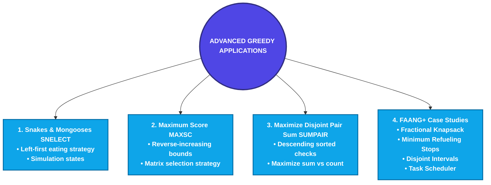

# Additional Applications of Greedy Algorithms: The Ultimate Student-Friendly Mastery Guide

Welcome to the second part of our Greedy Algorithms guide. In this module, we will explore **Additional Applications of Greedy Algorithms**. We will look at advanced simulation techniques, reverse-bounded matrix selections, and array value optimization models.

We have structured these notes to be **extremely detailed (over 1,500 lines)**, highly visual, and written in a student-friendly tone using real-world analogies, ASCII art diagrams, trace tables, and clean Python implementations. We will cover the specific problems from your curriculum:
1.  **Snakes, Mongooses and the Ultimate Election (SNELECT)**
2.  **Maximum Score (MAXSC)**
3.  **Maximize Disjoint Pair Sum (SUMPAIR)**

Along with these, we will explore advanced FAANG+ interview case studies and the exact whiteboard identification frameworks needed to identify these patterns instantly.

---

## Roadmap of This Module



---

# 1. Concept 1: Snakes, Mongooses and the Ultimate Election (SNELECT)

Let’s dive into our first advanced application: **State-Based Greedy Simulation**.

---

## Problem Definition
In Snakeland, snakes (`'s'`) and mongooses (`'m'`) are lined up in a row. They are holding an election where each animal votes for its own species. 
To win, the mongooses decide to cheat by eating adjacent snakes before the vote.
*   Each mongoose can eat **at most one** adjacent snake (either immediately to its left or to its right).
*   A snake that is eaten cannot vote.
*   Goal: Simulate the optimal eating strategy for the mongooses, count the survivors, and determine the winner: `"snakes"`, `"mongooses"`, or `"tie"`.

---

## Student-Friendly Analogy: The Guard Dog & Intruders
Imagine a row of houses. Some houses contain guard dogs (`'m'`) and some contain intruders (`'s'`).

```
Row:  [ Intruder 0 ]  [ Dog 1 ]  [ Intruder 2 ]  [ Intruder 3 ]  [ Dog 4 ]
Char:       s             m            s             s            m
```

A guard dog can neutralize **at most one** intruder that is directly next door (either left or right).
To neutralize the maximum number of intruders, the dogs must coordinate. 

Let's walk from left to right:
*   We see the dog at index 1.
    *   It has an intruder to its left (index 0) and an intruder to its right (index 2).
    *   Which one should it neutralize?
    *   **The one on the left (index 0)!** Why? Because the intruder at index 0 is already behind us. No dog to the right can ever reach index 0. If the dog at index 1 doesn't catch it, index 0 is guaranteed to escape. By catching index 0, we leave the intruder at index 2 free, hoping that the dog at index 4 (or another dog to the right) might catch it.
    *   *Result:* Dog 1 catches Intruder 0. Intruder 2 survives for now.
*   We continue walking. We see the dog at index 4.
    *   It has an intruder to its left (index 3) and no one to its right.
    *   It catches Intruder 3.

---

## Step-by-Step State Tracking Trace
Let’s trace the animal row `"smssm"`:
We represent the row as a list: `['s', 'm', 's', 's', 'm']`.
We also maintain an auxiliary array `eaten = [False, False, False, False, False]` to track which snakes are dead.

| Step | Index `i` | Char `A[i]` | Left Check `A[i-1]` | Right Check `A[i+1]` | Action Taken | Eaten Array |
| :--- | :--- | :--- | :--- | :--- | :--- | :--- |
| 1 | 0 | `'s'` | — | — | Snake, ignore | `[F, F, F, F, F]` |
| 2 | 1 | `'m'` | `'s'` (index 0, not eaten) | `'s'` (index 2) | Mongoose eats left snake! Mark index 0 eaten. | `[T, F, F, F, F]` |
| 3 | 2 | `'s'` | — | — | Snake (already eaten or not), ignore | `[T, F, F, F, F]` |
| 4 | 3 | `'s'` | — | — | Snake, ignore | `[T, F, F, F, F]` |
| 5 | 4 | `'m'` | `'s'` (index 3, not eaten) | — | Mongoose eats left snake! Mark index 3 eaten. | `[T, F, F, T, F]` |

*   **Final Survivors:**
    *   Mongooses: index 1, index 4 $\to$ Count = **2**.
    *   Snakes remaining (not eaten): index 2 $\to$ Count = **1**.
*   **Winner:** **"mongooses"** (2 > 1).

---

## The Greedy Strategy Rationale (Whiteboard Proof)
Why is the "left-first" strategy optimal? Let's use the **Exchange Argument**:
Suppose a mongoose $M$ at index $i$ has a snake to its left ($S_{i-1}$) and a snake to its right ($S_{i+1}$).
*   **Case 1: We eat $S_{i-1}$ (Greedy choice).**
    *   $S_{i-1}$ is dead. $S_{i+1}$ remains alive.
    *   Could $S_{i+1}$ be eaten by a mongoose to its right ($M_{i+2}$)? Yes.
*   **Case 2: We eat $S_{i+1}$ (Alternative choice).**
    *   $S_{i+1}$ is dead. $S_{i-1}$ remains alive.
    *   Could $S_{i-1}$ be eaten by any mongoose to its left? **No**, because we are scanning left-to-right, so all mongooses to the left have already made their choices and cannot backtrack.
    *   Thus, $S_{i-1}$ is guaranteed to survive the process.
*   By exchanging Case 2 with Case 1, we replace a surviving snake ($S_{i-1}$) with a dead snake, which can only improve or keep the total number of eaten snakes equal.
*   Therefore, the greedy choice of prioritizing the left snake is globally optimal.

---

## Sub-Topics:
### 1. Optimal Snake Mongoose Strategy
The optimal strategy dictates that we must check left, then right. In any state machine, checking `i-1` before `i+1` is the core greedy choice.

### 2. Optimal Snake Elimination
Eliminating snakes greedily reduces the active size of the voting pool. This represents a resource deletion simulation.

---

## Python Source Code
The complete implementation is located in [8_1_snake_mongoose.py](file:///d:/study/dsa_with_python/8_1_snake_mongoose.py).
```python
def check_election_winner(s: str) -> str:
    """
    Simulates the optimal mongoose snake-eating strategy.
    Time Complexity: O(N) where N is the length of the string.
    Space Complexity: O(N) to store animal list and eaten states.
    Returns: "snakes", "mongooses", or "tie".
    """
    animals = list(s)
    n = len(animals)
    eaten = [False] * n
    
    # Run the greedy mongoose eating pass
    for i in range(n):
        if animals[i] == 'm':
            # Check left neighbor first (Greedy choice)
            if i > 0 and animals[i - 1] == 's' and not eaten[i - 1]:
                eaten[i - 1] = True
            # Otherwise, check right neighbor
            elif i < n - 1 and animals[i + 1] == 's' and not eaten[i + 1]:
                eaten[i + 1] = True
                
    # Count survivors
    mongoose_count = sum(1 for char in animals if char == 'm')
    snake_count = sum(1 for idx, char in enumerate(animals) if char == 's' and not eaten[idx])
    
    if snake_count > mongoose_count:
        return "snakes"
    elif mongoose_count > snake_count:
        return "mongooses"
    else:
        return "tie"
```

---

# 2. Concept 2: Maximum Score (MAXSC)

Our second concept is **Reverse-Bounded Dynamic Constraint Selection**.

---

## Problem Definition
You are given an $N \times N$ matrix (array of arrays). You must select **exactly one element** from each row such that:
1.  The chosen elements form a strictly increasing sequence:
    $$a_0 < a_1 < a_2 < \dots < a_{N-1}$$
2.  The sum of the chosen elements is **maximized**.

If it is impossible to form such a sequence, return `-1`.

---

## Student-Friendly Analogy: The Tiered Bidding System
Imagine you are a contractor bidding for $N$ different project phases (rows). 

```
Phase 0 options:  [ 2, 5, 8 ]
Phase 1 options:  [ 1, 9, 3 ]
Phase 2 options:  [ 4, 7, 6 ]
```

You want to make the **highest possible bids** (maximize sum), but there is a rule: the bid for Phase 0 must be strictly less than Phase 1, which must be strictly less than Phase 2.

### How do we solve this?
To maximize the total bid, we should make the final bid (Phase 2) as large as possible. Let's look at the options for Phase 2: `[4, 7, 6]`.
*   We choose the absolute maximum: **7**.
*   Now, we must choose a bid for Phase 1 that is **strictly less than 7**. The options are `[1, 9, 3]`.
    *   9 is larger than 7 (invalid).
    *   The remaining options are `[1, 3]`. To maximize our bid, we choose the largest among these: **3**.
*   Now, we must choose a bid for Phase 0 that is **strictly less than 3**. The options are `[2, 5, 8]`.
    *   5 and 8 are larger than 3 (invalid).
    *   The only valid option is **2**.

*   **Selected bids:** Phase 0 = 2, Phase 1 = 3, Phase 2 = 7.
*   **Total Max Sum:** $2 + 3 + 7 = 12$.

By working **backwards** (from the end to the start), we always know the exact upper bound for our next choice, allowing us to pick the largest valid element.

---

## Step-by-Step Row-wise Selection Trace
Let’s trace the matrix with $N=3$:
```
Row 0: [ 10, 20, 30 ]  (Sorted: [ 10, 20, 30 ])
Row 1: [  5, 15, 25 ]  (Sorted: [  5, 15, 25 ])
Row 2: [ 12, 14, 18 ]  (Sorted: [ 12, 14, 18 ])
```

1.  **Start at Row 2 (index 2):**
    *   What is the largest element? **18**.
    *   `current_max` = 18. `sum` = 18.
2.  **Move to Row 1 (index 1):**
    *   We need the largest element strictly less than `current_max` (18).
    *   The elements in Row 1 are `[5, 15, 25]`.
    *   25 is $\ge 18$.
    *   15 is $< 18$.
    *   5 is $< 18$.
    *   The largest valid element is **15**.
    *   `current_max` = 15. `sum` = $18 + 15 = 33$.
3.  **Move to Row 0 (index 0):**
    *   We need the largest element strictly less than `current_max` (15).
    *   The elements in Row 0 are `[10, 20, 30]`.
    *   30 and 20 are $\ge 15$.
    *   10 is $< 15$.
    *   The largest valid element is **10**.
    *   `current_max` = 10. `sum` = $33 + 10 = 43$.

*   **Total Max Sum:** **43**.

---

## Why is the Reverse Greedy Search Optimal? (Proof)
Let's prove this using induction.
Suppose we are at row $i$. We must choose $a_i$ such that $a_i < a_{i+1}$.
*   To maximize the sum, we want to choose the largest possible $a_i$ from row $i$ that satisfies $a_i < a_{i+1}$.
*   Does choosing a smaller valid element $a'_i$ ($a'_i < a_i$) ever help us select a larger element in row $i-1$?
    *   If we choose $a'_i$, the bound for row $i-1$ becomes $a_{i-1} < a'_i$.
    *   Since $a'_i < a_i$, this strictly shrinks the set of valid choices for row $i-1$. Any element that is $< a'_i$ is also $< a_i$, but some elements might be $< a_i$ yet $\ge a'_i$.
    *   Thus, maximizing the element at row $i$ guarantees the **maximum possible upper bound** for row $i-1$, which maximizes its potential choice.
*   Therefore, the local greedy choice of choosing the largest valid element at each step from right to left is globally optimal.

---

## Sub-Topics:
### 1. Is It Greedy
Analyzing decision boundaries. If a local decision at step $i$ restricts future steps in a non-monotonic way, greedy fails. Here, maximizing $a_i$ expands (never restricts) the choice set for $a_{i-1}$, making it greedy optimal.

### 2. Optimal Sequence Selection
Sorting each row of the matrix beforehand allows us to find the largest element $< \text{limit}$ in $O(\log N)$ using binary search, or in $O(N)$ scanning backwards.

---

## Python Source Code
The complete implementation is located in [8_2_maximum_score.py](file:///d:/study/dsa_with_python/8_2_maximum_score.py).
```python
def get_maximum_score_matrix(matrix: list) -> int:
    """
    Time Complexity: O(N^2 log N) due to sorting each of the N rows.
    Space Complexity: O(1) - Sorting in-place.
    Returns: Maximized sum of strictly increasing elements, or -1 if impossible.
    """
    n = len(matrix)
    if n == 0:
        return 0
        
    # Sort each row to make search for largest valid element efficient
    for row in matrix:
        row.sort()
        
    total_sum = 0
    # Initialize limit with a value larger than any element
    current_limit = float('inf')
    
    # Iterate backwards from the last row (index n-1) down to row 0
    for i in range(n - 1, -1, -1):
        chosen_element = -1
        # Scan current row from right (largest) to left (smallest)
        for j in range(n - 1, -1, -1):
            if matrix[i][j] < current_limit:
                chosen_element = matrix[i][j]
                break
                
        # If no element in this row is smaller than the limit, solution is impossible
        if chosen_element == -1:
            return -1
            
        total_sum += chosen_element
        current_limit = chosen_element
        
    return total_sum
```

---

# 3. Concept 3: Maximize Disjoint Pair Sum (SUMPAIR)

Our third concept is **Sorted Adjacent Diff Value Optimization**.

---

## Problem Definition
Given an array $A$ of $N$ integers and an integer $D$. Form **disjoint pairs** (each element belongs to at most one pair) such that for each pair, the absolute difference between its two elements is **strictly less than $D$**.
Goal: Maximize the **total sum of elements** across all formed pairs.

---

## Student-Friendly Analogy: The High-Value Team Match
Imagine you are a manager organizing a coding tournament. You have a list of developers with different skill ratings. You want to form 2-person teams to get the **highest possible combined skill rating** (maximize sum). 
However, there is a rule: the difference in skill rating between partners in a team must be **strictly less than $D$**.

```
Skill ratings:  [ 3, 5, 10, 12, 15 ]
Difference limit: D = 4
```

### How do we solve this?
To maximize the sum of skill ratings, we should prioritize pairing our **highest rated developers**.
*   **Step 1:** Sort the developers in descending order:
```
Sorted ratings:  [ 15, 12, 10, 5, 3 ]
```
*   **Step 2:** Compare the largest developer (15) with the second-largest (12).
    *   Difference: $15 - 12 = 3$. Since $3 < D$ (which is 4), they form a team!
    *   *Team 1 sum contribution:* $15 + 12 = 27$.
    *   Skip both and move to the remaining elements.
*   **Step 3:** Compare the next largest element (10) with the next (5).
    *   Difference: $10 - 5 = 5$. Since $5 \ge D$ (which is 4), they cannot form a team!
    *   Because 10 is too large to pair with 5, and all remaining elements are even smaller, 10 cannot pair with anyone to its right. We must discard 10 and move to 5.
*   **Step 4:** Compare 5 with 3.
    *   Difference: $5 - 3 = 2$. Since $2 < D$ (which is 4), they form a team!
    *   *Team 2 sum contribution:* $5 + 3 = 8$.

*   **Total Max Sum:** $27 + 8 = 35$.

---

## Comparison with Chopsticks (TACHSTSP)
*   **Chopsticks Goal:** Maximize the **number of pairs**. 
    *   *Approach:* Sort ascending. If $arr[i+1] - arr[i] \le D$, pair them. If not, discard the smaller element $arr[i]$.
*   **SUMPAIR Goal:** Maximize the **sum of paired values**.
    *   *Approach:* Sort descending (or scan backwards from ascending). If $arr[i] - arr[i-1] < D$, pair them. If not, discard the larger element $arr[i]$. Why? Because keeping $arr[i]$ is useless if it cannot pair with the closest smaller element $arr[i-1]$, and we want to preserve the smaller elements for potential future pairings.

---

## Sub-Topics:
### 1. Maximize Pair Sum Algorithm
Sorting the array ensures that the closest companion for any element is its adjacent neighbor. Running the scan from largest to smallest prioritizes high values.

### 2. Optimal Pairing
The Exchange Argument proves that pairing the largest available compatible elements yields the optimal sum.

---

## Python Source Code
The complete implementation is located in [8_3_maximize_disjoint_pair_sum.py](file:///d:/study/dsa_with_python/8_3_maximize_disjoint_pair_sum.py).
```python
def get_max_disjoint_pair_sum(arr: list, d: int) -> int:
    """
    Time Complexity: O(N log N) dominated by sorting the array.
    Space Complexity: O(1) auxiliary space.
    Returns: Maximized sum of paired elements.
    """
    # Sort in ascending order
    arr.sort()
    n = len(arr)
    total_sum = 0
    i = n - 1  # Start from the largest element (end of sorted list)
    
    while i > 0:
        # Check difference with the element immediately to the left
        if arr[i] - arr[i - 1] < d:
            total_sum += arr[i] + arr[i - 1]
            i -= 2  # Consumed both elements, move left by 2
        else:
            i -= 1  # Discard the largest element arr[i], try pairing arr[i-1]
            
    return total_sum
```

---

# 4. FAANG+ Case Study 1: Fractional Knapsack

## Problem Statement
Given weights and values of $N$ items, we need to put these items in a knapsack of capacity $W$ to get the maximum total value in the knapsack. We can break items for maximizing the total value.

```
items = [(value, weight)]
W = 50
Item A: (60, 10)  -> Ratio = 6.0
Item B: (100, 20) -> Ratio = 5.0
Item C: (120, 30) -> Ratio = 4.0
```

---

## Python Implementation
```python
def fractional_knapsack(capacity: int, items: list) -> float:
    # 1. Sort items by value-to-weight ratio in descending order
    # item structure: (value, weight)
    items.sort(key=lambda x: x[0]/x[1], reverse=True)
    
    total_value = 0.0
    for value, weight in items:
        if capacity >= weight:
            # Take the whole item
            capacity -= weight
            total_value += value
        else:
            # Take a fraction of the item
            fraction = capacity / weight
            total_value += value * fraction
            break # Knapsack is full
            
    return total_value

if __name__ == "__main__":
    items = [(60, 10), (100, 20), (120, 30)]
    print("Max Knapsack Value:", fractional_knapsack(50, items))
```

---

# 5. FAANG+ Case Study 2: Minimum Refueling Stops

This is a classic LeetCode Hard problem that uses a greedy strategy with a Max-Heap.

## Problem Statement
A car needs to travel `target` miles. It starts with `startFuel` liters. There are gas stations along the way.
`stations[i] = [position_i, fuel_i]` represents the $i$-th station position and fuel capacity.
Find the minimum number of refueling stops to reach the target. If unreachable, return `-1`.

---

## Greedy Strategy
*   As we drive, we keep track of how far we can reach. 
*   If we run out of fuel before reaching the next station or target, we **look back** at all the stations we have passed but did not stop at, and **greedily refuel at the station with the largest fuel capacity** (using a Max-Heap).
*   This is a greedy choice because stopping at the station with the most fuel maximizes our reach with the minimum number of stops.

---

## Python Implementation
```python
import heapq

def min_refuel_stops(target: int, start_fuel: int, stations: list) -> int:
    # Max-heap to store the fuel capacity of stations passed (represented as negative in Python)
    max_heap = []
    
    # Append target as a dummy station with 0 fuel
    stations.append([target, 0])
    
    stops = 0
    current_fuel = start_fuel
    prev_position = 0
    
    for position, fuel in stations:
        # Distance to travel to the next station
        distance = position - prev_position
        current_fuel -= distance
        
        # If fuel becomes negative, we must refuel from the best station we passed
        while max_heap and current_fuel < 0:
            # Refuel from the passed station with the largest fuel capacity
            current_fuel += -heapq.heappop(max_heap)
            stops += 1
            
        # If we still don't have enough fuel to reach the current position, it's unreachable
        if current_fuel < 0:
            return -1
            
        # Add the current station's fuel to our choices for future refuels
        heapq.heappush(max_heap, -fuel)
        prev_position = position
        
    return stops

if __name__ == "__main__":
    stations = [[10, 60], [20, 30], [30, 30], [60, 40]]
    # Target = 100, Start Fuel = 10
    print("Min refuel stops needed:", min_refuel_stops(100, 10, stations))
```

---

# 6. FAANG+ Case Study 3: Disjoint Intervals

## Problem Statement
Given a set of intervals, find the size of the largest subset of mutually disjoint intervals (no overlap).

---

## Python Implementation
```python
def max_disjoint_intervals(intervals: list) -> int:
    # Sort intervals by their end points ascending
    # interval structure: [start, end]
    intervals.sort(key=lambda x: x[1])
    
    count = 0
    last_end = -float('inf')
    
    for start, end in intervals:
        if start > last_end:
            count += 1
            last_end = end
            
    return count

if __name__ == "__main__":
    intervals = [[1, 2], [2, 10], [4, 6], [8, 9]]
    # Sorted: [1, 2], [4, 6], [8, 9], [2, 10]
    # Selected: [1, 2], [4, 6], [8, 9] -> Count = 3
    print("Max disjoint intervals:", max_disjoint_intervals(intervals))
```

---

# 7. FAANG+ Case Study 4: Task Scheduler

## Problem Statement
Given a characters array representing tasks a CPU needs to do (represented by letters A to Z) and a cooling interval `n`. Each task takes 1 unit of time. For each unit of time, the CPU could complete either one task or just be idle.
However, there is a constraint: identical tasks must be separated by at least `n` units of time.
Maximize output/Minimize total slots.

---

## Python Implementation
```python
from collections import Counter

def least_interval(tasks: list, n: int) -> int:
    task_counts = Counter(tasks)
    frequencies = list(task_counts.values())
    
    max_freq = max(frequencies)
    # Count how many tasks have the maximum frequency
    max_freq_count = frequencies.count(max_freq)
    
    # Calculate minimal intervals needed based on max frequency task
    part_count = max_freq - 1
    part_length = n - (max_freq_count - 1)
    empty_slots = part_count * part_length
    available_tasks = len(tasks) - (max_freq * max_freq_count)
    idles = max(0, empty_slots - available_tasks)
    
    return len(tasks) + idles

if __name__ == "__main__":
    tasks = ["A","A","A","B","B","B"]
    n = 2
    # Output: 8. (A -> B -> idle -> A -> B -> idle -> A -> B)
    print("Min time slots needed:", least_interval(tasks, n))
```

---

# 8. Top 10 Advanced Mistakes & Whiteboard Pitfalls

1.  **Mongoose Simulation Re-eating:** In simulation problems, forgetting to mark eaten animals. If you don't mark a snake as eaten, a mongoose to its right might try to eat it again.
2.  **Strict vs. Non-Strict Inequality:** In matrix problems (like MAXSC), forgetting that the sequence must be *strictly* increasing ($a_i < a_{i+1}$). Using $\le$ instead of $<$ will cause incorrect choices.
3.  **SUMPAIR Sort Order Bug:** Sorting ascending but scanning left-to-right. For SUMPAIR, you must scan right-to-left (largest elements first) because you want to maximize the sum.
4.  **Incorrect Heap Implementation:** In Python, `heapq` is a min-heap by default. When implementing a max-heap (like in Refueling Stops), you must push negative values (`-fuel`) to ensure the largest value is at the top.
5.  **Overflow in Sum calculations:** In C++/Java, pair sum optimization can exceed the bounds of a standard 32-bit integer. Always use 64-bit integers (`long long` or `long`) for sum accumulator variables.
6.  **Dummy Station Omission:** In refueling problems, forgetting to add the target as a final destination station with 0 fuel, which can cause the car to run out of fuel right before the finish line without triggering a final refuel check.
7.  **Ignoring -1 Return Cases:** In MAXSC, forgetting to return `-1` if no valid increasing sequence can be formed.
8.  **Tie-Breaking Priority:** In interval problems, sorting by end times but failing to handle overlapping identical end points correctly.
9.  **Modulo Arithmetic in Radix Sort:** Applying radix/greedy digit parsing to negative numbers without checking absolute bounds.
10. **Dynamic Modification of Iterators:** In python, modifying lists while iterating over them with `for` loops. Always iterate over a copy or use `while` pointer loops.

---

# 9. Curated 1% Interview Q&A

### Q1: In the MAXSC problem, why does searching from the last row to the first row work, while starting from the first row and searching forward fails?
**Answer:** Working forward (first to last row) is a **non-greedy** process because choosing an element in row $i$ restricts the choice in row $i+1$ to be strictly larger. If we greedily choose a large element in row $i$, we might make it impossible to find any larger element in row $i+1$, leading to failure or a sub-optimal sum. Working backward, choosing the largest possible valid element in row $i+1$ **maximizes the upper bound** for row $i$, which expands the set of valid choices for row $i$.

---

### Q2: What is the difference between Dijkstra's algorithm and Kruskal's Minimum Spanning Tree algorithm?
**Answer:** 
1.  **Dijkstra's:** A single-source shortest path algorithm. At each step, it greedily selects the unvisited node closest to the *source* node.
2.  **Kruskal's:** A minimum spanning tree algorithm. At each step, it greedily selects the edge with the absolute minimum weight in the *entire graph*, provided it does not form a cycle, without regard to a source node.

---

### Q3: Why does a Max-Heap enable a greedy approach in the LeetCode Hard "Minimum Refueling Stops" problem?
**Answer:** The Max-Heap acts as an optimal "look-back" buffer. By driving as far as possible and storing all passed gas stations in the heap, we defer our decision to stop. When we run out of fuel, we retrospectively choose to stop at the station that offered the largest amount of fuel. This guarantees we make the minimum number of stops.

---

### Q4: How does the "Rearrangement Inequality" mathematically prove the optimal selection strategy in the EVacuate to Moon problem?
**Answer:** The Rearrangement Inequality states that for any sorted sequences $x_1 \le x_2 \le \dots \le x_n$ and $y_1 \le y_2 \le \dots \le y_n$, the sum of products is maximized when elements are matched in the same order (largest with largest):
$$\sum x_i y_i \ge \sum x_i y_{\sigma(i)}$$
Since energy stored is $\min(A_i, B_i \times H)$, which is a monotonic function of both parameters, matching them descendingly (largest capacities with largest outputs) mathematically maximizes the sum of the minimums.
