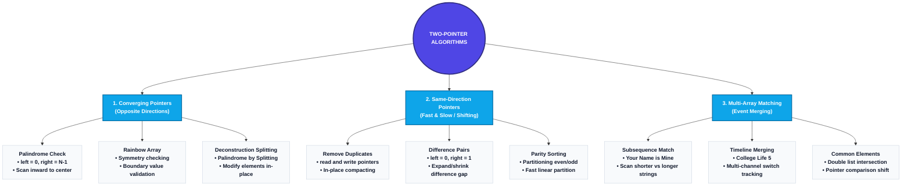
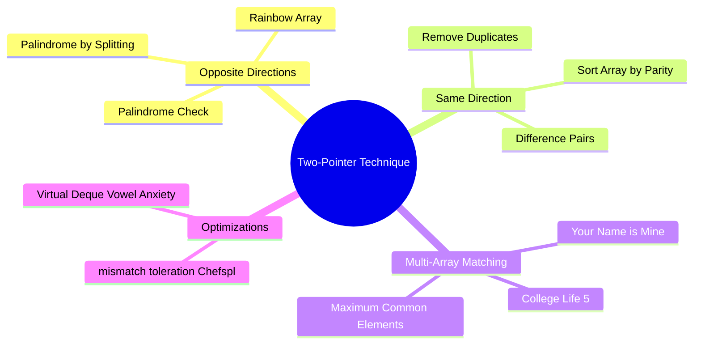

# Two-Pointer Algorithms in Python: Complete Mastery Guide

This study guide provides a comprehensive, production-grade reference to **Two-Pointer Algorithms** and key related patterns in Python. It covers opposite-directional converging pointers (Palindrome, Rainbow Array, Palindrome by Splitting), same-directional pointer scans (Remove Duplicates, Difference Pairs, Sort Array by Parity), subsequence matching (Your Name is Mine), multi-pointer merging timelines (College Life 5), double-ended queue allocations (Vowel Anxiety), and string mismatch checking (Chef and Special Dishes).

---

# 1. The Big Picture & Concept Connections

The **Two-Pointer Technique** is an algorithmic pattern that uses two index variables (pointers) to traverse a contiguous data structure (like an array or string) simultaneously. It optimizes problems that would naively require nested loops ($O(N^2)$) by scanning elements in a single linear pass ($O(N)$), saving time complexity without increasing space complexity.



### Prerequisite Concepts
Before studying Two-Pointer Algorithms, ensure you are comfortable with:
*   **Array Layout & Memory Contiguity:** How array indexes map to memory offsets ($O(1)$ lookup).
*   **Asymptotic Time & Space Complexity:** Big O notation, understanding how $O(N)$ linear scans differ from $O(N^2)$ nested loops.
*   **String Indexing & Slicing:** Managing string traversals in Python.

### Dependent Concepts
The concepts mastered in this module are used directly in:
*   **Sliding Window Algorithms:** A variation of two-pointers where the distance between pointers defines a dynamic "window".
*   **Divide and Conquer Partitioning:** Quick Sort’s partition step (Lomuto vs Hoare) uses two pointers to partition elements.
*   **Binary Search:** Uses two pointers (`low`, `high`) to split search space logarithmically.

---

# 2. Concept 1: Converging Pointers (Check Palindrome & Rainbow Array)

## Definition
**Converging Pointers** is a pattern where two pointers start at opposite ends of an array/string (`left = 0`, `right = N-1`) and move toward each other (converging to the center) until they meet.

---

## Intuition
Imagine checking if a word like `"RACECAR"` is a palindrome. You don't read the word forward, copy it backwards to another sheet of paper, and compare the two sheets. Instead, your eyes naturally check the first letter `'R'` and the last letter `'R'`. If they match, your eyes move inward to check `'A'` and `'A'`, then `'C'` and `'C'`, meeting at the center `'E'`. If all pairs match, the word is a palindrome.

---

## Detailed Explanation
In a converging pointer scan, the left pointer increment is `left += 1` and the right pointer decrement is `right -= 1`. 
*   If elements at the pointers match (`arr[left] == arr[right]`), the search narrows.
*   If elements do not match, the condition fails immediately, allowing early termination.

---

## Key Components
1.  **Left Pointer:** Initialized to `0`.
2.  **Right Pointer:** Initialized to `len(arr) - 1`.
3.  **Convergence Condition:** Loop runs `while left < right`.
4.  **Symmetry Invariant:** Element check `arr[left] == arr[right]`.

---

## Workflow / Process (ASCII Visualization)
Checking `"ABBA"`:
```
Step 1:  [ A ] [ B ] [ B ] [ A ]
          L                 R
         L and R match ('A' == 'A'). L += 1, R -= 1.

Step 2:  [ A ] [ B ] [ B ] [ A ]
                  L     R
         L and R match ('B' == 'B'). L += 1, R -= 1.

Step 3:  L >= R (meet). Exit loop. Palindrome is True.
```

---

## Python Implementations & Syllabus Exercises

### 1. Check Palindrome
Checks if a string is a palindrome.
```python
def is_palindrome(s: str) -> bool:
    left = 0
    right = len(s) - 1
    while left < right:
        if s[left] != s[right]:
            return False
        left += 1
        right -= 1
    return True
```

### 2. Chef and Rainbow Array (CodeChef RAINBOWA)
An array is a "Rainbow Array" if it contains elements $1, 2, 3, 4, 5, 6, 7$ in increasing order, followed by the same elements in decreasing order, and is symmetric.
*   *Greedy/Two-Pointer strategy:*
    1. Check if the array is symmetric using converging pointers.
    2. Ensure that as we move inward, elements increment by at most 1, and we cover all numbers from 1 to 7.

```python
def is_rainbow_array(arr: list) -> bool:
    n = len(arr)
    left = 0
    right = n - 1
    
    # We must reach exactly 7 in the center
    expected_values = {1, 2, 3, 4, 5, 6, 7}
    seen_values = set()
    
    # Check symmetry and strictly valid transitions
    prev_val = 0
    while left <= right:
        if arr[left] != arr[right]:
            return False
        
        current_val = arr[left]
        seen_values.add(current_val)
        
        # Values must be between 1 and 7
        if current_val < 1 or current_val > 7:
            return False
            
        # Value must either be the same as previous or increment by exactly 1
        if current_val != prev_val and current_val != prev_val + 1:
            return False
            
        prev_val = current_val
        left += 1
        right -= 1
        
    return seen_values == expected_values
```

### 3. Palindrome by Splitting (CodeChef SPLITPAL)
You are given an array of positive integers. You can split any element $A_i$ into $x$ and $y$ ($x + y = A_i$). Find the minimum splits to make the array a palindrome.
*   *Two-Pointer strategy:*
    *   If `arr[left] == arr[right]`: Move both inward.
    *   If `arr[left] < arr[right]`: Split `arr[right]` into `arr[left]` and `arr[right] - arr[left]`. This matches `arr[left]`, so `left += 1`, and update `arr[right] -= arr[left]`. Add 1 to operations.
    *   If `arr[left] > arr[right]`: Split `arr[left]` into `arr[right]` and `arr[left] - arr[right]`. This matches `arr[right]`, so `right -= 1`, and update `arr[left] -= arr[right]`. Add 1 to operations.

```python
def min_splits_for_palindrome(arr: list) -> int:
    left = 0
    right = len(arr) - 1
    splits = 0
    
    # We copy the list to avoid modifying the input array in-place outside the function
    arr_copy = arr.copy()
    
    while left < right:
        if arr_copy[left] == arr_copy[right]:
            left += 1
            right -= 1
        elif arr_copy[left] < arr_copy[right]:
            arr_copy[right] -= arr_copy[left]
            left += 1
            splits += 1
        else:
            arr_copy[left] -= arr_copy[right]
            right -= 1
            splits += 1
            
    return splits
```

---

## Advantages & Disadvantages
### Advantages
*   **Memory Efficiency:** Run in-place with $O(1)$ auxiliary space.
*   **Time Efficiency:** Bypasses $O(N^2)$ checks by terminating in a single $O(N)$ pass.
*   **Early Termination:** Returns `False` on the first mismatch, saving execution time.

### Disadvantages
*   **Symmetry Constraint:** Only applicable if the problem has structural symmetry (like Palindromes) or sorted boundaries.
*   **Array Modifiability:** Some variants (like SPLITPAL) require array updates, which can introduce side effects if not copied.

---

## Best Practices
*   Use integer division `mid = len(arr) // 2` when you only need to scan the first half.
*   Avoid standard list slices like `arr == arr[::-1]` for large inputs in interviews, as slicing creates a full copy of the array, consuming $O(N)$ space. Use index variables to keep space at $O(1)$.

---

# 3. Concept 2: Same-Direction Pointers (Remove Duplicates & Difference Pairs)

## Definition
**Same-Direction Pointers** (often called "Fast and Slow Pointers" or "Reader-Writer Pointers") is a pattern where both pointers start at the same end of the array and move in the same direction, but at different speeds or based on different conditions.

---

## Intuition
Imagine you are cleaning a bookshelf. You scan books from left to right.
*   Your **Reader Pointer** looks at every book one by one.
*   Your **Writer Pointer** keeps track of where the next "clean, unique" book should be placed.
If you see a duplicate book, you skip it. If you see a new book, you slide it to the position marked by the writer pointer and move the writer pointer forward. This compacts the unique books in-place.

---

## Detailed Explanation
One pointer (`fast` or `read`) scans every element of the array. The other pointer (`slow` or `write`) only advances when a certain condition is met (e.g. a unique element is identified). The elements are written to the `slow` index, effectively updating the array in-place.

---

## Key Components
1.  **Fast Pointer (`i`):** Reads the current element, increments every step.
2.  **Slow Pointer (`write`):** Tracks the boundary of the processed/compacted segment.
3.  **Loop Constraint:** `for i in range(len(arr))` or equivalent.

---

## Workflow / Process (ASCII Visualization)
Removing duplicates from `[1, 1, 2]`:
```
Step 1:  [ 1 ] [ 1 ] [ 2 ]
          W
          F
         i = 0. write = 0. arr[0] is always unique. Move W to 1.

Step 2:  [ 1 ] [ 1 ] [ 2 ]
                  W
                  F
         i = 1. arr[1] == arr[write-1] (duplicate). Skip.

Step 3:  [ 1 ] [ 1 ] [ 2 ]
                  W
                          F
         i = 2. arr[2] != arr[write-1] (unique). Write arr[write] = arr[2].
         Array becomes: [ 1 ] [ 2 ] [ 2 ]. W += 1.

Final:   Unique array is arr[0:W] -> [ 1, 2 ].
```

---

## Python Implementations & Syllabus Exercises

### 1. Remove Duplicates (CodeChef 900)
Remove duplicates from a sorted array in-place and return the length of the unique elements.
```python
def remove_duplicates(arr: list) -> int:
    if not arr:
        return 0
        
    write_idx = 1
    for read_idx in range(1, len(arr)):
        # If current element is different from the last unique element
        if arr[read_idx] != arr[write_idx - 1]:
            arr[write_idx] = arr[read_idx]
            write_idx += 1
            
    return write_idx
```

### 2. Difference Pairs (CodeChef 1000)
Given a sorted array, find if there exists a pair $(A_i, A_j)$ such that $A_j - A_i = K$.
*   *Two-Pointer strategy:*
    *   Initialize `left = 0`, `right = 1`.
    *   If `arr[right] - arr[left] < K`: Increment `right` to increase the difference.
    *   If `arr[right] - arr[left] > K`: Increment `left` to decrease the difference.
    *   If `== K` and `left != right`: Return `True`.

```python
def has_difference_pair(arr: list, k: int) -> bool:
    k = abs(k)
    n = len(arr)
    left = 0
    right = 1
    
    while left < n and right < n:
        if left == right:
            right += 1
            continue
            
        diff = arr[right] - arr[left]
        if diff == k:
            return True
        elif diff < k:
            right += 1
        else:
            left += 1
            
    return False
```

### 3. Sort Array by Parity (Medium)
Given an array, rearrange elements such that all even integers are at the beginning followed by all odd integers.
*   *Two-Pointer strategy:*
    *   `left = 0`, `right = len(arr) - 1`.
    *   If `arr[left]` is odd and `arr[right]` is even: swap them.
    *   If `arr[left]` is even: `left += 1`.
    *   If `arr[right]` is odd: `right -= 1`.

```python
def sort_array_by_parity(arr: list) -> list:
    left = 0
    right = len(arr) - 1
    
    while left < right:
        if arr[left] % 2 > arr[right] % 2:
            # Swap odd at left with even at right
            arr[left], arr[right] = arr[right], arr[left]
            
        if arr[left] % 2 == 0:
            left += 1
        if arr[right] % 2 != 0:
            right -= 1
            
    return arr
```

---

# 4. Concept 3: Subsequence Verification (Your Name is Mine & Special Dishes)

## Definition
**Subsequence Verification** is a two-pointer pattern where pointers are placed on two different strings or arrays to check if one sequence can be formed by deleting elements from the other without changing their relative order.

---

## Intuition
Imagine checking if the letters of `"cat"` appear in `"character"`. 
*   You look for `'c'` in `"character"`. You find it at index 0.
*   Now, you look for `'a'` to the right of `'c'`. You find it at index 2.
*   Now, you look for `'t'` to the right of `'a'`. You find it at index 5.
You matched all letters of `"cat"` sequentially, so it is a subsequence.

---

## Python Implementations & Syllabus Exercises

### 1. Your Name is Mine (CodeChef NAME2)
A man $M$ and a woman $W$ can marry if one of their names is a subsequence of the other.
```python
def can_marry(m: str, w: str) -> bool:
    return is_subsequence(m, w) or is_subsequence(w, m)

def is_subsequence(s1: str, s2: str) -> bool:
    """
    Checks if s1 is a subsequence of s2.
    Time Complexity: O(len(s2))
    Space Complexity: O(1)
    """
    p1 = 0 # Pointer for s1
    p2 = 0 # Pointer for s2
    
    while p1 < len(s1) and p2 < len(s2):
        if s1[p1] == s2[p2]:
            p1 += 1
        p2 += 1
        
    return p1 == len(s1)
```

### 2. Chef and Special Dishes (CodeChef 1760)
A string $S$ is special if it can be formed by doubling a string $T$ ($T+T$) and optionally inserting at most one character. Given $S$, check if it is special.
*   *Two-Pointer strategy:*
    *   If $len(S)$ is even: $S$ must split exactly in half, and $S[0:N/2] == S[N/2:]$.
    *   If $len(S)$ is odd: Try matching the left half $S[0:N//2]$ with the right half $S[N//2:]$ (or vice-versa, depending on which half is longer) allowing at most 1 mismatch skip.

```python
def is_special_dish(s: str) -> bool:
    n = len(s)
    if n < 2:
        return False
        
    if n % 2 == 0:
        mid = n // 2
        return s[:mid] == s[mid:]
        
    # If length is odd, one half has size mid, the other has size mid + 1.
    mid = n // 2
    
    # Case 1: First half is shorter (extra character in second half)
    # We compare s[0:mid] with s[mid:n]
    if match_with_one_skip(s[:mid], s[mid:]):
        return True
        
    # Case 2: First half is longer (extra character in first half)
    # We compare s[0:mid+1] with s[mid+1:n]
    if match_with_one_skip(s[mid+1:], s[:mid+1]):
        return True
        
    return False

def match_with_one_skip(short_str: str, long_str: str) -> bool:
    """
    Checks if short_str matches long_str with at most 1 character skip in long_str.
    """
    p_short = 0
    p_long = 0
    skips = 0
    
    while p_short < len(short_str) and p_long < len(long_str):
        if short_str[p_short] == long_str[p_long]:
            p_short += 1
            p_long += 1
        else:
            p_long += 1  # Skip mismatch character in long_str
            skips += 1
            if skips > 1:
                return False
                
    return p_short == len(short_str)
```

---

# 5. Concept 4: Two-Pointer Event Merging (College Life 5)

## Definition
**Two-Pointer Event Merging** is a pattern where pointers are maintained on two sorted arrays, and at each step, we compare elements and advance the pointer pointing to the smaller element. This merges the arrays into a single chronological timeline.

---

## Intuition (College Life 5)
Imagine you are watching TV. Football events happen at times $F = [2, 5, 8]$. Cricket events happen at times $C = [1, 9, 10]$. You start watching football. 
*   The first event is at time 1 (Cricket). You switch channels to Cricket.
*   The next event is at time 2 (Football). You switch to Football.
*   The next is at time 5 (Football). You are already watching Football, so you do not switch.
*   The next is at time 8 (Football). You do not switch.
*   The next is at time 9 (Cricket). You switch to Cricket.
*   The next is at time 10 (Cricket). You do not switch.
By comparing the next upcoming event from both channels, you count the switches.

---

## Python Implementations & Syllabus Exercises

### 1. College Life 5 (CodeChef COLLIFE5)
Count the number of channel switches. You start watching Football (represented by 0). Cricket is 1.
```python
def count_channel_switches(football: list, cricket: list) -> int:
    """
    Time Complexity: O(N + M)
    Space Complexity: O(1)
    """
    n = len(football)
    m = len(cricket)
    
    p_foot = 0
    p_cric = 0
    
    current_channel = 0 # 0 for Football, 1 for Cricket
    switches = 0
    
    while p_foot < n and p_cric < m:
        # Compare upcoming events
        if football[p_foot] < cricket[p_cric]:
            # Football event occurs first
            if current_channel != 0:
                switches += 1
                current_channel = 0
            p_foot += 1
        else:
            # Cricket event occurs first
            if current_channel != 1:
                switches += 1
                current_channel = 1
            p_cric += 1
            
    # Process remaining football events
    while p_foot < n:
        if current_channel != 0:
            switches += 1
            current_channel = 0
        p_foot += 1
        
    # Process remaining cricket events
    while p_cric < m:
        if current_channel != 1:
            switches += 1
            current_channel = 1
        p_cric += 1
        
    return switches
```

### 2. Maximum Common Elements / Largest Common Element
Find the count of elements common to two sorted arrays.
```python
def count_common_elements_sorted(arr1: list, arr2: list) -> int:
    p1 = 0
    p2 = 0
    common_count = 0
    
    while p1 < len(arr1) and p2 < len(arr2):
        if arr1[p1] == arr2[p2]:
            common_count += 1
            p1 += 1
            p2 += 1
        elif arr1[p1] < arr2[p2]:
            p1 += 1
        else:
            p2 += 1
            
    return common_count
```

---

# 6. Concept 5: Virtual Deque Reversals (Vowel Anxiety)

## Definition
**Virtual Deque Reversal** is an optimization pattern where, instead of performing expensive $O(N)$ array reversals on a condition, we use pointers or a double-ended queue (deque) to insert elements at the front or back dynamically.

---

## Intuition (Vowel Anxiety)
Given a string, whenever we encounter a vowel, we reverse the string processed so far.
*   *Naive approach:* Iterate through the string. On a vowel, run `s[:i] = s[:i][::-1]`. This takes $O(N^2)$ time and causes TLE (Time Limit Exceeded) for $N = 10^5$.
*   *Two-pointer/Deque approach:* 
    *   Notice that reversing toggles whether new characters are appended to the left or right of the string.
    *   We can iterate through the string **in reverse order** (from right to left).
    *   Maintain a direction state `add_to_front = True`. Every time we see a vowel, we toggle this state. 
    *   If `add_to_front` is True, we push to the front of our collection; otherwise, we push to the back.

---

## Python Implementation: Vowel Anxiety (CodeChef 1823)
```python
from collections import deque

def solve_vowel_anxiety(s: str) -> str:
    """
    Solves Vowel Anxiety in linear O(N) time.
    """
    vowels = {'a', 'e', 'i', 'o', 'u'}
    n = len(s)
    result = deque()
    
    # We iterate backwards from right to left
    # The last characters are never affected by any subsequent reversals
    add_to_front = True
    
    for i in range(n - 1, -1, -1):
        if add_to_front:
            result.appendleft(s[i])
        else:
            result.append(s[i])
            
        # Every time we cross a vowel, the direction of all elements to its left is toggled
        if s[i] in vowels:
            add_to_front = not add_to_front
            
    return "".join(result)
```

---

# 7. Curated Practice Problems & Whiteboard Walkthroughs

## 1. Coronavirus Spread (CodeChef 1219)
*   *Whiteboard Strategy:* Scan the sorted array. If `arr[i+1] - arr[i] > 2`, the virus cannot cross. This breaks the array into independent clusters. The sizes of these clusters represent the possible infection counts. Find the min and max cluster size.
```python
def find_corona_spread_range(arr: list) -> tuple:
    arr.sort()
    n = len(arr)
    min_infected = float('inf')
    max_infected = -float('inf')
    
    current_cluster_size = 1
    for i in range(n):
        if i == n - 1 or arr[i + 1] - arr[i] > 2:
            min_infected = min(min_infected, current_cluster_size)
            max_infected = max(max_infected, current_cluster_size)
            current_cluster_size = 1
        else:
            current_cluster_size += 1
            
    return min_infected, max_infected
```

---

## 2. Check Square (Medium)
Check if a given non-negative integer $C$ can be represented as $a^2 + b^2 = C$.
*   *Whiteboard Strategy:* Converging pointers. `left = 0`, `right = int(math.sqrt(c))`. 
    *   If `left^2 + right^2 < c`: `left += 1`.
    *   If `left^2 + right^2 > c`: `right -= 1`.
    *   If `== c`: Return `True`.
```python
import math

def check_sum_of_squares(c: int) -> bool:
    left = 0
    right = int(math.isqrt(c))
    
    while left <= right:
        val = left * left + right * right
        if val == c:
            return True
        elif val < c:
            left += 1
        else:
            right -= 1
            
    return False
```

---

# 8. Top 10 Whiteboard Pitfalls & Anti-Patterns

1.  **Off-by-One Indexing:** In converging pointer checks, running `while left <= right` when you should run `while left < right` (or vice-versa), causing redundant checks or out-of-bounds index errors.
2.  **Pointer Swap Deadlock:** In same-direction pointers, forgetting to increment the fast pointer at every step, causing infinite loops.
3.  **Invalid Sorted Assumption:** Applying two-pointer summation/difference scans (like Difference Pairs) on unsorted arrays. Always verify if the array must be sorted first.
4.  **Inefficient String Slicing:** Using string reversal or slicing inside a loop (like in Vowel Anxiety), turning an $O(N)$ linear algorithm into a slow $O(N^2)$ algorithm. Use Deques or pointer toggles instead.
5.  **Pointers Crossing Boundaries:** Forgetting to boundary check pointers in checks like `while p1 < len(arr1) and p2 < len(arr2)`.
6.  **Division Resulting in Float Indexing:** In middle-index splits, using float division `/` instead of integer division `//` to compute array bounds.
7.  **Ignoring Empty Inputs:** Failing to check if list lengths are 0 or 1 before launching index assignments.
8.  **Tie-Breaking Priority:** In event merging, failing to define which channel/event takes priority if event times are identical.
9.  **Modulo Arithmetic Overflow:** In parity sorting, using complex math operations instead of basic bitwise check `num & 1 == 0`.
10. **Array Modification during Iteration:** Mutating list size inside a two-pointer loop, which corrupts index offset alignment.

---

# 9. Curated 1% Interview Q&A

### Q1: Why does the two-pointer approach for the Target Difference problem require the pointers to move in the same direction, whereas the Target Sum problem requires pointers to move in opposite directions?
**Answer:** 
1.  **Target Sum ($A + B = K$):** If we start pointers at opposite ends (`left = 0`, `right = N-1`), increasing `left` increases the sum, and decreasing `right` decreases the sum. The direction of change is monotonic, so we can adjust pointers predictably.
2.  **Target Difference ($B - A = K$):** If we used opposite ends, moving pointers inward would decrease $B$ and increase $A$, which decreases the difference. But what if the difference is already too small? We have no way to increase the difference by moving inward. By moving both pointers in the *same* direction, we can expand the gap (incrementing `right` to increase $B$) or shrink it (incrementing `left` to increase $A$), keeping the search monotonic.

---

### Q2: Explain how the Virtual Deque optimization in Vowel Anxiety reduces time complexity from $O(N^2)$ to $O(N)$.
**Answer:** The naive approach performs a string slice copy and reverse operation `s[:i][::-1]` at each vowel, which takes $O(i)$ time. Over $N$ steps, this sums to $\sum i = O(N^2)$ time. The Virtual Deque approach scans the string backwards from right to left. By realizing that each vowel toggles the orientation of all characters to its left, we can simply change our insertion side (front vs. back of a double-ended queue) when crossing a vowel. Pushing to the front or back of a deque takes $O(1)$ constant time, resulting in $O(N)$ total time.

---

### Q3: How does the "Palindrome by Splitting" (SPLITPAL) greedy two-pointer strategy guarantee the minimum number of splits?
**Answer:** By comparing `arr[left]` and `arr[right]`, we are forced to resolve mismatches. If `arr[left] < arr[right]`, we *must* split `arr[right]` to match `arr[left]`. Any other split would create an element that doesn't match the boundary, requiring further splits down the line. Thus, splitting the larger boundary value by exactly the smaller boundary value is the local optimal choice that directly satisfies the optimal substructure.

---

# 10. Comprehensive Revision Notes

*   **Converging Pointers:** Use for palindrome, symmetry, or boundary-target searching.
    *   *Pointers:* `left = 0`, `right = len(arr) - 1`. Loop `while left < right`.
*   **Same-Direction Pointers:** Use for in-place array compaction, subarray searches, or gap-difference matching.
    *   *Pointers:* `slow = 0`, `fast = 1` (or both starting at 0).
*   **Subsequence Pointers:** Used to match elements of a short sequence against a long sequence sequentially in $O(N)$ time.
*   **Virtual Deque:** Saves $O(N)$ copying overhead of array reversals by using a `collections.deque` and toggling append direction.

---

# 11. Master Mind Map


