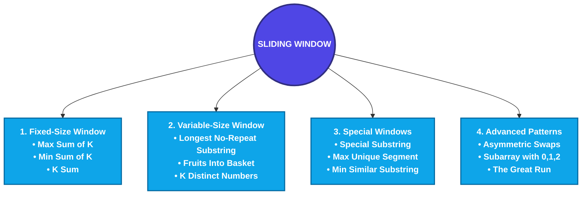
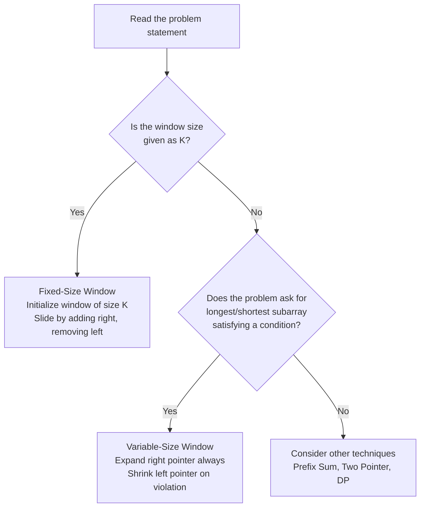
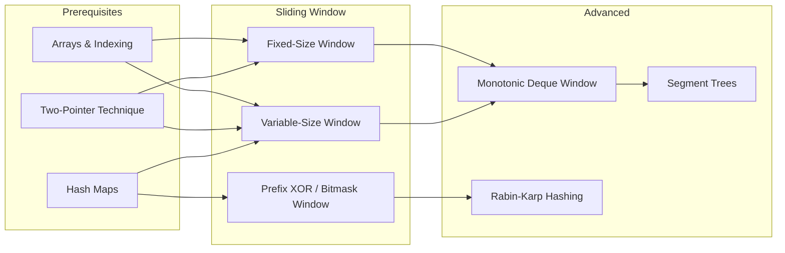

# Sliding Window Algorithms in Python: Complete Mastery Guide

This study guide provides a comprehensive, production-grade reference to **Sliding Window Algorithms** in Python. It covers fixed-size windows, variable-size (expand/shrink) windows, frequency-map tracking, distinct-element constraints, and advanced segment optimization problems. Every concept follows the structure defined in [prompt.md](file:///d:/study/prompt.md): Definition, Intuition, Detailed Explanation, Key Components, Workflow, Examples, Python Implementation, Advantages, Disadvantages, Best Practices, Common Mistakes, and Interview Questions.

---

# 1. The Big Picture & Concept Connections

## Definition
The **Sliding Window** technique is a method for efficiently processing contiguous subarrays or substrings by maintaining a "window" (a range defined by two pointers) that slides across the data structure. Instead of recomputing results from scratch for every possible subarray, the window *incrementally* adds the new element entering the window and removes the element leaving the window.

## Intuition
Imagine you are standing on a moving train looking out a fixed-size rectangular window. As the train moves forward, the scenery at the back edge of the window disappears, and new scenery appears at the front edge. You never need to re-examine the entire landscape — you only process what enters and exits the frame.

```
Array:  [ 2 ] [ 1 ] [ 5 ] [ 1 ] [ 3 ] [ 2 ]

Window of size K=3:

Step 1:  [ 2   1   5 ] . . .      Sum = 8
Step 2:    . [ 1   5   1 ] . .    Sum = 8 - 2 + 1 = 7
Step 3:    . . [ 5   1   3 ] .    Sum = 7 - 1 + 3 = 9
Step 4:    . . . [ 1   3   2 ]    Sum = 9 - 5 + 2 = 6
```

At each step we subtract the element leaving the left edge and add the element entering the right edge. This gives us $O(N)$ time instead of $O(N \times K)$.

## Prerequisite Concepts
*   **Arrays & Indexing:** Direct $O(1)$ index access.
*   **Two-Pointer Technique:** The sliding window is a specialization of two pointers where the gap between them defines a range.
*   **Hash Maps / Frequency Counters:** Used in variable-size windows to track element counts.
*   **Time Complexity Analysis:** Understanding why $O(N)$ beats $O(N \times K)$.

## Dependent Concepts
*   **Deque-based Sliding Window Maximum/Minimum:** Uses a monotonic deque inside a sliding window.
*   **Prefix Sum Arrays:** An alternative to sliding windows for certain fixed-sum problems.
*   **Rabin-Karp String Matching:** Uses a sliding hash window for pattern matching.

---

## Roadmap of This Module



---

# 2. The Two Fundamental Patterns

Before diving into individual problems, understand that **every** sliding window problem falls into one of two categories:

| Attribute | Fixed-Size Window | Variable-Size Window |
| :--- | :--- | :--- |
| **Window Size** | Constant $K$ given in the problem. | Dynamic — grows and shrinks based on a condition. |
| **Right Pointer** | Advances by 1 each step. | Advances by 1 each step (expansion). |
| **Left Pointer** | Advances by 1 each step (after the first $K$ elements). | Advances only when a constraint is violated (shrinking). |
| **When to Use** | "Find the max/min/average of all subarrays of size $K$." | "Find the longest/shortest subarray satisfying condition $X$." |
| **Time Complexity** | $O(N)$ | $O(N)$ amortized (each element enters and exits the window at most once). |

---

## Mermaid Flowchart: Choosing Your Pattern



---

# 3. Concept 1: Fixed-Size Sliding Window

## Definition
A **Fixed-Size Sliding Window** maintains a contiguous subarray of exactly $K$ elements. The window slides one position to the right at each step, adding the new rightmost element and removing the old leftmost element.

## Detailed Explanation
1.  **Initialization Phase:** Compute the aggregate (sum, max, product, etc.) of the first $K$ elements.
2.  **Sliding Phase:** For each subsequent element at index $i$ (from $K$ to $N-1$):
    *   Add `arr[i]` to the aggregate.
    *   Remove `arr[i - K]` from the aggregate.
    *   Update the answer (e.g., track the maximum aggregate seen so far).

## Key Components
1.  **Window Start:** `left = i - K + 1` (implicit — we don't always need an explicit left pointer).
2.  **Window End:** `right = i` (the current element being processed).
3.  **Aggregate Variable:** `current_sum`, `current_product`, etc.
4.  **Answer Variable:** `max_sum`, `min_sum`, etc.

## Workflow (ASCII Visualization)
Finding the maximum sum subarray of size $K=3$ in `[2, 1, 5, 1, 3, 2]`:

```
Phase 1 - Initialize:
  [ 2   1   5 ] 1   3   2       current_sum = 2+1+5 = 8
                                  max_sum = 8

Phase 2 - Slide:
  Step 1:  2 [ 1   5   1 ] 3   2
           Remove 2, Add 1:  current_sum = 8 - 2 + 1 = 7.  max_sum = max(8, 7) = 8.

  Step 2:  2   1 [ 5   1   3 ] 2
           Remove 1, Add 3:  current_sum = 7 - 1 + 3 = 9.  max_sum = max(8, 9) = 9.

  Step 3:  2   1   5 [ 1   3   2 ]
           Remove 5, Add 2:  current_sum = 9 - 5 + 2 = 6.  max_sum = max(9, 6) = 9.

Answer: 9
```

---

## Python Implementations

### 3.1 Maximum Sum of K Elements (CodeChef 932)

```python
def max_sum_of_k(arr: list, k: int) -> int:
    n = len(arr)
    if n < k:
        return 0
    # Phase 1: Initialize the first window
    current_sum = sum(arr[:k])
    max_sum = current_sum
    # Phase 2: Slide
    for i in range(k, n):
        current_sum += arr[i] - arr[i - k]
        max_sum = max(max_sum, current_sum)
    return max_sum
```
**Time:** $O(N)$. **Space:** $O(1)$.

### 3.2 Finding the Subarray with Minimum Sum of Size K

```python
def min_sum_of_k(arr: list, k: int) -> int:
    n = len(arr)
    if n < k:
        return 0
    current_sum = sum(arr[:k])
    min_sum = current_sum
    for i in range(k, n):
        current_sum += arr[i] - arr[i - k]
        min_sum = min(min_sum, current_sum)
    return min_sum
```
**Time:** $O(N)$. **Space:** $O(1)$.

### 3.3 K Sum
Compute the sum of every subarray of size $K$ and return them all.

```python
def k_sums(arr: list, k: int) -> list:
    n = len(arr)
    if n < k:
        return []
    current_sum = sum(arr[:k])
    result = [current_sum]
    for i in range(k, n):
        current_sum += arr[i] - arr[i - k]
        result.append(current_sum)
    return result
```

---

## Common Mistakes (Fixed-Size)
1.  **Off-by-one in initialization:** Using `sum(arr[:k-1])` instead of `sum(arr[:k])`.
2.  **Wrong removal index:** Removing `arr[i - k + 1]` instead of `arr[i - k]`.
3.  **Not handling `n < k`:** Forgetting to return 0 or an empty result when the array is shorter than $K$.

---

# 4. Concept 2: Variable-Size Sliding Window (Expand / Shrink)

## Definition
A **Variable-Size Sliding Window** uses two pointers (`left` and `right`) where the `right` pointer always advances, and the `left` pointer advances only when a constraint is violated. The window dynamically expands and contracts to find the optimal subarray or substring.

## Intuition
Imagine you are stretching a rubber band across an array. You keep stretching it to the right (expanding). The moment the rubber band snaps (a condition is violated — too many distinct elements, a repeated character, etc.), you release the left end (shrink) until the band is healthy again.

## Detailed Explanation
1.  **Expand:** Move `right` pointer one step forward. Add `arr[right]` to the window state (e.g., frequency map).
2.  **Check Constraint:** Is the window still valid?
    *   If **YES:** Update the answer (e.g., `max_length = max(max_length, right - left + 1)`).
    *   If **NO:** Shrink.
3.  **Shrink:** Move `left` pointer forward. Remove `arr[left]` from the window state. Repeat until the window is valid again.

## Key Components
1.  **Left Pointer (`left`):** The start of the window.
2.  **Right Pointer (`right`):** The end of the window (iterating variable).
3.  **Window State:** A data structure tracking the window's contents (e.g., `set`, `dict/Counter`, integer count).
4.  **Validity Condition:** The rule that must hold for the window to be "valid".

## Workflow (ASCII Visualization)
Finding the longest substring without repeating characters in `"abcabcbb"`:

```
Step 1:  [a] b c a b c b b     window = {a}      len = 1   max = 1
Step 2:  [a b] c a b c b b     window = {a,b}    len = 2   max = 2
Step 3:  [a b c] a b c b b     window = {a,b,c}  len = 3   max = 3
Step 4:  [a b c a] -- REPEAT 'a'! Shrink left until no repeat.
          Remove 'a': window = {b,c}. left = 1.
          Add 'a':    window = {b,c,a}. len = 3. max = 3.
          b [c a] b c b b -- wait, let me redo this more carefully:

left=0, right=0: "a"       -> {a}       len=1  max=1
left=0, right=1: "ab"      -> {a,b}     len=2  max=2
left=0, right=2: "abc"     -> {a,b,c}   len=3  max=3
left=0, right=3: "abca"    -> 'a' repeats! Shrink: remove arr[0]='a'. left=1.
left=1, right=3: "bca"     -> {b,c,a}   len=3  max=3
left=1, right=4: "bcab"    -> 'b' repeats! Shrink: remove arr[1]='b'. left=2.
left=2, right=4: "cab"     -> {c,a,b}   len=3  max=3
left=2, right=5: "cabc"    -> 'c' repeats! Shrink: remove arr[2]='c'. left=3.
left=3, right=5: "abc"     -> {a,b,c}   len=3  max=3
left=3, right=6: "abcb"    -> 'b' repeats! Shrink: remove arr[3]='a'. left=4.
left=4, right=6: "bcb"     -> 'b' repeats! Shrink: remove arr[4]='b'. left=5.
left=5, right=6: "cb"      -> {c,b}     len=2  max=3
left=5, right=7: "cbb"     -> 'b' repeats! Shrink: remove arr[5]='c'. left=6.
left=6, right=7: "bb"      -> 'b' repeats! Shrink: remove arr[6]='b'. left=7.
left=7, right=7: "b"       -> {b}       len=1  max=3

Answer: 3
```

---

## Python Implementations

### 4.1 Longest Substring Without Repeating Characters (CodeChef 932 / LeetCode 3)

```python
def longest_substring_no_repeat(s: str) -> int:
    char_set = set()
    left = 0
    max_length = 0
    for right in range(len(s)):
        # Shrink: while the incoming character already exists in the window
        while s[right] in char_set:
            char_set.remove(s[left])
            left += 1
        # Expand: add the incoming character
        char_set.add(s[right])
        max_length = max(max_length, right - left + 1)
    return max_length
```
**Time:** $O(N)$ amortized (each character is added and removed at most once). **Space:** $O(\min(N, |\Sigma|))$ where $|\Sigma|$ is the alphabet size.

### 4.2 Put Fruits Into Basket (At Most 2 Distinct — LeetCode 904)
You have a row of fruit trees. Each tree has a type of fruit. You have **two baskets**, and each basket can only hold one type of fruit. Find the maximum number of fruits you can collect from a contiguous segment.

This is equivalent to: *Find the longest subarray with at most 2 distinct elements.*

```python
def fruits_into_baskets(fruits: list) -> int:
    freq = {}
    left = 0
    max_fruits = 0
    for right in range(len(fruits)):
        fruit = fruits[right]
        freq[fruit] = freq.get(fruit, 0) + 1
        # Shrink: while there are more than 2 distinct fruits
        while len(freq) > 2:
            left_fruit = fruits[left]
            freq[left_fruit] -= 1
            if freq[left_fruit] == 0:
                del freq[left_fruit]
            left += 1
        max_fruits = max(max_fruits, right - left + 1)
    return max_fruits
```
**Time:** $O(N)$. **Space:** $O(1)$ since at most 3 keys in the map at any time.

### 4.3 Subarray with K Distinct Numbers (Hard — LeetCode 992)
Find the number of subarrays with **exactly** $K$ distinct integers.

**Key Insight:** `exactly(K) = atMost(K) - atMost(K-1)`.

```python
def subarrays_with_k_distinct(arr: list, k: int) -> int:
    def at_most_k_distinct(nums, k_limit):
        freq = {}
        left = 0
        count = 0
        for right in range(len(nums)):
            num = nums[right]
            freq[num] = freq.get(num, 0) + 1
            while len(freq) > k_limit:
                left_num = nums[left]
                freq[left_num] -= 1
                if freq[left_num] == 0:
                    del freq[left_num]
                left += 1
            # All subarrays ending at 'right' with start in [left, right]
            count += right - left + 1
        return count
    return at_most_k_distinct(arr, k) - at_most_k_distinct(arr, k - 1)
```
**Time:** $O(N)$. **Space:** $O(K)$.

---

## Common Mistakes (Variable-Size)
1.  **Forgetting to shrink:** Expanding without ever moving `left`, producing incorrect longest-subarray answers.
2.  **Deleting from frequency map incorrectly:** Decrementing a count but not deleting the key when it reaches 0, causing `len(freq)` to remain inflated.
3.  **Using `if` instead of `while` for shrinking:** Some windows need to shrink by more than one position to become valid again. Always use `while`.
4.  **Off-by-one in length:** Computing `right - left` instead of `right - left + 1`.

---

# 5. Concept 3: Special Windows & Segment Optimization

### 5.1 Maximum Unique Segment (CodeChef 1791)
Find the longest contiguous subarray where all elements are **unique** (no duplicates).

This is identical to "Longest Substring Without Repeating Characters" but on an integer array.

```python
def max_unique_segment(arr: list) -> int:
    seen = set()
    left = 0
    max_len = 0
    for right in range(len(arr)):
        while arr[right] in seen:
            seen.remove(arr[left])
            left += 1
        seen.add(arr[right])
        max_len = max(max_len, right - left + 1)
    return max_len
```

### 5.2 Special Substring (CodeChef 1400)
A substring is **special** if it contains at most one character with an odd frequency. Find the longest such substring.

**Strategy:** Use a sliding window with a bitmask. Each bit represents a character's parity (0 = even count, 1 = odd count). A window is valid if the bitmask has at most 1 bit set (i.e., `bitmask == 0` or `bitmask` is a power of 2).

```python
def longest_special_substring(s: str) -> int:
    # Use prefix XOR bitmask approach
    # bitmask tracks parity: bit i is 1 if character i has odd frequency
    prefix_mask = 0
    # Map from bitmask -> earliest index where this bitmask was seen
    first_seen = {0: -1}
    max_len = 0
    for i, ch in enumerate(s):
        bit = 1 << (ord(ch) - ord('a'))
        prefix_mask ^= bit
        # Case 1: All characters have even frequency
        if prefix_mask in first_seen:
            max_len = max(max_len, i - first_seen[prefix_mask])
        else:
            first_seen[prefix_mask] = i
        # Case 2: Exactly one character has odd frequency
        for j in range(26):
            toggled = prefix_mask ^ (1 << j)
            if toggled in first_seen:
                max_len = max(max_len, i - first_seen[toggled])
    return max_len
```

### 5.3 Minimum Similar Substring (CodeChef 1500)
Find the minimum length substring that contains at least one occurrence of every distinct character present in the entire string. This is a variant of "Minimum Window Substring."

```python
def min_similar_substring(s: str) -> int:
    from collections import Counter
    target_chars = set(s)
    target_count = len(target_chars)
    freq = {}
    formed = 0
    left = 0
    min_len = float('inf')
    for right in range(len(s)):
        ch = s[right]
        freq[ch] = freq.get(ch, 0) + 1
        if freq[ch] == 1:
            formed += 1
        # Shrink while the window contains all target characters
        while formed == target_count:
            min_len = min(min_len, right - left + 1)
            left_ch = s[left]
            freq[left_ch] -= 1
            if freq[left_ch] == 0:
                formed -= 1
            left += 1
    return min_len if min_len != float('inf') else 0
```

---

# 6. Concept 4: Auxiliary Techniques

### 6.1 Subarray with 0, 1, 2
Find the longest subarray containing **equal numbers** of 0s, 1s, and 2s.

**Key Insight:** Transform the problem using prefix differences. Define:
*   `diff01[i] = count_of_0s - count_of_1s` up to index $i$.
*   `diff02[i] = count_of_0s - count_of_2s` up to index $i$.

If `(diff01[i], diff02[i]) == (diff01[j], diff02[j])`, then the subarray from $j+1$ to $i$ has equal counts of 0, 1, and 2.

```python
def longest_subarray_012(arr: list) -> int:
    first_seen = {(0, 0): -1}
    d01 = 0  # count_0 - count_1
    d02 = 0  # count_0 - count_2
    max_len = 0
    for i, val in enumerate(arr):
        if val == 0:
            d01 += 1
            d02 += 1
        elif val == 1:
            d01 -= 1
        else:  # val == 2
            d02 -= 1
        key = (d01, d02)
        if key in first_seen:
            max_len = max(max_len, i - first_seen[key])
        else:
            first_seen[key] = i
    return max_len
```

### 6.2 The Great Run (CodeChef 1097)
Find the length of the longest "great run" — the longest subarray where all elements are the same.

```python
def the_great_run(arr: list) -> int:
    if not arr:
        return 0
    max_run = 1
    current_run = 1
    for i in range(1, len(arr)):
        if arr[i] == arr[i - 1]:
            current_run += 1
            max_run = max(max_run, current_run)
        else:
            current_run = 1
    return max_run
```

### 6.3 Asymmetric Swaps (CodeChef 1230)
Given an array, determine the minimum number of swaps to make all elements in a window of size $K$ equal, or similar constraint-based window optimization.

*   **Strategy:** For each window of size $K$, count how many elements differ from the most frequent element in that window. The minimum count across all windows is the answer.

---

# 7. On-The-Spot Interview Problem Identification

## How to Identify a Sliding Window Problem in 30 Seconds

Ask yourself these 4 questions:

1.  **Is the input a linear data structure?** (Array, string, linked list) → If no, it's not sliding window.
2.  **Does the problem ask about contiguous subarrays or substrings?** → If yes, strong signal.
3.  **Is the window size given (K)?** → Fixed-size sliding window.
4.  **Does the problem ask for the longest/shortest subarray satisfying a condition?** → Variable-size sliding window.

## How to Pitch It to Your Interviewer

> *"I notice this problem asks for the [longest/shortest/maximum sum] contiguous subarray. A brute-force approach would check all $O(N^2)$ subarrays, each requiring $O(K)$ to evaluate, giving $O(N^2 \cdot K)$ or $O(N^2)$. However, I can use a sliding window: maintain a [sum/set/frequency map] as the window slides, adding the new element and removing the old in $O(1)$, reducing the overall time to $O(N)$."*

---

# 8. Mermaid Relationship Diagram



---

# 9. Top 10 Common Mistakes & Pitfalls

1.  **Using nested loops when a window suffices:** The classic $O(N \cdot K)$ sum computation when $O(N)$ sliding window works.
2.  **Not initializing the first window correctly:** Forgetting to compute the initial aggregate before starting the slide.
3.  **Wrong shrink condition (`if` vs `while`):** Using `if len(freq) > k` instead of `while len(freq) > k` causes the window to remain invalid.
4.  **Forgetting to delete zero-count keys:** In frequency maps, decrementing a count to 0 but not removing the key inflates `len(freq)`.
5.  **Off-by-one in window length:** `right - left` vs `right - left + 1`.
6.  **Not handling edge cases:** Empty arrays, arrays shorter than $K$, single-element arrays.
7.  **Modifying the input array:** Some problems expect the original array to remain unchanged.
8.  **Using a list instead of a set for membership checks:** $O(N)$ membership check in a list vs $O(1)$ in a set.
9.  **Integer overflow in sum aggregates:** For very large arrays with large values, use Python's arbitrary precision integers.
10. **Confusing "at most K" with "exactly K":** Remember: `exactly(K) = atMost(K) - atMost(K-1)`.

---

# 10. Curated 1% Interview Q&A

### Q1: Why is the variable-size sliding window guaranteed to be $O(N)$ even though it has a nested `while` loop?
**Answer:** The `while` loop inside the `for` loop moves the `left` pointer forward. Across the entire execution of the outer `for` loop, the `left` pointer can move forward at most $N$ times total (it never moves backward). So the total number of operations across all iterations of the inner `while` loop is bounded by $N$. Combined with the $N$ iterations of the outer `for` loop, the total work is $O(N) + O(N) = O(N)$. This is called **amortized** $O(N)$ analysis.

### Q2: When should I use a sliding window vs. a prefix sum array?
**Answer:**
*   **Sliding Window:** Best for problems that require tracking a *dynamic state* (set of elements, frequency counts, etc.) within the window. Examples: longest substring without repeats, at most K distinct.
*   **Prefix Sum:** Best for problems that only need *aggregate sums* over ranges. Example: "Is there a subarray with sum equal to $T$?" can be solved with prefix sums + hash map in $O(N)$.

### Q3: How do you handle "exactly K distinct" problems efficiently?
**Answer:** Use the identity: `count_exactly_K = count_atMost_K - count_atMost_(K-1)`. Implement a helper function `atMost(arr, k)` that counts all subarrays with at most $k$ distinct elements using a variable-size sliding window. Call it twice. This avoids the complexity of tracking exactly $K$ distinct elements directly.

### Q4: What is the monotonic deque optimization for sliding window maximum/minimum?
**Answer:** For finding the maximum element in every window of size $K$, a naive approach recalculates the max in $O(K)$ per window. A monotonic deque maintains elements in decreasing order. When sliding:
1.  Remove elements from the back of the deque that are smaller than the incoming element.
2.  Add the incoming element to the back.
3.  Remove the front element if it has left the window.
The front of the deque is always the maximum. Each element is pushed and popped at most once, giving $O(N)$ total time.

---

# 11. Comprehensive Revision Notes

*   **Fixed-Size Window:** Initialize first $K$ elements. Slide: add `arr[i]`, remove `arr[i-K]`. Track max/min/sum.
*   **Variable-Size Window:** Expand `right` always. Shrink `left` on violation. Track length `right - left + 1`.
*   **Frequency Map:** `dict` or `collections.Counter`. Delete keys when count reaches 0.
*   **Exactly K Trick:** `exactly(K) = atMost(K) - atMost(K-1)`.
*   **Bitmask Parity:** XOR toggles character parity. Valid if bitmask is 0 or power of 2.
*   **Prefix Difference:** For equal-count problems (0/1/2), track `(diff01, diff02)` in a hash map.

---

# 12. Master Mind Map

```mermaid
flowchart TB
    %% Styling
    classDef root fill:#4F46E5,color:#FFFFFF,stroke:#312E81,stroke-width:3px,font-weight:bold;
    classDef chapterBox fill:#0EA5E9,color:#FFFFFF,stroke:#0369A1,stroke-width:2px,font-weight:bold;
    classDef topicBox fill:#10B981,color:#FFFFFF,stroke:#047857,stroke-width:2px;
    classDef detailBox fill:#F8FAFC,color:#0F172A,stroke:#94a3b8,stroke-width:1px;
    classDef signalBox fill:#F59E0B,color:#000000,stroke:#D97706,stroke-width:2px,font-weight:bold;

    ROOT["SLIDING WINDOW<br/>──────────────<br/>Maintain a contiguous range over<br/>an array or string using two pointers.<br/>Add entering element, remove leaving<br/>element to process in O(N) time."]:::root

    %% ─────────────── CHAPTER 1: FIXED SIZE ───────────────
    subgraph CH1["Chapter 1 — Fixed-Size Window"]
        direction TB
        F_INTRO["<b>Core Idea</b><br/>Window size is a constant K.<br/>Both pointers advance by 1 each step.<br/>Slide: add arr[i], subtract arr[i-K]."]:::chapterBox

        F1["<b>Max Sum of K</b><br/>Track current_sum and max_sum.<br/>Slide and update max on every step.<br/><i>Time: O(N) — Space: O(1)</i>"]:::detailBox
        F2["<b>Min Sum of K</b><br/>Same as Max Sum but track min_sum.<br/>Useful for worst-case subarray checks.<br/><i>Time: O(N) — Space: O(1)</i>"]:::detailBox
        F3["<b>K Sums List</b><br/>Collect every window sum into a list.<br/>Returns N-K+1 sum values.<br/><i>Time: O(N) — Space: O(N-K+1)</i>"]:::detailBox
        F4["<b>The Great Run</b><br/>Longest run of identical elements.<br/>Not a true window but uses a<br/>same-direction counter scan.<br/><i>Time: O(N) — Space: O(1)</i>"]:::detailBox

        F_INTRO --> F1
        F_INTRO --> F2
        F_INTRO --> F3
        F_INTRO --> F4
    end

    %% ─────────────── CHAPTER 2: VARIABLE SIZE ───────────────
    subgraph CH2["Chapter 2 — Variable-Size Window"]
        direction TB
        V_INTRO["<b>Core Idea</b><br/>Window size is dynamic.<br/>Right pointer always expands.<br/>Left pointer shrinks on constraint violation.<br/>Amortized O(N): each element enters and exits once."]:::chapterBox

        V1["<b>Longest No-Repeat Substring</b><br/>Use a set to track chars in window.<br/>Shrink left until duplicate is removed.<br/>Update max_length = right - left + 1.<br/><i>Time: O(N) — Space: O(|alphabet|)</i>"]:::detailBox
        V2["<b>Fruits Into Basket</b><br/>At most 2 distinct elements.<br/>Use a freq dict; shrink when len > 2.<br/>Delete key when count reaches 0.<br/><i>Time: O(N) — Space: O(1)</i>"]:::detailBox
        V3["<b>Max Unique Segment</b><br/>Longest subarray with all unique elements.<br/>Identical to No-Repeat Substring<br/>but operates on integer arrays.<br/><i>Time: O(N) — Space: O(N)</i>"]:::detailBox

        V_INTRO --> V1
        V_INTRO --> V2
        V_INTRO --> V3
    end

    %% ─────────────── CHAPTER 3: DISTINCT COUNT ───────────────
    subgraph CH3["Chapter 3 — Distinct-Count Tricks"]
        direction TB
        D_INTRO["<b>Core Idea</b><br/>Counting subarrays with exactly K distinct<br/>elements is hard directly. Use the identity:<br/><b>exactly(K) = atMost(K) − atMost(K−1)</b>"]:::chapterBox

        D1["<b>atMost(K) Helper</b><br/>Variable-size window with freq map.<br/>Shrink when len(freq) > K.<br/>Count += right − left + 1 at each step.<br/><i>Time: O(N) — Space: O(K)</i>"]:::detailBox
        D2["<b>Subarray with K Distinct</b><br/>Call atMost(K) − atMost(K−1).<br/>Two linear passes = still O(N).<br/><i>LeetCode 992 / CodeChef Hard</i>"]:::detailBox

        D_INTRO --> D1
        D_INTRO --> D2
    end

    %% ─────────────── CHAPTER 4: SPECIAL PATTERNS ───────────────
    subgraph CH4["Chapter 4 — Special Patterns"]
        direction TB
        S_INTRO["<b>Core Idea</b><br/>Some problems disguise a window<br/>behind prefix transforms, bitmasks,<br/>or multi-variable difference tracking."]:::chapterBox

        S1["<b>Special Substring (Bitmask XOR)</b><br/>Toggle bit per char with XOR.<br/>Valid if bitmask == 0 or is power of 2.<br/>Use prefix_mask + first_seen hash map.<br/><i>Time: O(26·N) — Space: O(2^26)</i>"]:::detailBox
        S2["<b>Min Similar Substring</b><br/>Minimum window containing all distinct<br/>characters of the string. Shrink while<br/>all chars are present. Classic min-window.<br/><i>Time: O(N) — Space: O(|alphabet|)</i>"]:::detailBox
        S3["<b>Subarray with 0, 1, 2</b><br/>Equal counts of 0s, 1s, 2s.<br/>Track prefix diffs: (cnt0−cnt1, cnt0−cnt2).<br/>Same tuple at two indices = valid segment.<br/><i>Time: O(N) — Space: O(N)</i>"]:::detailBox

        S_INTRO --> S1
        S_INTRO --> S2
        S_INTRO --> S3
    end

    %% ─────────────── CHAPTER 5: INTERVIEW SIGNALS ───────────────
    subgraph CH5["Chapter 5 — Interview Identification Signals"]
        direction TB
        I1["<b>Signal 1:</b> Problem says <i>contiguous subarray</i><br/>or <i>substring</i> — strong sliding window hint."]:::signalBox
        I2["<b>Signal 2:</b> Window size K is given<br/>→ Fixed-size window pattern."]:::signalBox
        I3["<b>Signal 3:</b> Problem asks for <i>longest</i><br/>or <i>shortest</i> satisfying a condition<br/>→ Variable-size window pattern."]:::signalBox
        I4["<b>Signal 4:</b> Brute force is O(N²)<br/>but answer needs O(N)<br/>→ Sliding window optimizes it."]:::signalBox
    end

    %% ─────────────── CONNECTIONS ───────────────
    ROOT --> CH1
    ROOT --> CH2
    ROOT --> CH3
    ROOT --> CH4
    ROOT --> CH5
```


