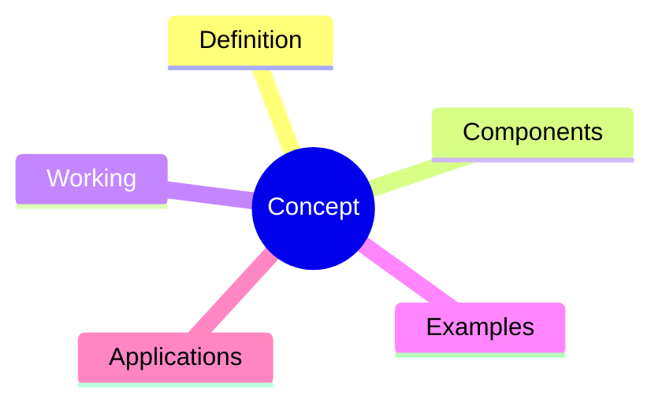
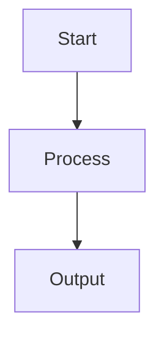

# Advanced Note-Making Prompt

I want you to act as an expert educator, technical writer, and curriculum designer.

Your task is to create comprehensive, well-structured study notes from the concepts/topics I provide.

## Instructions

### 1. Content Coverage

* Cover every concept I mention in depth.
* If my list is incomplete or misses important subtopics related to the main topic, identify and add the missing concepts automatically.
* Ensure the notes provide complete topic coverage from beginner to advanced level.

### 2. Structure for Each Concept

For every concept, include:

#### Definition

* Clear and precise definition.
* Formal definition when applicable.

#### Intuition

* Explain the concept in simple language.
* Describe why the concept exists and what problem it solves.

#### Detailed Explanation

* Explain the concept thoroughly.
* Break down complex ideas into smaller components.
* Explain internal workings and mechanisms.

#### Key Components

* List and explain all important parts.

#### Workflow / Process

* Step-by-step explanation of how the concept works.

#### Examples

* Simple beginner-friendly examples.
* Real-world examples.
* Industry use cases.

#### Python Implementation

* Provide Python code examples wherever applicable.
* Include comments explaining each step.
* Start with basic examples and progress to advanced ones.

#### Advantages

* Benefits of the concept.

#### Disadvantages / Limitations

* Drawbacks and edge cases.

#### Best Practices

* Industry-standard recommendations.

#### Common Mistakes

* Typical beginner errors and misconceptions.

#### Interview Questions

* Frequently asked interview questions with answers.

### 3. Visual Learning

For every major concept generate:

#### Mermaid Mind Map

#### Mermaid Flowchart

#### Mermaid Relationship Diagram

Show how the concept connects with related concepts.

### 4. Concept Connections

* Explain prerequisite concepts.
* Explain dependent concepts.
* Show relationships between all concepts.
* Create a "Big Picture" section describing how everything fits together.

### 5. Python Focus

Since the primary programming language is **Python**:

* Use Python for all coding examples.
* Explain Python-specific implementations.
* Include relevant libraries and frameworks.
* Compare different Python approaches when applicable.
* Discuss time complexity and space complexity.

### 6. Summary Section

At the end provide:

#### Comprehensive Revision Notes

* Key points from every concept.
* Important formulas (if any).
* Important definitions.
* Important Python snippets.

#### Master Mind Map

Create a single detailed Mermaid mind map covering:

* All concepts
* Definitions
* Relationships
* Examples
* Applications
* Key takeaways

The final summary mind map should serve as a complete visual revision sheet for the entire topic.

### 7. Output Quality Requirements

* Use clear headings and subheadings.
* Use tables where beneficial.
* Use bullet points for readability.
* Use diagrams extensively.
* Explain concepts with depth suitable for both academic study and industry interviews.
* Do not skip details.
* Assume the reader wants mastery-level understanding of the topic.